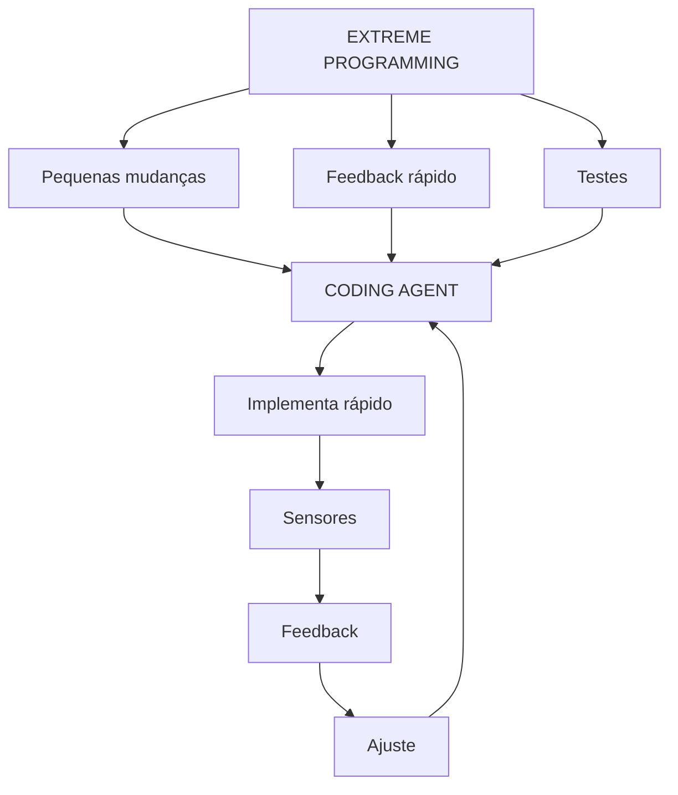
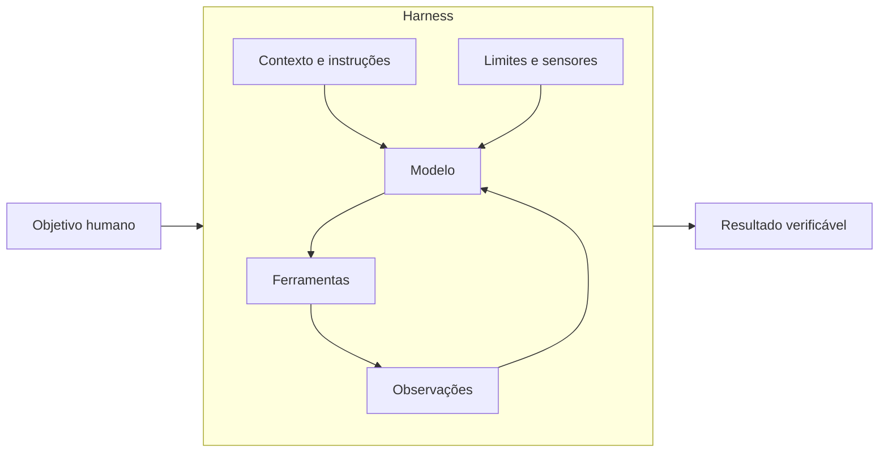
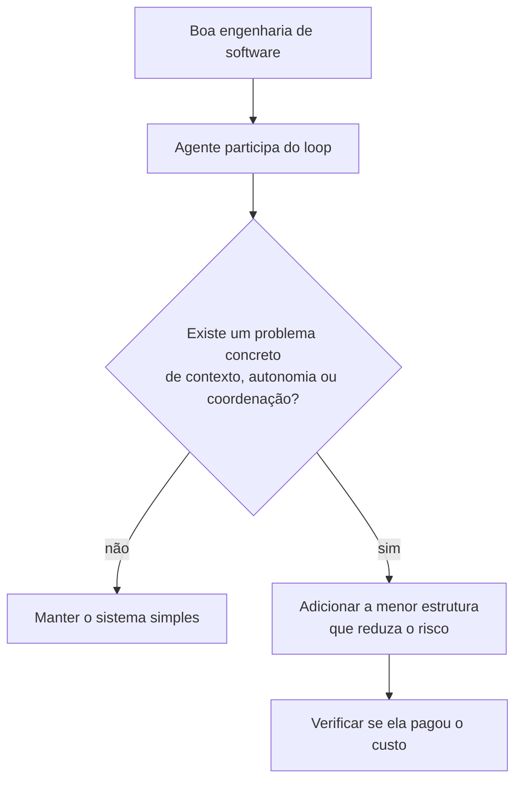
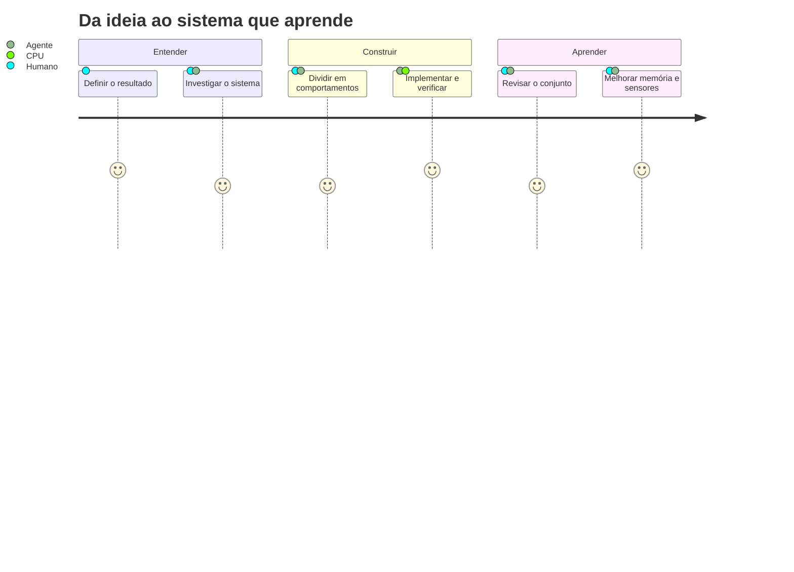

# Introdução — do prompt ao sistema

Imagine que você contrate uma pessoa muito inteligente para trabalhar em uma oficina. No primeiro
dia, você entrega apenas um pedido:

> “Conserte o carro.”

Ela ainda não sabe onde ficam as ferramentas, quais peças podem ser usadas, como a oficina registra
serviços ou quem aprova uma troca cara. Inteligência ajuda, mas não substitui ambiente, informação e
feedback.

Com agentes de IA acontece algo parecido.

## Engenharia de software primeiro

Não precisamos inventar uma nova engenharia de software para agentes. A base continua sendo testes,
integração contínua, versionamento, code review, feedback rápido, observabilidade, design simples,
refactoring e pequenas unidades de mudança.

A contribuição específica do trabalho com agentes é tornar essas práticas legíveis pelo agente,
executáveis pelo agente e verificáveis por sensores, dentro de limites explícitos de contexto e
autoridade. Estruturas novas só se justificam quando autonomia probabilística, contexto limitado ou
custo de coordenação criam um problema que as práticas existentes não resolvem sozinhas.

> **Engenharia com agentes não é substituir engenharia de software por uma nova coleção de
> frameworks. É colocar agentes dentro de loops de engenharia já sólidos, tornar contexto e
> autoridade explícitos, transformar intenção em feedback executável e adicionar complexidade
> somente quando um risco concreto paga por ela.**

## Uma raiz importante: Extreme Programming

Muitos fundamentos que usaremos têm raízes em **Extreme Programming — XP** e em práticas ágeis
clássicas: pequenas mudanças, feedback rápido, testes, integração contínua, **simple design**
(design simples), refactoring, pair programming e a aceitação de que mudar faz parte do
desenvolvimento normal.

XP não é equivalente a engenharia com agentes. É uma raiz conceitual útil porque coloca ciclos
curtos de ação e feedback no centro do trabalho. Um coding agent pode participar de uma nova
configuração de pair programming: o humano oferece intenção, julgamento e direção; o agente explora
e implementa rapidamente; sensores oferecem feedback objetivo para o próximo ajuste.

XP também usa o **spike**: um pequeno experimento feito para reduzir incerteza. Ele não precisa ser
código de produção. No mini-estudo Data Foundation, o modelo Pydantic usado como *probe* cumpre esse
papel: torna uma suposição observável antes que a equipe decida o comportamento definitivo.

## Modelo, agente e harness

Um **modelo de linguagem** recebe informações e produz uma resposta. Ele não ganha automaticamente
memória durável, acesso ao seu repositório, capacidade de executar testes ou permissão para alterar
arquivos.

Um **agente** combina esse modelo com mecanismos que permitem observar, agir e repetir.

Um **harness** (arnês, estrutura de controle) é o ambiente operacional de ferramentas, contexto,
sensores, feedback e limites dentro do qual o agente trabalha. Ele torna o trabalho possível e
governável; não substitui engenharia de software.

A fórmula “agente = modelo + harness” é útil, mas ampla. Neste livro usaremos duas escalas:

- **Harness do produto de agentes:** inclui prompt de sistema, ferramentas, filesystem, sandbox,
  memória, compactação e orquestração.
- **Harness do projeto de software:** é a camada que a equipe constrói para orientar um coding agent:
  documentação, Skills, especificações, testes, linters, regras arquiteturais e ciclos de revisão.

As duas definições não competem. A segunda é um recorte da primeira.

## A mudança mais importante

Uma pergunta comum é:

> “Como escrever um prompt que faça a IA acertar?”

Essa pergunta continua útil, mas é pequena para tarefas complexas. A pergunta de engenharia é:

> “Como construir um ambiente no qual o agente tenha boas chances de acertar, detecte parte dos
> próprios erros e peça ajuda nas decisões certas?”

O loop `implementar → testar → falhar → corrigir → testar` não nasceu com modelos de linguagem.
É um ciclo clássico de feedback de engenharia. A diferença operacional é que agora o agente pode
executar os sensores, receber seus resultados, corrigir-se dentro da autoridade concedida e
entregar evidência. O agente acelera o loop. Ele não elimina a necessidade do loop.

## O que este livro não promete

Ele não promete autonomia perfeita, código correto por definição ou uma pilha de ferramentas que
sirva para qualquer equipe. Harnesses ampliam nossa capacidade de orientar e verificar; não
transformam ambiguidade em certeza.

Também não vamos começar instalando um framework. Primeiro construiremos o modelo mental de forma
manual. Só então ferramentas como OpenSpec, Skills, sistemas multiagente ou verificações automáticas
ganham um propósito claro.

## O fio condutor

Usaremos uma feature de **recuperação de senha** ao longo do livro. Ela parece simples, mas exige
produto, segurança, arquitetura, interface, persistência, testes e observabilidade. Isso a torna um
bom pequeno laboratório.

No final, a jornada será esta:

## Antes de seguir

Tente responder com suas palavras:

1. Qual é a diferença entre um modelo e um agente?
2. Por que “dar uma instrução” e “criar um mecanismo de verificação” não são a mesma coisa?
3. Em que sentido o harness do projeto é apenas uma parte do harness completo do agente?

Se as respostas ainda estiverem vagas, tudo bem. Os próximos capítulos vão tornar essas diferenças
concretas.

[Próximo: Parte 1 — Fundamentos →](01-fundamentos.md)
