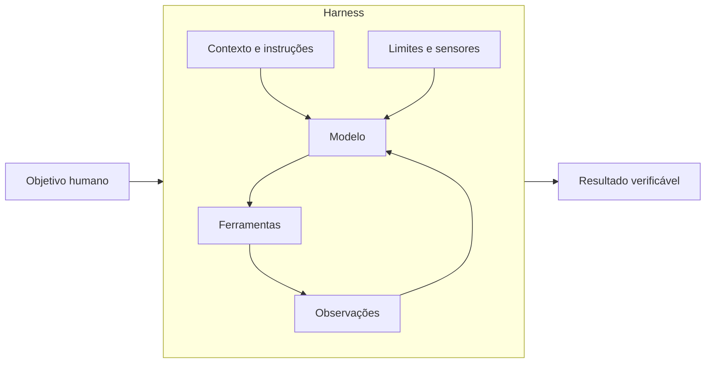
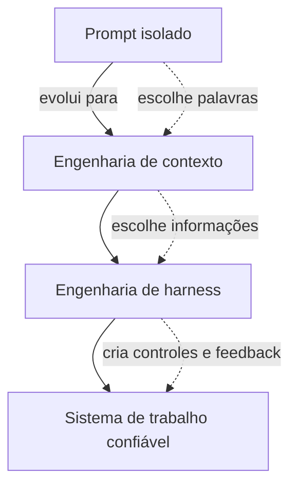
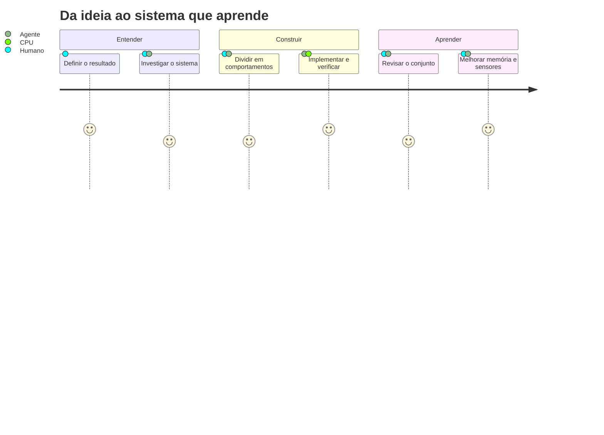

# Introdução — do prompt ao sistema

Imagine que você contrate uma pessoa muito inteligente para trabalhar em uma oficina. No primeiro
dia, você entrega apenas um pedido:

> “Conserte o carro.”

Ela ainda não sabe onde ficam as ferramentas, quais peças podem ser usadas, como a oficina registra
serviços ou quem aprova uma troca cara. Inteligência ajuda, mas não substitui ambiente, informação e
feedback.

Com agentes de IA acontece algo parecido.

## Modelo, agente e harness

Um **modelo de linguagem** recebe informações e produz uma resposta. Ele não ganha automaticamente
memória durável, acesso ao seu repositório, capacidade de executar testes ou permissão para alterar
arquivos.

Um **agente** combina esse modelo com mecanismos que permitem observar, agir e repetir.

Um **harness** (arnês, estrutura de controle) é o sistema ao redor do modelo que torna esse trabalho
possível e governável.

A fórmula “agente = modelo + harness” é útil, mas ampla. Neste livro usaremos duas escalas:

- **Harness do produto de agentes:** inclui prompt de sistema, ferramentas, filesystem, sandbox,
  memória, compactação e orquestração.
- **Harness do projeto de software:** é a camada que a equipe constrói para orientar um coding agent:
  documentação, Skills, especificações, testes, linters, regras arquiteturais e ciclos de revisão.

As duas definições não competem. A segunda é um recorte da primeira.

## A mudança mais importante

Durante muito tempo, a pergunta mais comum foi:

> “Como escrever um prompt que faça a IA acertar?”

Essa pergunta continua útil, mas é pequena para tarefas complexas. A pergunta de engenharia é:

> “Como construir um ambiente no qual o agente tenha boas chances de acertar, detecte parte dos
> próprios erros e peça ajuda nas decisões certas?”

## O que este livro não promete

Ele não promete autonomia perfeita, código correto por definição ou uma pilha de ferramentas que
sirva para qualquer equipe. Harnesses ampliam nossa capacidade de orientar e verificar; não
transformam ambiguidade em certeza.

Também não vamos começar instalando um framework. Primeiro construiremos o modelo mental de forma
manual. Só então ferramentas como OpenSpec, Skills, sistemas multiagente ou verificações automáticas
ganham um propósito claro.

## O fio condutor

Usaremos uma feature de **recuperação de senha** ao longo do livro. Ela parece simples, mas exige
produto, segurança, arquitetura, interface, persistência, testes e observabilidade. Isso a torna um
bom pequeno laboratório.

No final, a jornada será esta:

## Antes de seguir

Tente responder com suas palavras:

1. Qual é a diferença entre um modelo e um agente?
2. Por que “dar uma instrução” e “criar um mecanismo de verificação” não são a mesma coisa?
3. Em que sentido o harness do projeto é apenas uma parte do harness completo do agente?

Se as respostas ainda estiverem vagas, tudo bem. Os próximos capítulos vão tornar essas diferenças
concretas.

[Próximo: Parte 1 — Fundamentos →](01-fundamentos.md)
