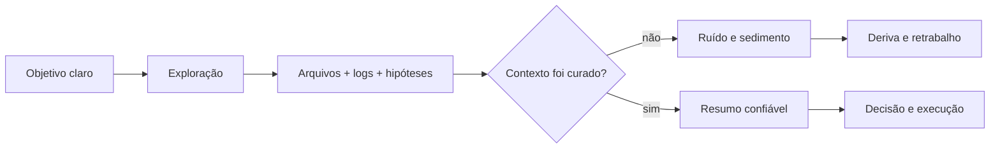
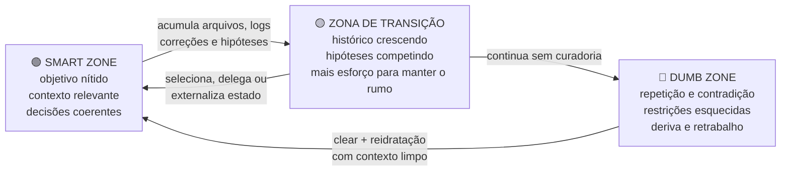
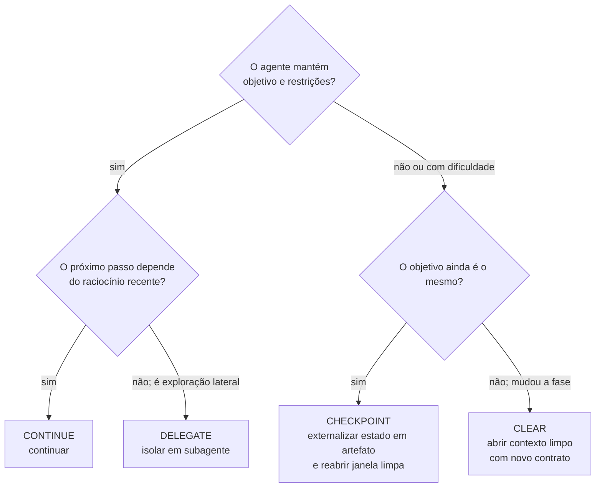
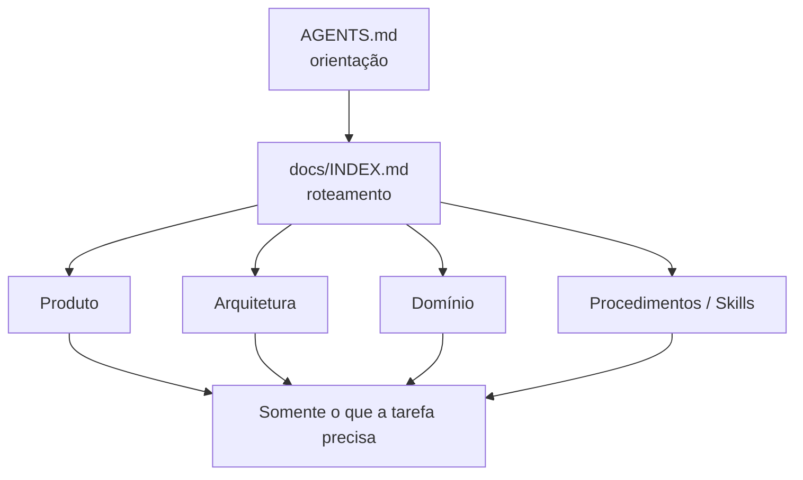

# Parte 1 — Fundamentos

## Capítulo 1 — Por que prompts não bastam

### A dor: o agente começa bem e termina confuso

Em uma tarefa pequena, você descreve a alteração, o agente encontra um arquivo, modifica algumas
linhas e executa o teste. Em um sistema antigo e grande — um projeto **brownfield** (campo já
construído) — ele precisa descobrir padrões, dependências, decisões antigas e exceções.

Cada busca, arquivo lido, log, correção e conversa ocupa espaço na **janela de contexto** (*context
window*): a quantidade de informação que o modelo consegue considerar durante aquela execução.

O problema não é apenas “caber”. Informação irrelevante compete por atenção com a tarefa atual.

### Analogia: a bancada de trabalho

Uma oficina pode possuir milhares de ferramentas. Isso é útil. Mas colocar todas sobre a bancada
antes de trocar um pneu atrapalha.

- **Oficina:** todo o conhecimento disponível no repositório.
- **Bancada:** a janela de contexto atual.
- **Ferramentas separadas para o serviço:** o contexto selecionado para a tarefa.

> Biblioteca grande, mochila pequena.

### Tipos de desgaste do contexto

| Problema | O que acontece | Exemplo |
|---|---|---|
| **Ruído** (*noise*) | Informação sem relação com a decisão atual ocupa atenção. | Logs de 10 mil linhas quando importavam três erros. |
| **Sedimento** (*context sediment*) | Hipóteses antigas permanecem depois de serem descartadas. | O agente ainda considera um caminho que a pesquisa já invalidou. |
| **Deriva** (*context drift*) | O objetivo vai se deformando durante uma execução longa. | A correção de um bug vira uma refatoração completa. |
| **Apodrecimento** (*context rot*) | A qualidade tende a cair à medida que o histórico se acumula. | O agente repete, contradiz ou esquece restrições iniciais. |



### Smart Zone e Dumb Zone

As expressões **Smart Zone** (zona inteligente) e **Dumb Zone** (zona de degradação) formam um
modelo mental popularizado em discussões sobre engenharia de contexto. Elas não descrevem dois
modos internos oficiais do modelo. Descrevem como a **qualidade observada do trabalho** pode mudar
conforme contexto, ruído e complexidade se acumulam.

O nome *Dumb Zone* é informal. Ele não quer dizer que o modelo “ficou burro” ou perdeu capacidade.
Quer dizer que criamos condições piores para ele usar a capacidade que já possui.

#### Analogia: a barra de energia de um jogo

Imagine um personagem de RPG carregando uma mochila durante uma missão.

No início, ele leva apenas mapa, chave e poção. Move-se rápido e sabe qual é o objetivo. Ao longo da
jornada, recolhe dez espadas, pedras “que talvez sejam úteis”, mapas antigos e bilhetes contraditórios.
A mochila ainda fecha, mas encontrar a chave certa durante uma batalha fica cada vez mais difícil.

O problema começa **antes** de a mochila ficar fisicamente cheia.



#### Como reconhecer cada zona

| Zona | O que costuma aparecer | Resposta saudável |
|---|---|---|
| **Smart Zone** | O agente explica o objetivo, encontra evidências e mantém decisões anteriores. | Continuar e carregar detalhes apenas quando necessários. |
| **Transição** | Começa a repetir buscas, confundir hipótese com fato ou pedir novamente algo já decidido. | Parar, revisar relevância e delegar explorações laterais. |
| **Dumb Zone** | Contradições, alterações fora do escopo, caminhos inventados, correções que desfazem decisões anteriores. | Não insistir no mesmo histórico: registrar o estado útil em um artefato e abrir contexto limpo. |

#### Não existe um marcador universal de 40%

Algumas apresentações e relatos práticos usam percentuais para ilustrar quando a degradação foi
percebida. Eles são uma **heurística**, não uma lei que vale igualmente para todos os modelos e
tarefas.

Uma janela com muito conteúdo simples pode continuar útil. Uma janela menor, mas cheia de regras
contraditórias e raciocínio arquitetural difícil, pode degradar cedo. A fronteira depende de:

- complexidade da tarefa;
- quantidade de decisões interdependentes;
- relevância e posição das informações;
- volume de saídas de ferramentas;
- presença de hipóteses descartadas;
- capacidade do harness de externalizar e recuperar estado.

Por isso, observe **sintomas**, não apenas um contador de tokens.



Repare que nenhum caminho recomenda a **compaction** (compactação — pedir ao harness que resuma a
conversa inteira para continuar na mesma sessão). Resumir a jornada tende a carregar sedimento
junto e produz um estado difícil de prever. O caminho preferido neste livro é externalizar o estado
útil em um artefato e reabrir uma janela limpa.

Essas quatro ações serão aprofundadas no
[Capítulo 9 — Ciclo de vida do contexto](04-engenharia-de-contexto.md#capítulo-9--ciclo-de-vida-do-contexto).

> A meta não é manter a conversa viva pelo maior tempo possível. É manter o trabalho na zona em que
> objetivo, evidência e decisões continuam nítidos.

### Orçamento de instruções

Além de tokens, existe um **orçamento de instruções** (*instruction budget*). Muitas regras podem
ser individualmente boas e, juntas, perder força. Se tudo é prioridade máxima, o agente precisa
adivinhar o que realmente importa para aquela tarefa.

Uma regra útil passa por três perguntas:

1. Ela é relevante para quase todo trabalho no repositório?
2. Ela continua verdadeira por bastante tempo?
3. Não existe um mecanismo automático melhor para aplicá-la?

Se as respostas forem “não”, “não” ou “sim”, provavelmente a regra não deveria estar no contexto
permanente.

### Greenfield e brownfield

**Greenfield** (campo verde) é um projeto novo. O agente encontra pouca história e pode ajudar a
estabelecer padrões desde o início.

**Brownfield** é um sistema existente. Nele, código, documentação e decisões podem discordar. A
tarefa exige investigação antes de implementação.

| Projeto novo | Sistema existente |
|---|---|
| Poucas restrições herdadas | Muitas restrições, algumas implícitas |
| O padrão pode ser criado | O padrão precisa ser descoberto |
| Refazer ainda é barato | Uma mudança pode atingir muitos consumidores |
| Contexto nasce organizado | Contexto precisa ser filtrado e validado |

### Em uma frase

> Mais contexto não significa automaticamente melhor contexto.

### Perguntas de revisão

1. Por que uma janela grande não elimina a necessidade de selecionar informação?
2. Qual é a diferença entre ruído e sedimento de contexto?
3. Por que a Dumb Zone não começa necessariamente quando a janela fica cheia?
4. Que sintomas indicam que é melhor externalizar o estado e abrir uma janela limpa em vez de continuar insistindo?
5. Por que uma tarefa brownfield normalmente pede uma fase explícita de investigação?
6. Cite uma regra do seu projeto que poderia virar teste ou linter em vez de instrução textual.

---

## Capítulo 2 — `AGENTS.md` e divulgação progressiva

### A dor: o manual que virou depósito

Um agente erra. A equipe adiciona uma regra ao `AGENTS.md`. Ele erra de outro jeito. Outra regra é
adicionada. Meses depois, o arquivo contém centenas de observações sem hierarquia, algumas
desatualizadas.

É o equivalente a uma cozinha com placas dizendo “não coloque plástico no forno”, “não coloque
papel no forno”, “não coloque telefone no forno”. A abstração correta — “use apenas recipientes
próprios para forno” — nunca foi criada.

### O papel do `AGENTS.md`

O `AGENTS.md` é um ponto de entrada operacional. Ele deve ajudar o agente a responder:

- Onde estou?
- O que este projeto faz?
- Quais comandos ou restrições globais são incomuns?
- Para onde devo ir quando precisar de detalhes?

Ele é um **mapa**, não a cidade inteira.



### Divulgação progressiva

**Progressive disclosure** (divulgação progressiva) significa mostrar detalhes à medida que eles se
tornam necessários.

Um mapa do país não exibe todas as casas. Quando você aproxima uma cidade, ruas aparecem. Quando
aproxima um bairro, aparecem estabelecimentos. A informação sempre existiu; apenas não estava toda
visível ao mesmo tempo.

No repositório, isso pode assumir esta forma:

```markdown
# Projeto

Aplicação de vendas para um mercado de bairro.

## Comandos

- Build: `npm run build`
- Testes: `npm test`

## Mapa

- Arquitetura: `docs/architecture/HLD.md`
- Decisões: `docs/architecture/adr/`
- Produto: `docs/product/`
- Procedimentos repetíveis: `.agents/skills/`
```

### Quatro gavetas

| Informação | Melhor lugar | Pergunta que responde |
|---|---|---|
| Orientação global e estável | `AGENTS.md` | “Como começo?” |
| Conhecimento especializado | Documento | “O que sabemos?” |
| Procedimento repetível | Skill ou script | “Como faço?” |
| Regra verificável | Teste, tipo ou linter | “Como impedimos o erro?” |

### `INDEX.md` não é outro manual

Um índice saudável descreve onde encontrar conhecimento e, quando útil, quem é responsável ou
quando foi verificado. Ele não copia o conteúdo dos documentos.

```markdown
# Documentation index

## Autenticação

- Requisitos do produto: `product/authentication.md`
- Visão arquitetural: `architecture/authentication.md`
- Decisão sobre sessões: `architecture/adr/004-session-storage.md`
```

Referenciar reduz duplicação. Também reduz o risco de duas cópias da mesma regra envelhecerem de
formas diferentes.

### Armadilha: documentar geografia volátil

“O serviço está em `src/modules/auth/service.ts`” pode deixar de ser verdade amanhã. “Autenticação
é um domínio independente e não pode depender de catálogo” tende a ser mais estável.

Documentos permanentes devem preferir conceitos, contratos e decisões. Caminhos exatos cabem em
pesquisa ou tarefas quando forem úteis naquele momento.

### Checklist de um `AGENTS.md` saudável

- É curto o suficiente para ser lido em toda tarefa.
- Declara apenas regras realmente globais.
- Aponta para fontes mais específicas.
- Não repete linters, testes ou documentação.
- Não contém um histórico de todos os erros da equipe.
- É revisado quando a estrutura de documentação muda.

### Em uma frase

> `AGENTS.md` orienta a descoberta; ele não substitui a descoberta.

### Perguntas de revisão

1. Qual é a diferença entre `AGENTS.md`, índice, documento e Skill?
2. Por que copiar uma regra para vários arquivos aumenta o risco de documentação velha?
3. Onde você colocaria “sempre execute a migração em modo transacional”: instrução, documento,
   Skill ou sensor? O que faltaria saber para decidir?
4. Reescreva três proibições específicas como um princípio único e mais estável.

[← Introdução](00-introducao.md) · [Próximo: Parte 2 — Memória →](02-memoria.md)
