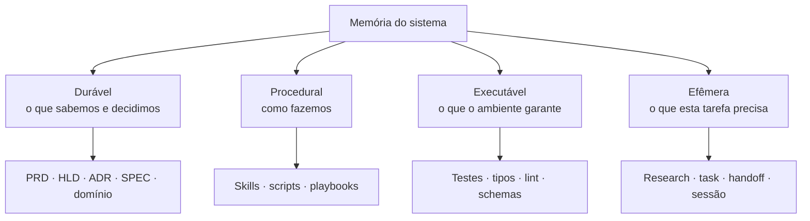
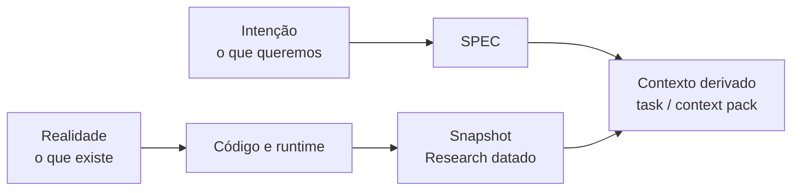
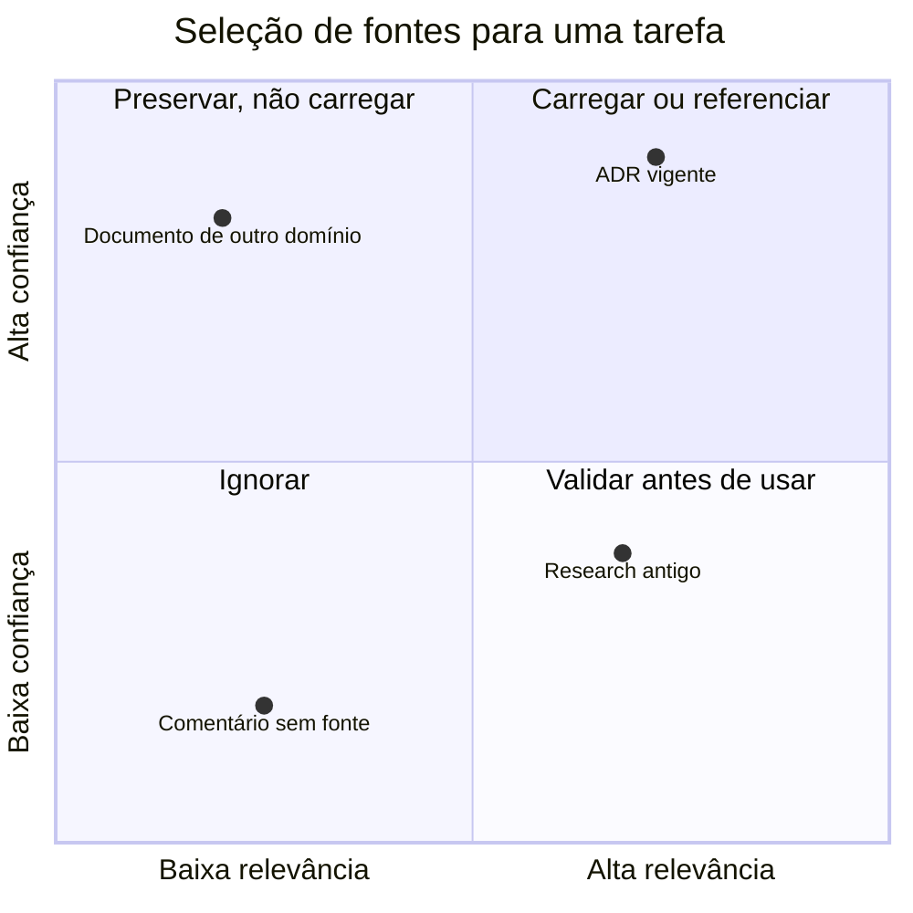

# Parte 2 — Arquitetura da memória

## Capítulo 3 — Quatro formas de memória

### A dor: guardar tudo ou esquecer tudo

Quando um agente descobre algo importante, é tentador registrar imediatamente no `AGENTS.md`. Se
fizermos isso com toda descoberta, voltamos ao manual gigante. Se não guardarmos nada, a próxima
execução precisará redescobrir os mesmos fatos.

A saída começa por perceber que “memória” não é uma coisa só.



### 1. Memória durável

É o conhecimento que merece sobreviver à tarefa atual:

- **PRD — Product Requirements Document** (documento de requisitos do produto): explica o
  problema, o público e os resultados desejados.
- **HLD — High-Level Design** (projeto de alto nível): descreve os grandes componentes e suas
  relações.
- **ADR — Architecture Decision Record** (registro de decisão arquitetural): preserva uma decisão,
  seu contexto e suas consequências.
- **SPEC — Specification** (especificação): define comportamentos ou contratos que devem ser
  verdadeiros.
- Documentos de domínio: registram vocabulário, regras de negócio e conceitos estáveis.

### 2. Memória procedural

É o conhecimento de como executar um tipo de trabalho. Uma Skill de migração pode explicar como
inspecionar o banco, criar a mudança, validar compatibilidade e preparar reversão. Um script pode
automatizar os passos determinísticos.

O conteúdo procedural não precisa ocupar o contexto de uma tarefa de CSS.

### 3. Memória executável

É o conhecimento codificado em mecanismos:

- o tipo impede um estado inválido;
- o teste prova um comportamento;
- o linter rejeita uma dependência proibida;
- o schema valida dados na fronteira;
- a pipeline bloqueia uma entrega insegura.

Ela costuma ser mais forte que prosa porque oferece feedback objetivo no momento da mudança.

### 4. Memória efêmera

É a memória de trabalho de uma mudança:

- descobertas da investigação;
- arquivos e símbolos relevantes;
- plano ou grafo de tarefas;
- hipóteses ainda abertas;
- resumo de passagem entre agentes.

Ela pode ser valiosa hoje e inútil depois do fechamento da feature.

### Analogia: hospital

Um hospital possui protocolos permanentes, equipamentos com alarmes e o prontuário temporário de
cada atendimento.

- Diretrizes médicas se parecem com memória durável.
- Procedimentos operacionais se parecem com memória procedural.
- Alarmes e monitores se parecem com memória executável.
- As anotações do atendimento atual se parecem com memória efêmera.

Colocar todo prontuário de todo paciente no manual geral seria absurdo. Apagar protocolos após cada
plantão também.

### Persistir não é carregar

Um ADR pode existir para sempre sem entrar no contexto da tarefa atual.

```text
tempo de armazenamento ≠ tempo no contexto
conhecimento disponível ≠ conhecimento ativo
```

Essa distinção permite documentação rica sem obrigar o agente a ler tudo.

### Como classificar uma descoberta

Pergunte:

1. É estável ou muda com frequência?
2. É global ou interessa apenas a esta feature?
3. É caro redescobrir?
4. É uma decisão, um fato, um procedimento ou uma regra verificável?
5. Poderia ser descoberta com segurança diretamente do código?

| Descoberta | Destino provável |
|---|---|
| “Tokens expiram em 15 minutos por decisão de segurança” | ADR ou SPEC |
| “O handler atual fica na linha 84” | Research/task, não memória durável |
| “Toda migração exige checagem de compatibilidade” | Skill |
| “UI não pode importar repositórios” | Teste estrutural/linter + documento arquitetural |

### Perguntas de revisão

1. Qual é a diferença entre memória procedural e executável?
2. Por que um ADR permanente não precisa estar em toda janela de contexto?
3. Classifique: um comando de deploy, a razão para usar filas e o log da investigação atual.
4. Quando redescobrir pode ser melhor do que documentar?

---

## Capítulo 4 — Em qual fonte confiar?

### A dor: SPEC diz X, documento diz Y, código faz Z

A pergunta “qual fonte é a verdadeira?” parece objetiva, mas ainda está incompleta. Cada artefato
pode responder a um tipo diferente de verdade.

| Pergunta | Fonte mais apropriada |
|---|---|
| O que o produto deseja? | PRD ou decisão humana atual |
| Que comportamento foi acordado? | SPEC canônica |
| Por que a arquitetura escolheu este caminho? | ADR |
| Como o sistema funciona hoje? | Código, configuração e runtime |
| O que foi encontrado ao preparar esta mudança? | Research, como fotografia datada |
| Como executar um procedimento? | Skill ou playbook validado |

### Quatro funções epistemológicas

**Epistemologia** é o estudo de como sabemos o que sabemos. Aqui basta uma versão prática:



- **Fonte de intenção:** diz o estado desejado.
- **Fonte de realidade:** mostra o estado implementado.
- **Snapshot** (fotografia): compacta a realidade observada em um momento.
- **Contexto derivado:** seleciona trechos das fontes para uma tarefa.

Uma SPEC e o código podem discordar sem que uma fonte seja “mentirosa”: a diferença pode ser
justamente a mudança que precisa ser implementada.

### Autoridade, atualidade e relevância

Ao selecionar uma fonte, avalie três eixos:

1. **Autoridade:** ela tem poder para responder a este tipo de pergunta?
2. **Atualidade:** quando foi verificada pela última vez?
3. **Relevância:** seu conteúdo altera alguma decisão desta tarefa?



### Divergência é informação

Quando documento e código discordam, não escolha silenciosamente um lado. Registre a divergência:

```markdown
## Divergência encontrada

- A SPEC exige resposta neutra para e-mails inexistentes.
- O endpoint atual retorna `404`.
- Precisamos confirmar se a implementação está atrasada ou se a SPEC não foi atualizada.
```

Isso impede que uma hipótese seja promovida acidentalmente a fato.

### Escada de confiança

Para a **realidade atual** de um comportamento, uma heurística útil é:

1. observação reproduzível em runtime;
2. teste que executa o comportamento;
3. código e configuração atuais;
4. documentação recentemente verificada;
5. Research datado;
6. comentários, conversas e memória humana não confirmada.

Para a **intenção**, a ordem muda: uma decisão humana ou SPEC aprovada pode ter mais autoridade que
o código, pois o código pode ser justamente o que está errado.

### Em uma frase

> Antes de perguntar “qual fonte vence?”, pergunte “que tipo de verdade estou procurando?”.

### Perguntas de revisão

1. Como SPEC e código podem divergir sem que a SPEC esteja desatualizada?
2. Qual é a diferença entre autoridade e atualidade?
3. Um Research de seis meses atrás é inútil? Que fatores determinam a resposta?
4. Escreva como registraria uma divergência sem resolvê-la por suposição.

[← Parte 1 — Fundamentos](01-fundamentos.md) · [Próximo: Parte 3 — Especificação →](03-especificacao-e-planejamento.md)
