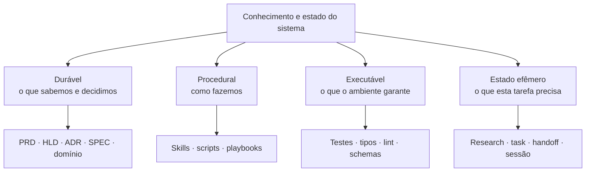
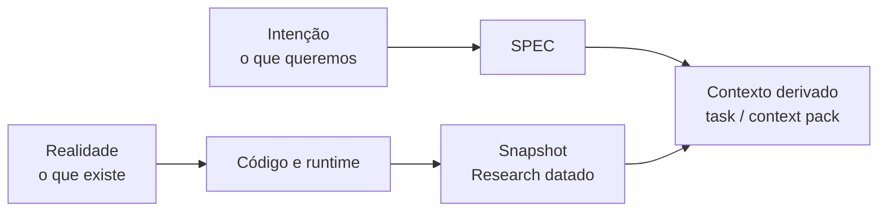
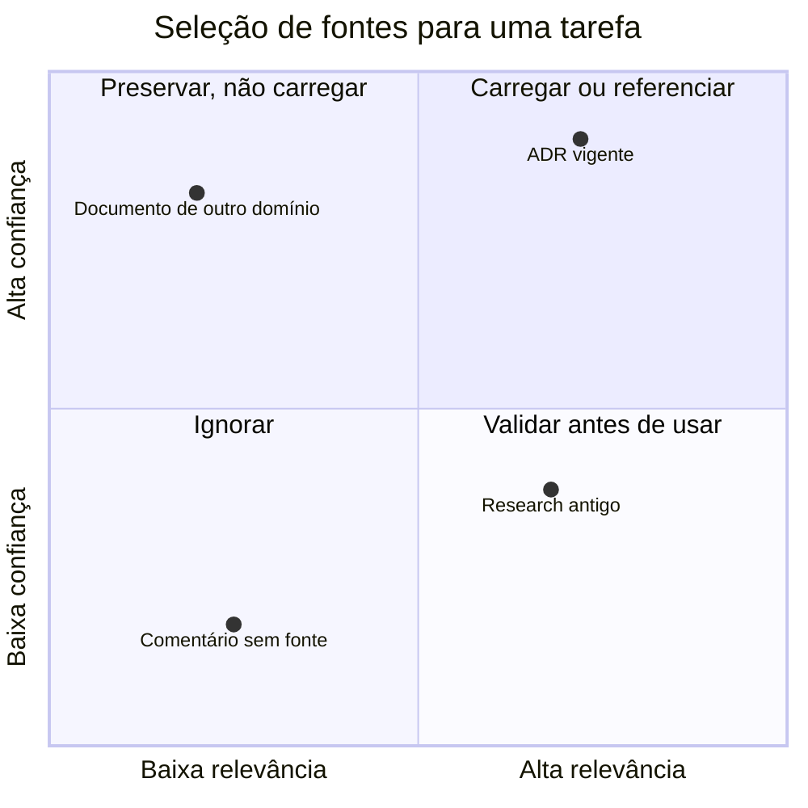

# Parte 2 — Arquitetura da memória

## Capítulo 3 — Memória e estado de trabalho

### A dor: guardar tudo ou esquecer tudo

Quando um agente descobre algo importante, é tentador registrar imediatamente no `AGENTS.md`. Se
fizermos isso com toda descoberta, voltamos ao manual gigante. Se não guardarmos nada, a próxima
execução precisará redescobrir os mesmos fatos.

A saída começa por separar memória reutilizável de estado de trabalho e perceber que o conhecimento
persistido também pode assumir formas diferentes.

### Memória não é guardar conversas

Uma conversa preservada mostra que algo foi dito. Ela não prova que a conclusão continua correta,
que vale para o projeto inteiro ou que possui autoridade para orientar uma ação futura.

**Memória de projeto** é conhecimento passado que sobrevive à sessão, preserva proveniência, pode
ser recuperado e reavaliado, pode ser substituído por uma versão mais atual, pode perder relevância
ou ser esquecido e, quando aprovado, pode ser promovido para uma regra ou sensor.

Quatro superfícies não devem ser confundidas:

```text
SESSION
→ história detalhada do trabalho ocorrido

HANDOFF
→ estado mínimo necessário para continuar o trabalho

MEMORY
→ conhecimento potencialmente reutilizável em trabalhos futuros

RULE
→ conhecimento aprovado que deve governar ações futuras
```

Uma sessão pode conter tentativas erradas e caminhos descartados. Um handoff seleciona apenas o
estado necessário para o próximo consumidor. Uma memória preserva algo que talvez volte a ser útil.
Uma regra exige autoridade e vive numa fonte canônica — por exemplo, `AGENTS.md`, uma SPEC ou um
sensor. Recuperar uma memória não a transforma automaticamente em regra.



### 1. Memória durável

É o conhecimento que merece sobreviver à tarefa atual:

- **PRD — Product Requirements Document** (documento de requisitos do produto): explica o
  problema, o público e os resultados desejados.
- **HLD — High-Level Design** (projeto de alto nível): descreve os grandes componentes e suas
  relações.
- **ADR — Architecture Decision Record** (registro de decisão arquitetural): preserva uma decisão,
  seu contexto e suas consequências.
- **SPEC — Specification** (especificação): define comportamentos ou contratos que devem ser
  verdadeiros.
- Documentos de domínio: registram vocabulário, regras de negócio e conceitos estáveis.

### 2. Memória procedural

É o conhecimento de como executar um tipo de trabalho. Uma Skill de migração pode explicar como
inspecionar o banco, criar a mudança, validar compatibilidade e preparar reversão. Um script pode
automatizar os passos determinísticos.

O conteúdo procedural não precisa ocupar o contexto de uma tarefa de CSS.

### 3. Memória executável

É o conhecimento codificado em mecanismos:

- o tipo impede um estado inválido;
- o teste prova um comportamento;
- o linter rejeita uma dependência proibida;
- o schema valida dados na fronteira;
- a pipeline bloqueia uma entrega insegura.

Ela costuma ser mais forte que prosa porque oferece feedback objetivo no momento da mudança.

### 4. Estado efêmero

É o estado de trabalho de uma mudança:

- descobertas da investigação;
- arquivos e símbolos relevantes;
- plano ou grafo de tarefas;
- hipóteses ainda abertas;
- resumo de passagem entre agentes.

Ele pode ser valioso hoje e inútil depois do fechamento da feature.

### Analogia: hospital

Um hospital possui protocolos permanentes, equipamentos com alarmes e o prontuário temporário de
cada atendimento.

- Diretrizes médicas se parecem com memória durável.
- Procedimentos operacionais se parecem com memória procedural.
- Alarmes e monitores se parecem com memória executável.
- As anotações do atendimento atual se parecem com estado efêmero.

Colocar todo prontuário de todo paciente no manual geral seria absurdo. Apagar protocolos após cada
plantão também.

### Persistir não é carregar

Um ADR pode existir para sempre sem entrar no contexto da tarefa atual.

```text
tempo de armazenamento ≠ tempo no contexto
storage lifetime != context lifetime
conhecimento disponível ≠ conhecimento ativo
```

Essa distinção permite documentação rica sem obrigar o agente a ler tudo.

### Recuperar não é confiar

**Retrieval** (recuperação) seleciona memórias candidatas para a tarefa atual. Pode usar busca por
texto, entidades, links, recência ou similaridade semântica. O resultado do ranking responde “isto
parece relevante?”, não “isto é verdadeiro?” nem “isto tem autoridade?”.

Antes de agir sobre uma memória recuperada, reavalie autoridade, atualidade, escopo e proveniência.
Claims sobre o código atual devem ser comparados com checkout, testes, runtime e dados atuais. A
biblioteca pode ser grande; a mochila continua pequena e verificada.

### Retenção, substituição e esquecimento

Tipos diferentes de registro merecem políticas diferentes:

- histórico detalhado de sessão pode perder valor rapidamente;
- handoff deve expirar quando o trabalho foi aceito ou substituído;
- memória reutilizável pode permanecer, mas precisa admitir correção e **supersession**
  (substituição por uma versão mais atual);
- regra canônica permanece enquanto tiver autoridade, mas também precisa de revisão e remoção;
- índices de busca são derivados e podem ser reconstruídos a partir da fonte persistida.

Esquecer não é necessariamente uma falha. Remover episódios frios, hipóteses derrotadas e cópias
substituídas reduz ruído e evita que conhecimento antigo dispute atenção com fontes atuais.

### Estudo de caso: `akitaonrails/ai-memory`

O projeto [`ai-memory`](https://github.com/akitaonrails/ai-memory) oferece um exemplo concreto, não
uma dependência deste livro. Sua arquitetura separa um arquivo bruto de observações de sessão, uma
wiki Markdown versionada em Git e um índice SQLite derivado para busca. Ao final ou na compactação
de uma sessão, observações podem ser consolidadas; a próxima sessão pode receber um handoff limitado.

O desenho ilustra quatro princípios:

1. **Captura não é memória aprovada:** observações e páginas recuperadas continuam sendo evidência
   histórica não confiável até serem verificadas.
2. **Persistência não é retrieval:** a wiki pode ser grande enquanto índices lexicais, relações e
   vetores opcionais selecionam poucos candidatos.
3. **Retenção não é uniforme:** episódios podem perder peso e ser removidos; páginas semânticas são
   versionadas e podem ser superseded.
4. **Memória não é regra:** o próprio projeto mantém regras duráveis no arquivo canônico de
   instruções; posição, tag ou ranking de uma memória não lhe concede autoridade normativa.

Quando a documentação do sistema chama a wiki de “source of truth”, isso significa fonte canônica
do **registro de memória dentro da ferramenta**. Não significa que toda afirmação armazenada seja
fonte da realidade atual do software. Código, testes, runtime e dados continuam precisando ser
consultados.

### Como classificar uma descoberta

Pergunte:

1. É estável ou muda com frequência?
2. É global ou interessa apenas a esta feature?
3. É caro redescobrir?
4. É uma decisão, um fato, um procedimento ou uma regra verificável?
5. Poderia ser descoberta com segurança diretamente do código?

| Descoberta | Destino provável |
|---|---|
| “Tokens expiram em 15 minutos por decisão de segurança” | ADR ou SPEC |
| “O handler atual fica na linha 84” | Research/task, não memória durável |
| “Toda migração exige checagem de compatibilidade” | Skill |
| “UI não pode importar repositórios” | Teste estrutural/linter + documento arquitetural |

### Perguntas de revisão

1. Qual é a diferença entre session, handoff, memory e rule?
2. Por que uma memória bem ranqueada no retrieval ainda pode estar errada ou sem autoridade?
3. Qual é a diferença entre memória procedural e executável?
4. Por que um ADR permanente não precisa estar em toda janela de contexto?
5. Classifique: um comando de deploy, a razão para usar filas e o log da investigação atual.
6. Quando redescobrir ou esquecer pode ser melhor do que documentar?

---

## Capítulo 4 — Em qual fonte confiar?

### A dor: SPEC diz X, documento diz Y, código faz Z

A pergunta “qual fonte é a verdadeira?” parece objetiva, mas ainda está incompleta. Cada artefato
pode responder a um tipo diferente de verdade.

| Pergunta | Fonte mais apropriada |
|---|---|
| O que o produto deseja? | PRD ou decisão humana atual |
| Que comportamento foi acordado? | SPEC canônica |
| Por que a arquitetura escolheu este caminho? | ADR |
| Como o sistema funciona hoje? | Código, configuração e runtime |
| O que foi encontrado ao preparar esta mudança? | Research, como fotografia datada |
| Como executar um procedimento? | Skill ou playbook validado |

### Quatro funções epistemológicas

**Epistemologia** é o estudo de como sabemos o que sabemos. Aqui basta uma versão prática:



- **Fonte de intenção:** diz o estado desejado.
- **Fonte de realidade:** mostra o estado implementado.
- **Snapshot** (fotografia): compacta a realidade observada em um momento.
- **Contexto derivado:** seleciona trechos das fontes para uma tarefa.

Uma SPEC e o código podem discordar sem que uma fonte seja “mentirosa”: a diferença pode ser
justamente a mudança que precisa ser implementada.

Memória recuperada não cria um quinto tipo de verdade. Ela é um registro histórico que deve apontar
para decisão, observação, código, teste ou outra origem. Quando a consolidação perde essa
proveniência, fica mais difícil reavaliar a afirmação e sua confiança deve diminuir.

### Autoridade, atualidade, escopo e proveniência

Ao selecionar uma fonte, avalie quatro eixos:

1. **Autoridade:** ela tem poder para responder a este tipo de pergunta?
2. **Atualidade:** quando foi verificada pela última vez?
3. **Escopo:** a afirmação vale para este sistema, versão, ambiente e tarefa?
4. **Proveniência:** de onde veio a afirmação — runtime, teste, código, Research, outro agente ou
   inferência?

**Relevância** continua sendo o filtro de carregamento: mesmo uma fonte confiável fica fora da
mochila quando não altera a tarefa. **Escopo** é diferente: uma evidência pode ser muito relevante e
ainda assim não se aplicar ao ambiente ou componente em questão.



### Divergência é informação

Quando documento e código discordam, não escolha silenciosamente um lado. Registre a divergência:

```markdown
## Divergência encontrada

- A SPEC exige resposta neutra para e-mails inexistentes.
- O endpoint atual retorna `404`.
- Precisamos confirmar se a implementação está atrasada ou se a SPEC não foi atualizada.
```

Isso impede que uma hipótese seja promovida acidentalmente a fato.

### Escada de confiança

Para a **realidade atual** de um comportamento, uma heurística útil é:

1. observação reproduzível em runtime;
2. teste que executa o comportamento;
3. código e configuração atuais;
4. documentação recentemente verificada;
5. Research datado;
6. comentários, conversas e memória humana não confirmada.

Para a **intenção**, a ordem muda: uma decisão humana ou SPEC aprovada pode ter mais autoridade que
o código, pois o código pode ser justamente o que está errado.

### Em uma frase

> Antes de perguntar “qual fonte vence?”, pergunte “que tipo de verdade estou procurando?”.

### Perguntas de revisão

1. Como SPEC e código podem divergir sem que a SPEC esteja desatualizada?
2. Qual é a diferença entre autoridade e atualidade?
3. Um Research de seis meses atrás é inútil? Que fatores determinam a resposta?
4. Escreva como registraria uma divergência sem resolvê-la por suposição.
5. Por que “veio de outro agente” não basta como proveniência de uma conclusão?

[← Parte 1 — Fundamentos](01-fundamentos.md) · [Próximo: Parte 3 — Especificação →](03-especificacao-e-planejamento.md)
