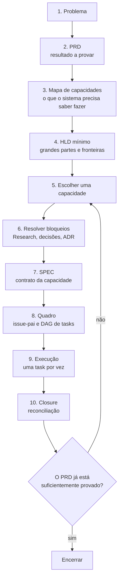

# Parte 3 — Do problema à capacidade

## Capítulo 5 — Os cinco níveis de decisão

### A dor: perguntas que não têm resposta ainda

Seu Renato terminou de descrever o que queria: perguntar igual pergunta ao sobrinho e ver o
gráfico. Na primeira reunião depois disso, as perguntas que aparecem são estas:

- Qual banco vetorial vamos usar?
- Precisamos de LangGraph ou basta uma chamada direta?
- Quais ADRs temos que escrever?
- Quantas issues isso vira?

Nenhuma delas tem resposta. E o problema não é falta de conhecimento técnico — é que cada pergunta
pertence a um nível de decisão diferente, e os níveis anteriores ainda estão vazios. Escolher um
banco vetorial exige saber qual prova será feita. Saber qual prova será feita exige saber qual
resultado o produto precisa entregar. Ninguém escreveu nenhum dos dois.

Quando isso acontece, a equipe costuma responder mesmo assim. A escolha é feita por preferência,
por familiaridade ou pelo último artigo lido, e depois passa a ser defendida como se tivesse
nascido de uma análise.

### Analogia: o cardápio antes da fome

Imagine escolher panelas antes de decidir se você vai cozinhar para dois ou para quarenta pessoas.
A pergunta “qual panela?” é legítima, mas ela é a quarta pergunta de uma sequência. Feita primeiro,
ela obriga a inventar uma resposta para todas as anteriores — em silêncio.

Perguntas fora de ordem não ficam sem resposta. Elas recebem respostas inventadas.

### Os cinco níveis

Quase toda confusão de escopo é uma mistura de cinco níveis de decisão:

```text
Nível 1 — Problema:    por que construir?
Nível 2 — Produto:     o que precisa ser provado?
Nível 3 — Arquitetura: que grandes responsabilidades colaboram?
Nível 4 — Capacidade:  qual comportamento limitado construiremos agora?
Nível 5 — Execução:    qual pequena mudança fazemos primeiro?
```

Cada nível tem um dono natural, um artefato e uma pergunta que só ele responde:

| Nível | Pergunta | Artefato típico | Erro de misturar |
|---|---|---|---|
| Problema | por que agir agora? | pedido do cliente, evidência | construir algo que ninguém precisa |
| Produto | qual resultado provar? | PRD | tecnologia escolhida sem tese |
| Arquitetura | quais partes colaboram? | HLD, ADR | padrões adotados sem decisão |
| Capacidade | o que o sistema precisa saber fazer? | mapa de capacidades, SPEC | backlog antes de contrato |
| Execução | qual mudança verificável? | task, código, sensores | implementação que decide produto |

As quatro perguntas da reunião ficam legíveis quando recebem etiqueta. “Qual banco vetorial” é
nível 3 ou 5; “quantas issues” é nível 5; “quais ADRs” é nível 3 — e todas foram feitas enquanto os
níveis 1 e 2 continuavam em branco.

### Um gate por vez

**Gate** (portão de passagem) é uma condição de saída verificável entre dois níveis. A correção
para a mistura não é planejar mais: é trabalhar com um gate por vez. Em cada etapa, produza uma
saída pequena, confira a condição de saída, e só então avance.

Um gate não é aprovação burocrática. É uma frase que você consegue completar — ou não.

```text
Gate do nível 2 (Produto):

“Para <pessoa>, queremos provar que <comportamento/resultado>,
 medindo <evidência>, sem <efeitos proibidos>.”
```

Se você não consegue preencher os quatro espaços, o gate não passou. Isso não é fracasso: é a
informação de que a próxima decisão pertence a este nível, não ao seguinte.

### A trilha única

Os cinco níveis se desdobram em dez etapas. Elas formam uma trilha, e a trilha tem um laço:



As etapas 1 a 5 são o assunto desta parte. As etapas 6 a 8 são a
[Parte 4](03-especificacao-e-planejamento.md); as etapas 9 e 10 aparecem no
[estudo de caso](08-estudo-de-caso.md) e no experimento com
[Linear](09b-linear-como-memoria-operacional-da-spec.md).

Repare no laço. Depois do closure, você não volta ao PRD: volta à etapa 5 e escolhe a próxima
capacidade. O PRD só é revisitado quando a evidência muda o produto.

### Baseline: aprovar sem congelar

**Baseline** (linha de base) é a versão de um documento que foi aprovada por uma decisão humana e
serve de referência até que uma evidência a mude. Não é a versão final, e não é rascunho.

A distinção importa porque desfaz um impasse comum. Você não “termina o PRD para sempre” antes de
aprender nada — isso exigiria conhecer o que só a implementação vai revelar. Mas também não trabalha
sem PRD, porque então cada task decide produto por conta própria.

```text
Rascunho  → ainda em construção; ninguém deve derivar decisões daqui
Baseline  → aprovada; pode ser citada, derivada e cobrada
Substituída → uma evidência mudou o produto; existe uma nova baseline
```

Uma baseline é aprovada quando é **suficiente para começar**, não quando é completa. A pergunta do
gate é “consigo escolher a próxima capacidade sem inventar intenção?”, não “está tudo respondido?”.

### Armadilha: transformar o nível 2 em backlog

A tentação mais forte, ao terminar um PRD, é pedir ao agente que decomponha o documento inteiro em
tasks. O resultado parece produtivo: dezenas de cartões, fases, estimativas.

O problema é que o PRD descreve o produto inteiro, e o produto inteiro ainda não foi aprendido. Cada
cartão gerado assim carrega decisões que ninguém tomou — de arquitetura, de escopo e de semântica.
O backlog cresce antes de o caminho ser conhecido, e passa a exigir manutenção sem ajudar ninguém.

O PRD informa **quais capacidades importam**. Uma SPEC define **qual comportamento será construído
agora**. Só depois disso existe um grafo de tasks.

### Um tutor para conduzir os gates

Quando você não sabe em qual nível está — que é a situação normal no começo —, um agente pode
conduzir a trilha em vez de executá-la. O prompt abaixo pede exatamente isso, e proíbe o resto:

```text
Atue como tutor do meu workflow e conduza somente um gate por vez.

Estado atual: <DESCREVA OU INFORME A ISSUE>.
Artefatos disponíveis: <LINKS/CAMINHOS>.

1. Identifique em qual nível estou: problema, produto, arquitetura, capacidade
   ou execução.
2. Diga qual única decisão pertence a esse nível agora.
3. Explique os termos técnicos em inglês no formato “termo (tradução)”.
4. Mostre quais evidências já existem e qual lacuna impede avançar.
5. Dê uma tarefa curta para eu responder ou decidir.
6. Não avance, não crie artefatos seguintes e não implemente até eu responder.

Quando eu responder, valide o gate. Se estiver satisfeito, explique por que e
conduza somente ao próximo. Se não estiver, mostre a lacuna sem inventar minha
decisão.
```

A instrução mais importante é a sexta. Sem ela, o modelo responde a pergunta do nível 1 e entrega,
no mesmo texto, um PRD, um HLD e uma lista de issues — cada um construído sobre suposições que você
ainda não confirmou. A restrição é o que transforma geração em condução.

### Em uma frase

Perguntas fora de ordem não ficam sem resposta — recebem respostas inventadas; um gate por vez
mantém cada decisão no nível que consegue sustentá-la.

### Perguntas de revisão

1. Classifique nos cinco níveis: “vamos usar Postgres”, “o gestor precisa confiar no número”,
   “criar a tabela de produtos”, “o sistema precisa desambiguar nomes de produto”.
2. Por que “qual stack usar?” é uma pergunta impossível antes do nível 2?
3. Qual é a diferença entre uma baseline e uma versão final?
4. O que acontece com as decisões ausentes quando o PRD é decomposto em tasks de uma vez?
5. Complete o gate do nível 2 para um projeto seu.

---

## Capítulo 6 — PRD, jornada do usuário e mapa de capacidades

### A dor: “crie um PRD para um agente de vendas”

O pedido parece razoável e produz, em segundos, um documento bem formatado. Ele terá seções,
tabelas e uma lista de requisitos. Terá também, quase sempre:

- um banco de dados escolhido;
- uma biblioteca de agentes escolhida;
- métricas que ninguém decidiu medir;
- e um escopo que cobre um produto inteiro, não uma prova.

O documento não é ruim por estar mal escrito. Ele é inutilizável porque respondeu perguntas de
quatro níveis ao mesmo tempo, e você não consegue distinguir o que foi decidido por você do que foi
preenchido para o texto não ficar incompleto.

### O que um PRD decide — e o que não decide

**PRD — Product Requirements Document** (documento de requisitos do produto) define o problema,
para quem, qual comportamento e como saber se o trabalho cumpriu sua missão.

| O PRD decide | O PRD não decide |
|---|---|
| qual problema e qual evidência | bibliotecas e versões |
| quem são os atores | nomes de classes, funções e diretórios |
| que resultado precisa ser observável | banco definitivo |
| o que está fora do escopo | lista completa de tasks |
| como a tese será avaliada | ordem imutável de implementação |

A coluna da direita não é proibida para sempre — é proibida **aqui**. Cada item dela pertence ao
nível 3 ou 5, e será decidido quando houver base para isso.

### O que você entrega ao pedir um PRD

A diferença entre um PRD utilizável e um documento genérico está inteiramente na entrada. Não peça
“crie um PRD”. Entregue:

```text
1. problema e evidência;
2. usuários/atores;
3. resultado e decisão esperados;
4. exemplos de caminhos percorridos pelo usuário, do pedido ao resultado;
5. restrições e efeitos proibidos;
6. fora do escopo;
7. como a tese será avaliada;
8. dúvidas que não podem ser inventadas.
```

O item 8 é o que mais muda o resultado. Sem ele, o modelo preenche lacunas silenciosamente. Com
ele, as lacunas voltam para você marcadas como decisão pendente.

```text
Crie uma proposta de PRD para este projeto usando a entrada abaixo:

<COLE A ENTRADA>

Estruture problema, atores, tese, resultados observáveis, caminhos do usuário,
capacidades de produto, fora do escopo, restrições, avaliação, riscos, premissas
e decisões abertas. Não escolha tecnologia e não transforme o documento em
backlog. Marque lacunas como OPEN DECISION. Termine mostrando exatamente o que
preciso decidir para aprovar a baseline do PRD.
```

### Duas jornadas, dois eixos

A partir daqui aparece a palavra **jornada**, e ela tem dois sentidos neste livro. Os dois são
usados o tempo todo na prática, então vale separá-los antes de continuar — e este livro nunca usa
“jornada” sozinha quando o sentido importa.

| | **Jornada do usuário** | **Jornada do trabalho** |
|---|---|---|
| Quem percorre | a pessoa que tem o problema | as tasks que constroem a solução |
| Onde vive | no PRD | no quadro kanban |
| O que responde | como alguém sai da necessidade e chega ao resultado? | em que ponto da construção estamos? |
| Termina quando | a pessoa percebe o resultado | o cartão chega em Done |
| Natureza | prosa que descreve comportamento | estado, não prosa |

As duas não são homônimos acidentais. Elas são o mesmo caminho visto de dois lados, e uma produz a
outra:

```text
jornada do usuário → capacidades → SPEC → tasks → jornada do trabalho
     o que construímos                          como construímos
```

A jornada do usuário fica do lado do **destino**: é a descrição do que precisa ser verdade quando
terminarmos. A jornada do trabalho fica do lado do **percurso**: é onde cada cartão está agora. A
[Parte 4](03-especificacao-e-planejamento.md) trata da segunda; este capítulo trata da primeira.

### Jornada do usuário, caso de uso de referência e fluxo esperado

**Jornada do usuário** — *user journey* (caminho percorrido pelo usuário) — é uma história em
etapas que começa com uma necessidade e termina com um resultado percebido pela pessoa.

Ela responde: quem inicia, o que essa pessoa quer alcançar, o que acontece do pedido até o
resultado, onde o caminho pode parar ou desviar, e o que a pessoa recebe no final.

Jornada do usuário não é cronograma do projeto, lista de telas ou sequência de arquivos.

Junto dela vêm dois conceitos que descrevem o mesmo comportamento com precisão crescente:

| Conceito | Tradução simples | Pergunta que responde |
|---|---|---|
| Jornada do usuário | a história geral vivida pela pessoa | como alguém sai de uma necessidade e chega ao resultado? |
| Caso de uso de referência | um exemplo concreto e representativo dessa história | qual situação específica usaremos como prova principal? |
| Fluxo esperado | passos, decisões, entradas e saídas para executar o exemplo | o que pessoa e sistema fazem, em qual ordem e com quais desvios? |

```text
JORNADA DO USUÁRIO — geral
“Um gestor pergunta sobre vendas em linguagem comum e recebe uma resposta confiável.”

CASO DE USO DE REFERÊNCIA — exemplo concreto
“Seu Renato pergunta quanto vendeu de papel higiênico na semana passada.”

FLUXO ESPERADO — execução verificável do exemplo
pergunta → identificar métrica e período → resolver o produto → consultar → responder com fatos
```

Os três precisam estar representados, mas não viram três documentos. O formato mínimo é uma seção
do PRD com uma jornada principal, um caso de referência, um fluxo esperado e de três a cinco
caminhos alternativos importantes. Se o caso e o fluxo já tornam a jornada óbvia, uma frase de
jornada basta. O objetivo é preservar os três níveis de entendimento, não criar cerimônia.

### Exemplo: a jornada do usuário do Mercado Bom Preço

```markdown
# Jornada do usuário — consultar vendas em linguagem comum

## Pessoa
Seu Renato, dono do mercado, decidindo as compras da semana na segunda de manhã.

## Gatilho e necessidade
Precisa saber quanto saiu de um produto para decidir quanto comprar, sem esperar
dois dias por um relatório e sem aprender a operar o sistema do PDV.

## Caminho principal
1. Seu Renato pergunta: “quanto vendeu de papel higiênico semana passada?”.
2. O sistema identifica métrica, período e menção a produto.
3. O sistema verifica que as informações obrigatórias estão presentes.
4. O sistema resolve “papel higiênico” para produtos reais do cadastro.
5. O sistema transforma o pedido em uma consulta controlada.
6. A fonte de dados executa a consulta e devolve fatos.
7. O sistema responde usando somente esses fatos.

## Caminhos alternativos
- se o período estiver ausente, perguntar e aguardar;
- se “papel higiênico” tiver vários candidatos plausíveis, pedir desambiguação;
- se não houver vendas no período, informar ausência sem tratar como erro;
- se a fonte falhar, informar a falha sem inventar número.

## Resultado percebido
Um número em que ele confia, ou um pedido claro para completar a pergunta —
nunca um número plausível de origem desconhecida.
```

Repare no último caminho alternativo e no resultado percebido. Eles não descrevem o sucesso: eles
descrevem o que é proibido acontecer. É daí que sairão os invariantes mais importantes do sistema.

### Do PRD ao mapa de capacidades

**Mapa de capacidades** é a lista e as dependências das habilidades que o sistema precisa possuir
para realizar o PRD. Ainda não são componentes, tecnologias ou tasks.

Objetivo, jornada do usuário, capacidade e task não são a mesma coisa:

| Nível | Exemplo | Pergunta |
|---|---|---|
| Objetivo do PRD | permitir consulta confiável de vendas em linguagem comum | qual resultado amplo queremos provar? |
| Jornada do usuário | da pergunta sobre papel higiênico até a resposta com fatos | o que a pessoa e o sistema percorrem? |
| Capacidade | identificar informação obrigatória ausente | o que o sistema precisa saber fazer nesse caminho? |
| SPEC | contrato completo de uma capacidade escolhida | o que exatamente deve ser verdade? |
| Task | implementar e provar uma fatia da SPEC | qual mudança verificável fazemos agora? |

### Como extrair uma capacidade

O método é mecânico. Pegue **uma etapa** da jornada do usuário e complete a frase:

```text
Para que essa etapa seja verdadeira, o sistema precisa ser capaz de
<verbo no infinitivo + objeto + condição observável>.
```

```text
Etapa da jornada do usuário:
“Se o período estiver ausente, o sistema pergunta e aguarda.”

Capacidades encontradas:
- detectar que o período obrigatório está ausente;
- produzir uma pergunta de esclarecimento;
- preservar o estado enquanto aguarda;
- retomar depois que a pessoa responder.
```

Uma etapa costuma produzir mais de uma capacidade. Isso é sinal de que o método está funcionando —
é exatamente o trabalho escondido que uma task chamada “implementar o chat” teria absorvido em
silêncio.

Aplicado à jornada inteira do usuário:

| Etapa da jornada do usuário | Capacidade em português simples |
|---|---|
| reconhecer o pedido | entender intenção, métrica, período e menções |
| verificar suficiência | identificar informação obrigatória ausente |
| resolver “papel higiênico” | encontrar produtos reais e tratar ambiguidade |
| consultar vendas | transformar a necessidade em contrato e consultar uma fonte |
| responder | usar somente os fatos retornados |
| avaliar o resultado | comparar respostas com exemplos de referência conhecidos |

A última linha não veio de nenhuma etapa da jornada do usuário — veio da pergunta “como saberemos
que funcionou?”. Para responder a ela, o projeto precisa de uma **capacidade habilitadora**: produzir
dados reproduzíveis com respostas conhecidas. Guarde essa capacidade; ela reaparece no próximo
capítulo.

### O que não é capacidade

```text
“Instalar LangGraph”        → ação tecnológica
“Criar pasta domain”        → organização física
“Adicionar PostgreSQL”      → mecanismo candidato

“Pausar e retomar quando falta informação”   → capacidade
“Consultar vendas por contrato substituível” → capacidade
“Responder usando somente fatos consultados” → capacidade
```

O teste é simples: se a frase sobreviveria à troca da tecnologia, é capacidade. Se ela desaparece
quando você troca a biblioteca, é mecanismo.

### Armadilha: o mapa que vira backlog

Um mapa de capacidades com trinta caixas e setas em todas as direções não é mais preciso — é um
backlog disfarçado de análise. Ele obriga a estimar trabalho que ainda não foi especificado e cria
a impressão de que a ordem já está decidida.

O mapa deve responder duas coisas: quais habilidades existem e quais dependem de quais. Prioridade,
sequência e tamanho são decisões do próximo capítulo, e são tomadas uma de cada vez.

### Esqueleto de PRD

```markdown
# PRD — <produto ou iniciativa>

- Status: Rascunho | Baseline aprovada | Substituído
- Responsável:
- Revisores:
- Última decisão humana:

## 1. Resumo executivo
<problema, público e resultado em poucas frases>

## 2. Problema e oportunidade
<situação atual, dor, evidência e por que agir agora>

## 3. Usuários e atores
| Ator | Necessidade | Contexto de uso |
|---|---|---|

## 4. Resultados e objetivos
| ID | Resultado observável | Como avaliar |
|---|---|---|
| OBJ-01 | | |

## 5. Fora do escopo
<limites explícitos desta versão>

## 6. Jornada do usuário e caso de uso de referência

### 6.1. Jornada principal
- Pessoa:
- Gatilho e necessidade:
- Caminho geral:
- Resultado percebido:

### 6.2. Caso de uso de referência
- Por que representa o problema:
- Situação inicial:
- Entrada concreta:
- Resultado concreto esperado:
- Efeitos proibidos:

### 6.3. Fluxo esperado
| Passo | Quem age | Entrada/estado | Ação ou decisão | Saída observável |
|---:|---|---|---|---|
| 1 | | | | |

### 6.4. Caminhos alternativos
- se <informação ausente>, então <comportamento>;
- se <ambiguidade ou conflito>, então <comportamento>;
- se <ausência de resultado>, então <comportamento>;
- se <falha técnica>, então <comportamento>.

## 7. Capacidades do produto
| Capacidade | Resultado habilitado | Dependências | Estado |
|---|---|---|---|
| | | | proposta/parcial/entregue |

## 8. Restrições e invariantes de produto
<privacidade, isolamento de dados, fundamentação em fatos, compliance>

## 9. Avaliação e critérios de sucesso
<cenários, dados de referência, métricas e observações qualitativas>

## 10. Premissas, riscos e decisões abertas
| ID | Tipo | Descrição | Como reduzir ou decidir |
|---|---|---|---|
| | premissa/risco/decisão | | |

## 11. Rastreabilidade
| Resultado/capacidade | HLD/ADR | SPEC | Estado |
|---|---|---|---|

## 12. Estado do documento
<o que foi aprovado, por quem e o que permanece aberto>
```

A seção 11 parece burocracia e não é. Ela é o que permite, meses depois, responder “por que esta
SPEC existe?” sem depender da memória de quem estava na sala. O
[Capítulo 20](07-lifecycle-e-aprendizagem.md#capítulo-20--matriz-de-reconstrução) mostra o custo de
não tê-la.

### Em uma frase

O PRD descreve o destino e a jornada do usuário mostra o caminho até ele; o mapa de capacidades
traduz esse caminho em habilidades que o sistema precisa ter — sem escolher uma única tecnologia.

### Perguntas de revisão

1. Qual é a diferença entre jornada do usuário e jornada do trabalho? Onde cada uma vive?
2. Por que “dúvidas que não podem ser inventadas” muda tanto a qualidade de um PRD gerado?
3. Transforme esta etapa em capacidades: “se o produto for ambíguo, o sistema pede desambiguação”.
4. Classifique: “usar embeddings para busca de produto” é capacidade ou mecanismo? Por quê?
5. Escreva a jornada do usuário, o caso de referência e o fluxo esperado de uma feature sua.

---

## Capítulo 7 — HLD mínimo e escolha da capacidade

### A dor: o desenho que começa pelas pastas

Peça um desenho de arquitetura e observe o que volta. Quase sempre um diagrama com `Domain`,
`Application`, `Infrastructure`, um adaptador para cada fronteira e três camadas de abstração.

O desenho não está errado por conter esses nomes. Está errado porque eles apareceram **antes** de
qualquer decisão que os justificasse. Ninguém decidiu adotar arquitetura hexagonal; ninguém
registrou por quê; e a partir de agora todo código será organizado por uma escolha que não tem
autor.

Alguns meses depois, quando alguém perguntar por que existe um adaptador entre duas funções que
sempre mudam juntas, a resposta será: “é o padrão do projeto”.

### O HLD mínimo

**HLD — High-Level Design** (desenho de alto nível) é o mapa das grandes responsabilidades do
sistema, das informações que elas possuem e de como colaboram para realizar as jornadas do usuário.

Ele não começa por camadas nem por padrões. Essas estruturas aparecem somente quando já existe uma
decisão arquitetural registrada que as justifique.

De onde vem cada informação do HLD:

| Referência | O que o HLD extrai dela | O que não deve inventar |
|---|---|---|
| PRD | resultados, atores, restrições e critérios | tecnologia e estrutura de código |
| Jornadas do usuário e fluxos | interações, decisões, entradas e saídas | componentes sem responsabilidade clara |
| Mapa de capacidades | habilidades e dependências do sistema | ordem detalhada de tasks |
| Sistema atual | o que já existe e limita a mudança | tratar o alvo futuro como implementado |
| Research | fatos e limitações descobertos | decisão que a pesquisa não tomou |
| ADRs aceitas | regras arquiteturais obrigatórias | ampliar a decisão além do registrado |

A ordem, portanto, é:

```text
PRD + jornadas do usuário
→ capacidades
→ responsabilidades lógicas
→ informações e interações
→ fronteiras necessárias
→ decisões arquiteturais abertas
→ ADR, se uma escolha durável precisar ser feita
→ HLD atualizado com a decisão aceita
```

### Responsabilidade lógica

Uma **responsabilidade lógica** é um grupo coerente de comportamento e informação. Ainda não é
pasta, classe, processo ou serviço. O nome descreve o que a parte deve garantir, não como será
implementada.

```text
Capacidade: detectar informação obrigatória ausente
Responsabilidade lógica: verificar suficiência da solicitação

Capacidade: resolver “papel higiênico” para produtos reais
Responsabilidade lógica: resolver entidades do catálogo

Capacidade: responder usando somente fatos consultados
Responsabilidade lógica: compor resposta fundamentada
```

Escrever assim tem um efeito prático imediato: você pode discutir o desenho com Seu Renato. Ele não
tem opinião sobre um `ProductResolverAdapter`, mas tem opinião muito clara sobre o que deve
acontecer quando o nome do produto é ambíguo.

### Fronteira: controle, dono e confiança

**Fronteira** é onde muda o controle, o dono ou a confiança. As três palavras são perguntas
concretas sobre o outro lado de uma linha do desenho:

```text
Controle  → consigo mudar o comportamento do outro lado?
Dono      → quem mantém e evolui aquilo somos nós?
Confiança → posso assumir que responde, responde certo e está no ar?
```

Se qualquer resposta muda ao cruzar a linha, ali existe uma fronteira. Do lado de cá você projeta;
do lado de lá você negocia contrato e trata falha.

### Analogia: a porta e o corredor

Dentro da sua casa você move móveis sem avisar ninguém. Na porta da rua, tudo muda: você não
controla a calçada, não é dono dela e não pode assumir que estará limpa. Você não coloca uma porta
entre a sala e a cozinha só porque portas existem — coloca onde muda quem manda.

Fronteiras internas inventadas custam o mesmo que portas dentro de um cômodo: atrapalham a
passagem e não protegem nada.

### Armadilha: a fronteira preventiva

“Vamos separar isto atrás de uma interface, caso um dia troquemos o banco.” O argumento parece
prudente e quase sempre é caro. Ele cria uma fronteira onde controle, dono e confiança não mudam —
e paga o custo de indireção hoje por uma opção que talvez nunca seja exercida.

Fronteira preventiva é diferente de fronteira decidida. A segunda tem um ADR com alternativas e
consequências. A primeira tem só uma frase começando com “caso um dia”.

### Esqueleto de HLD

```markdown
# HLD — <sistema ou produto>

- Status: Rascunho | Baseline aprovada | Substituído
- PRD de origem:
- Jornadas do usuário e casos de uso:
- Mapa de capacidades:
- Research relevante:
- ADRs governantes:

## 1. Objetivo e direcionadores
<quais resultados e forças arquiteturais orientam o desenho>

## 2. Escopo e limites
<o que esta arquitetura cobre e não cobre>

## 3. Estado atual
<o que realmente existe hoje; não confundir com o alvo>

## 4. Contexto do sistema
<atores, sistemas externos e fronteiras de confiança>

## 5. Responsabilidades lógicas
| Responsabilidade | Jornada/capacidade de origem | Informação principal | Não é responsável por |
|---|---|---|---|

## 6. Informações e fontes de verdade
| Informação | Fonte de verdade | Responsável | Garantias |
|---|---|---|---|

## 7. Fluxos e interações
| Passo | Responsabilidade | Recebe | Produz | Falha ou desvio |
|---:|---|---|---|---|
| 1 | | | | |

## 8. Fronteiras e justificativas
| Fronteira proposta | Motivo concreto | O que permanece junto |
|---|---|---|
| | controle/dono/confiança/ADR | |

## 9. Decisões arquiteturais aceitas
| ADR | Regra aplicável | Como organiza estas responsabilidades |
|---|---|---|

## 10. Invariantes transversais
<segurança, isolamento, auditabilidade, fundamentação em fatos>

## 11. Falhas, observabilidade e operação
<modos de falha, sinais necessários e recuperação>

## 12. Decisões abertas
| Questão | Por que importa | Alternativas conhecidas | Evidência necessária |
|---|---|---|---|

## 13. Estado do documento
<baseline, revisão e pendências>
```

A seção 9 costuma ficar vazia no começo, e deve mesmo ficar. Se nenhum ADR governa camadas ou
padrões, preserve os nomes das responsabilidades e não invente `Domain`, `Application`, ports,
adapters ou microsserviços.

### O ADR: registrar uma escolha durável

**ADR — Architecture Decision Record** (registro de decisão arquitetural) preserva uma decisão, seu
contexto e suas consequências. Crie um quando as três condições valerem juntas: existem
alternativas plausíveis, a consequência é duradoura, e reverter custa caro ou exige coordenação.

Preferência local e reversível, dentro da autoridade de uma task, normalmente não merece ADR.

```markdown
# ADR-<NNNN> — <decisão em voz ativa>

- Status: Proposto | Aceito | Rejeitado | Substituído por ADR-<...>
- Data:
- Decisores:
- PRD/HLD/SPEC relacionados:

## Contexto
<problema, forças, restrições e por que decidir agora>

## Decisão
<o que foi escolhido, a fronteira e as regras obrigatórias>

## Alternativas consideradas
### <Alternativa A>
- benefícios:
- custos e riscos:
- razão para não escolher:

## Consequências
### Positivas
### Negativas e custos aceitos

## Critérios de conformidade
<como código, review ou sensor detecta violação da decisão>

## Decisões não abrangidas
<o que este ADR deliberadamente não decide>

## Gatilhos de revisão
<qual evidência justificaria substituir a decisão>
```

Duas seções fazem o trabalho pesado e costumam ser as primeiras a serem cortadas. **Alternativas
consideradas** é o que distingue uma decisão de uma preferência: um ADR sem alternativas registradas
não é uma decisão, é uma declaração. E **critérios de conformidade** é o que liga o ADR ao harness —
uma regra que um sensor consegue verificar deixa de depender de alguém lembrar dela no code review.

O [Capítulo 11](04-engenharia-de-contexto.md#capítulo-11--montagem-do-contexto) explica por que um
ADR permanente não precisa estar em toda janela de contexto.

### Escolher uma capacidade para fazer agora

Esta é a última etapa antes da SPEC, e é a mais fácil de pular. Ela não escolhe tudo que o projeto
construirá — escolhe **uma única promessa do mapa para transformar na próxima SPEC**.

```text
ENTRADA                          SAÍDA
- PRD aprovado;                  - uma capacidade escolhida;
- mapa de capacidades;           - justificativa da escolha;
- HLD mínimo;                    - dependências confirmadas;
- evidências já produzidas;      - dúvidas a resolver antes da SPEC;
- dependências e incertezas.     - lista do que não será feito agora.
```

Nenhum código, dependência, ADR, SPEC ou issue é criado nesta etapa.

### Método de eliminação

Não tente calcular a prioridade perfeita. Passe cada candidata por quatro perguntas, nesta ordem:

```text
1. NECESSÁRIA — ajuda a provar a tese ou um critério do PRD?
   ├─ não → fora do escopo desta rodada
   └─ sim → pergunta 2

2. ALCANÇÁVEL — as dependências já existem?
   ├─ não → permanece no mapa como bloqueada
   └─ sim → pergunta 3

3. PROVÁVEL — consigo demonstrar o resultado com evidência objetiva?
   ├─ não → fazer Research ou redefinir o recorte
   └─ sim → pergunta 4

4. ÚTIL AGORA — reduz risco, libera outras capacidades ou antecipa feedback?
   ├─ pouco → comparar com outra candidata alcançável
   └─ muito → candidata forte para a próxima SPEC
```

A ordem importa. “Necessária” antes de “alcançável” evita construir algo fácil e inútil; “provável”
antes de “útil agora” evita escolher uma capacidade cujo sucesso ninguém saberia reconhecer.

### Exemplo: a escolha que produziu a Data Foundation

Aplicando o método ao mapa do capítulo anterior:

| Candidata | Necessária? | Alcançável? | O que prova ou desbloqueia | Decisão |
|---|---|---|---|---|
| produzir dados reproduzíveis com respostas conhecidas | sim | sim | cria a verdade de referência para métricas, entidades e avaliação | **escolher** |
| consultar vendas por contrato substituível | sim | parcialmente | prova a substituição da fonte | aguardar dados mínimos |
| resolver produtos por nome coloquial | sim | não | prova ambiguidade e nomes reais | aguardar catálogo e dados |
| pausar e retomar quando falta informação | sim | pode receber um spike | reduz risco da interação | manter candidata |
| instalar LangGraph | não é capacidade | — | é mecanismo possível da anterior | não selecionar |

A última linha é a mais instrutiva. “Instalar LangGraph” não perdeu a disputa — ela nunca entrou
nela, porque não é uma capacidade. Se tivesse sido escolhida, o projeto teria adotado um framework
antes de saber qual comportamento precisava dele.

A escolha foi “produzir dados reproduzíveis”, não “criar arquivos CSV”. A primeira é uma habilidade
verificável que desbloqueia todas as provas seguintes; a segunda é um detalhe de saída dentro do
contrato.

```markdown
## Capacidade escolhida
Produzir uma base derivada reproduzível e auditável a partir do dump do PDV.

## Por que agora
Nenhuma resposta ao Seu Renato pode ser confiável antes de existir uma verdade
de referência sobre o que foi vendido.

## Evidência que esperamos obter
Toda linha do dump tem destino conhecido; a soma fecha; anomalias sem decisão
ficam preservadas e marcadas.

## Dependências
Acesso ao dump; Research concluído sobre formatos e anomalias.

## Dúvidas antes da SPEC
O significado comercial das quantidades negativas continua aberto.

## Não faremos agora
Nenhuma pergunta em linguagem natural, nenhum gráfico, nenhum agente.
```

Esse registro é o gate de saída da Parte 3. Com ele, a Parte 4 pode escrever uma SPEC sem
reinventar intenção — e é exatamente essa SPEC que o
[mini-estudo Data Foundation](08b-mini-estudo-data-foundation.md) desenvolve e que o experimento com
[Linear](09b-linear-como-memoria-operacional-da-spec.md) executa até o fechamento.

### Em uma frase

O HLD mínimo mostra quais responsabilidades colaboram e onde muda o dono, o controle ou a confiança;
escolher uma capacidade transforma um mapa inteiro em uma única promessa que cabe numa SPEC.

### Perguntas de revisão

1. Por que um HLD não deve começar por `Domain`, `Application` e `Infrastructure`?
2. Aplique as três perguntas de fronteira a uma integração do seu projeto. Existe fronteira ali?
3. Quando uma decisão merece ADR e quando não merece?
4. Por que “instalar LangGraph” não pode competir com as outras candidatas?
5. Passe duas capacidades suas pelo método de eliminação. Qual sobrevive às quatro perguntas?

[← Parte 2 — Memória](02-memoria.md) ·
[Próximo: Parte 4 — Especificação →](03-especificacao-e-planejamento.md)
