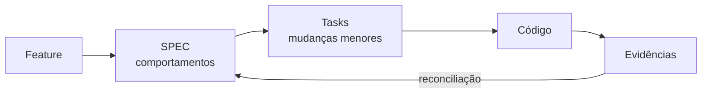
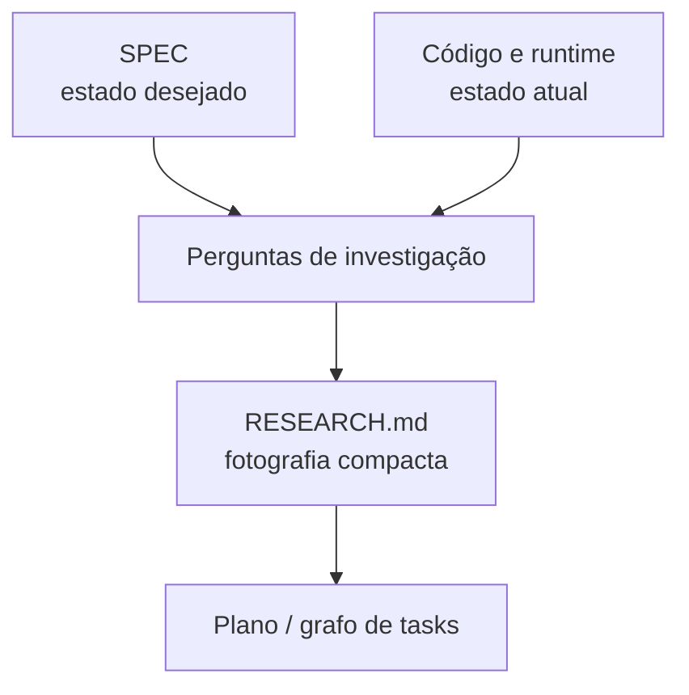
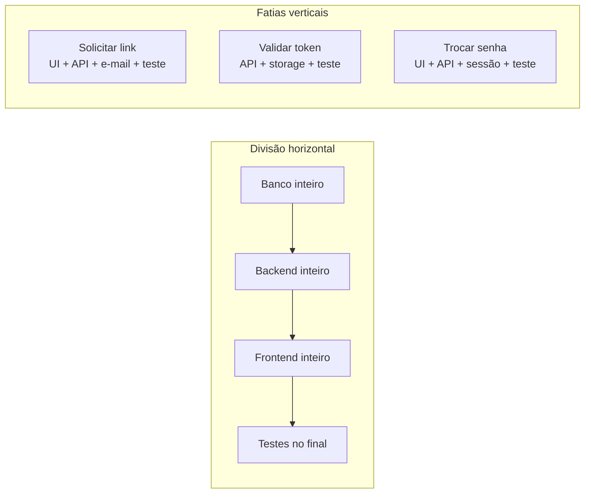
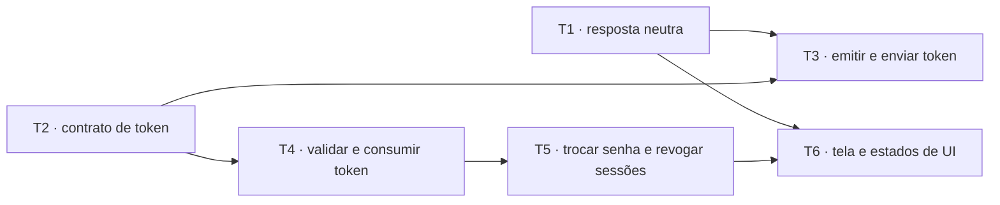

# Parte 3 — Especificação e planejamento

## Capítulo 5 — SPEC como contrato de comportamento

### A dor: “implemente recuperação de senha”

A frase parece uma tarefa, mas esconde decisões:

- Devemos revelar se o e-mail existe?
- Por quanto tempo o token vale?
- Um token pode ser usado duas vezes?
- O que acontece com sessões já abertas?
- Qual mensagem o usuário verá?

Começar pelo código transfere essas decisões silenciosamente para quem estiver implementando —
humano ou agente.

### O que é SDD

**Spec-Driven Development — SDD** (desenvolvimento orientado por especificação) usa uma
especificação como âncora do ciclo de mudança. A SPEC descreve comportamentos observáveis antes de
decidirmos todos os detalhes de implementação.



### SPEC, design, plano e task

| Artefato | Pergunta principal | Evita |
|---|---|---|
| SPEC | Que comportamento deve ser verdadeiro? | Solução correta para o problema errado |
| Design | Qual estratégia técnica adotaremos e por quê? | Decisões arquiteturais implícitas |
| Plano | Em que sequência chegaremos ao resultado? | Trabalho desordenado |
| Task | Qual mudança verificável faremos agora? | Unidades grandes e vagas |

Esses artefatos não precisam ser quatro arquivos em toda mudança. Uma alteração pequena pode ter
uma SPEC curta e uma task. A distinção conceitual importa mais que a quantidade de Markdown.

### Uma SPEC comportamental

```markdown
# Recuperação de senha

## Solicitar recuperação

- Dado um e-mail válido, a API sempre responde com uma mensagem neutra.
- Se a conta existir, um link de uso único é enviado.
- A resposta não revela se o e-mail pertence a uma conta.

## Redefinir senha

- O token expira 15 minutos após a emissão.
- Um token usado ou expirado não altera a senha.
- Ao trocar a senha, todas as sessões anteriores são revogadas.

## Fora do escopo

- Recuperação por SMS.
- Alteração do provedor de e-mail.
```

Ela descreve o que pode ser observado. Não obriga `Redis`, tabela SQL, JWT ou uma classe
`PasswordResetService`.

### Critério de aceitação não é validação

- **Critério de aceitação:** resultado observável necessário.
- **Validação:** mecanismo usado para produzir evidência desse resultado.

```text
Critério: token usado não altera a senha novamente.
Validação: teste de integração que envia duas requisições com o mesmo token.
```

Misturar os dois amarra a SPEC a uma ferramenta. Separá-los preserva o contrato e permite que os
sensores evoluam.

### Armadilha: SPEC como código em prosa

“Crie `TokenRepository`, depois `ResetService`, depois uma rota” é plano de implementação. Pode ser
útil, mas não substitui a explicação do comportamento desejado.

### Perguntas de revisão

1. Que decisão indevida o agente poderia tomar ao receber apenas “faça recuperação de senha”?
2. Qual é a diferença entre SPEC e design?
3. Transforme “crie uma tabela de tokens” em um comportamento observável.
4. Escreva um critério de aceitação e uma validação correspondente.

---

## Capítulo 6 — Research: descobrir antes de decidir

### A dor: planejar sobre um sistema imaginário

Uma SPEC define o destino. Ela não explica automaticamente a estrada atual. Em um projeto
brownfield, o agente precisa investigar como autenticação, e-mail, sessões e testes funcionam hoje.

**Research** (pesquisa) é a fase que reduz incerteza antes do plano.



### O que Research não é

- Não é conhecer o repositório inteiro.
- Não é copiar todos os arquivos lidos.
- Não é um diário de cada comando executado.
- Não é implementar “só uma pequena parte” durante a investigação.

> `RESEARCH.md` não é o diário da expedição; é o mapa produzido depois dela.

### Perguntas que dirigem a pesquisa

Para recuperação de senha:

1. Como usuários são identificados?
2. Como segredos são armazenados?
3. Como e-mails transacionais são enviados?
4. Como sessões são emitidas e revogadas?
5. Que padrão de endpoint e erro já existe?
6. Que testes demonstram os fluxos atuais?
7. Há decisões arquiteturais ou requisitos de segurança relevantes?

Perguntas delimitam melhor a exploração do que “estude o módulo de autenticação”.

### Um Research compacto

```markdown
# Research — recuperação de senha

## Contexto durável relevante

- `ADR-004`: sessões ficam no banco e podem ser revogadas por usuário.
- `SPEC-auth §2`: respostas de recuperação não revelam existência da conta.

## Implementação atual

- `AuthService` já centraliza hash e validação de senha.
- `EmailGateway` possui template de confirmação, mas não de recuperação.
- Não existe armazenamento para tokens de uso único.

## Restrições

- Rotas HTTP não acessam repositórios diretamente.
- Testes de integração usam relógio injetável.

## Questões abertas

- Revogar todas as sessões ou apenas as anteriores à troca?

## Símbolos relevantes

- `AuthService.changePassword`
- `SessionRepository.revokeByUser`
- `EmailGateway.send`
```

### Fato, inferência e pergunta

Marque a natureza das descobertas:

- **Fato:** confirmado por código, teste ou execução.
- **Inferência:** interpretação plausível que ainda precisa ser validada.
- **Pergunta:** decisão ou informação ausente.

Essa separação evita que a compressão transforme dúvida em certeza.

### Quando parar

A pesquisa termina quando existe informação suficiente para:

- identificar as superfícies de mudança;
- escolher uma estratégia sem grandes suposições ocultas;
- dividir o trabalho em unidades verificáveis;
- nomear as perguntas que ainda precisam de decisão humana.

O objetivo é reduzir incerteza suficiente para planejar, não eliminar toda incerteza possível.

### Perguntas de revisão

1. Por que SPEC e Research olham em direções diferentes?
2. Qual o risco de registrar todo o histórico de exploração?
3. Transforme “entenda autenticação” em quatro perguntas investigáveis.
4. Quando uma questão aberta deve bloquear o plano?

---

## Capítulo 7 — Fatias verticais e grafo de tarefas

### A dor: banco primeiro, depois backend, depois frontend

Dividir uma feature por camada técnica cria longos períodos sem comportamento completo. O banco
pode estar “pronto”, mas nada de valor ainda pode ser demonstrado.

Uma **vertical slice** (fatia vertical) atravessa apenas as camadas necessárias para produzir uma
nova verdade observável.



### Uma fatia produz uma verdade verificável

Em vez de:

> Criar `TokenRepository`.

Prefira:

> Uma solicitação para conta existente cria um token de recuperação de uso único e agenda o e-mail,
> sem alterar a resposta pública.

A segunda formulação contém valor, limite e evidência possível.

### Critérios de tamanho

Uma task saudável tende a ter:

- **raio de exploração pequeno:** poucos domínios ou padrões desconhecidos;
- **poucas decisões em aberto:** a task executa mais do que inventa;
- **superfície de mudança limitada:** falhas são localizáveis;
- **feedback próximo:** os sensores rodam na mesma unidade;
- **boa recuperação:** outro agente consegue continuar a partir do estado registrado.

### Tracer bullet

Um **tracer bullet** (projétil traçante) é uma implementação fina de ponta a ponta usada para validar
o caminho cedo. Antes de construir todas as variações de recuperação, podemos provar que UI, rota,
serviço, fila de e-mail e teste se conectam com um cenário mínimo.

Ele não é código descartável por definição. É uma primeira fatia integrada que reduz risco.

### Grafo, não apenas lista

Tasks podem depender umas das outras. Um **DAG — Directed Acyclic Graph** (grafo direcionado
acíclico) torna essas dependências explícitas.



T1 e T2 podem ser independentes. T3 precisa das duas. O objetivo não é maximizar paralelismo; é
deixar visível onde o trabalho é realmente independente.

### Cápsula de contexto de uma task

```markdown
# T4 — Validar e consumir token

## Objetivo
Token válido pode ser consumido uma única vez.

## Escopo
- validação de hash e expiração;
- consumo atômico;
- testes de integração.

## Fora do escopo
- tela de nova senha;
- envio de e-mail.

## Dependências
- T2 concluída: contrato e persistência do token.

## Contexto relevante
- `SPEC-password-reset §2`;
- findings R3 e R5 do Research;
- `ADR-006` sobre relógio injetável.

## Critérios de aceitação
- token válido é aceito uma vez;
- token expirado ou reutilizado não produz alteração.

## Validação
- `npm test -- password-reset-token`.
```

### Perguntas de revisão

1. Por que dividir por camada atrasa o feedback integrado?
2. O que torna uma task uma cápsula de contexto?
3. Uma fatia vertical precisa sempre tocar UI, API e banco? Explique.
4. Desenhe um pequeno DAG para uma feature do seu projeto.

[← Parte 2 — Memória](02-memoria.md) · [Próximo: Parte 4 — Contexto →](04-engenharia-de-contexto.md)
