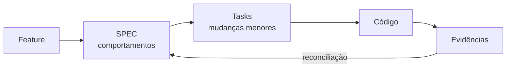
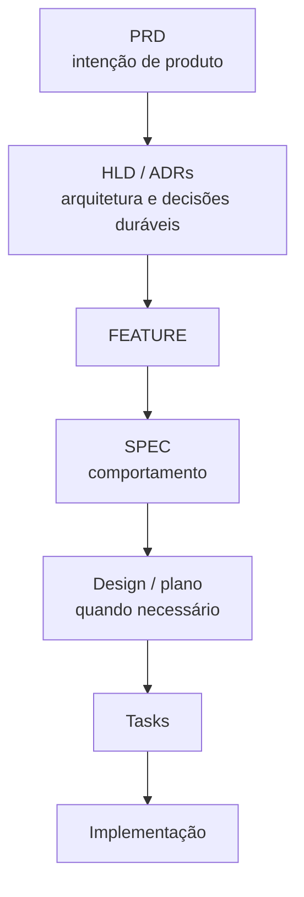
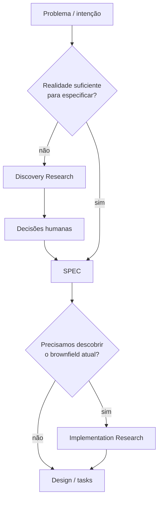
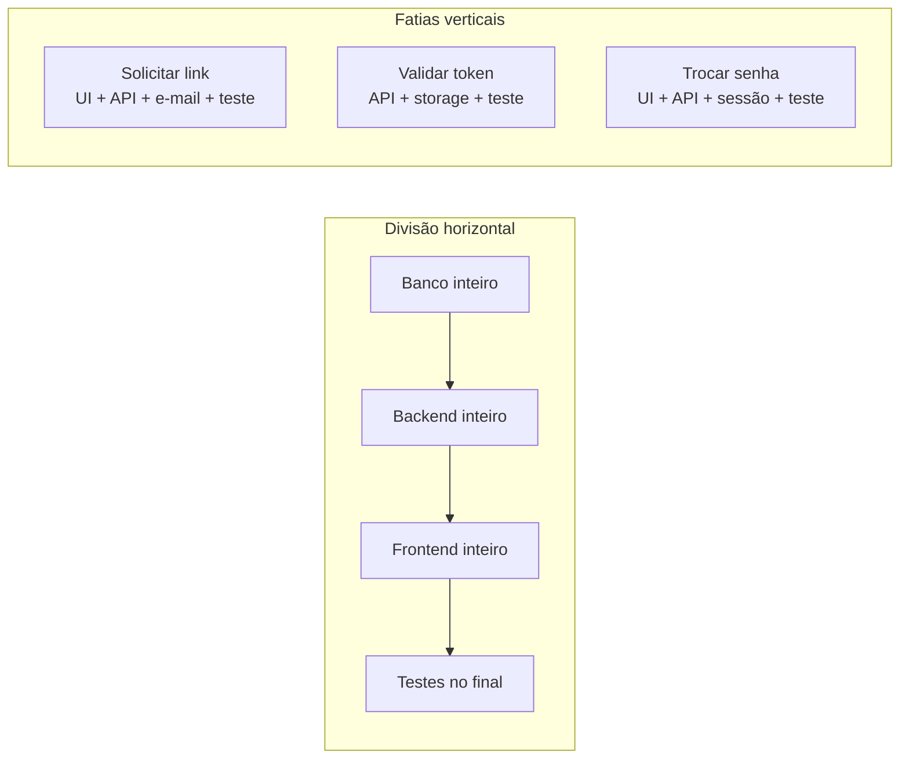
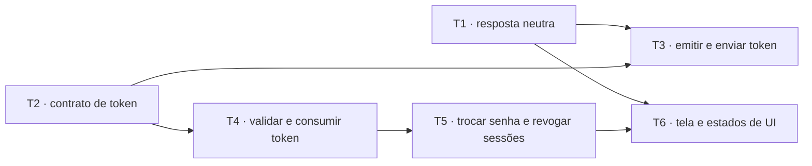
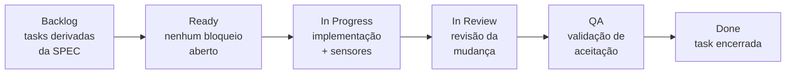

# Parte 4 — Especificação e planejamento

## Capítulo 8 — SPEC como contrato de comportamento

### A dor: “implemente recuperação de senha”

A frase parece uma tarefa, mas esconde decisões:

- Devemos revelar se o e-mail existe?
- Por quanto tempo o token vale?
- Um token pode ser usado duas vezes?
- O que acontece com sessões já abertas?
- Qual mensagem o usuário verá?

Começar pelo código transfere essas decisões silenciosamente para quem estiver implementando —
humano ou agente.

### O que é SDD

**Spec-Driven Development — SDD** (desenvolvimento orientado por especificação) usa uma
especificação como âncora do ciclo de mudança. A SPEC descreve comportamentos observáveis antes de
decidirmos todos os detalhes de implementação.



### Mapa dos artefatos de intenção

Os artefatos formam uma cadeia de refinamento: partem da intenção de produto e chegam a unidades
executáveis. Cada um preserva um tipo diferente de decisão.



Nem toda mudança precisa de todos esses artefatos. Uma correção local pode partir de uma SPEC
existente direto para uma task; uma nova capacidade sistêmica pode exigir PRD, HLD e ADRs. O mapa
mostra responsabilidades, não uma burocracia obrigatória.

Antes de criar qualquer camada, pergunte que problema concreto ela resolve e qual erro ou risco
ficaria mais provável sem ela. Um mapa de responsabilidades possíveis não é um waterfall:

| Situação | Estrutura que pode bastar |
|---|---|
| Mudança pequena e clara | prompt + sensor ou teste |
| Incerteza factual relevante | Research proporcional à dúvida |
| Unidade clara de execução | task |
| Comportamento importante ou ambíguo | SPEC + task + sensores |
| Decisão arquitetural durável | HLD ou ADR, quando o custo da decisão justificar |

### SPEC, design, plano e task

| Artefato | Pergunta principal | Evita |
|---|---|---|
| SPEC | Que comportamento deve ser verdadeiro? | Solução correta para o problema errado |
| Design | Qual estratégia técnica adotaremos e por quê? | Decisões arquiteturais implícitas |
| Plano | Em que sequência chegaremos ao resultado? | Trabalho desordenado |
| Task | Qual mudança verificável faremos agora? | Unidades grandes e vagas |

Esses artefatos não precisam ser quatro arquivos em toda mudança. Uma alteração pequena pode ter
uma SPEC curta e uma task. A distinção conceitual importa mais que a quantidade de Markdown.

### Uma SPEC comportamental

```markdown
# Recuperação de senha

## Solicitar recuperação

- Dado um e-mail válido, a API sempre responde com uma mensagem neutra.
- Se a conta existir, um link de uso único é enviado.
- A resposta não revela se o e-mail pertence a uma conta.

## Redefinir senha

- O token expira 15 minutos após a emissão.
- Um token usado ou expirado não altera a senha.
- Ao trocar a senha, todas as sessões anteriores são revogadas.

## Fora do escopo

- Recuperação por SMS.
- Alteração do provedor de e-mail.
```

Ela descreve o que pode ser observado. Não obriga `Redis`, tabela SQL, JWT ou uma classe
`PasswordResetService`.

### Critério de aceitação não é validação

- **Critério de aceitação:** resultado observável necessário.
- **Validação:** mecanismo usado para produzir evidência desse resultado.

```text
Critério: token usado não altera a senha novamente.
Validação: teste de integração que envia duas requisições com o mesmo token.
```

Misturar os dois amarra a SPEC a uma ferramenta. Separá-los preserva o contrato e permite que os
sensores evoluam.

### Armadilha: SPEC como código em prosa

“Crie `TokenRepository`, depois `ResetService`, depois uma rota” é plano de implementação. Pode ser
útil, mas não substitui a explicação do comportamento desejado.

### SPEC ancora intenção; não representa toda a realidade

Uma SPEC aprovada é fonte de intenção: registra invariantes e comportamentos cuja ambiguidade tem
custo. Código, testes, runtime, dados e evidências mostram a realidade implementada. Por isso,
**spec-anchored é diferente de spec-as-source-of-truth**.

A SPEC não precisa descrever classes, algoritmos, todas as decisões locais ou descobertas que ainda
podem surgir. Ela precisa limitar o que não pode emergir por acidente.

> Software emerge dentro de limites.

```text
INVARIANTES / INTENÇÃO
→ vale tornar explícito antes

DETALHES / DESCOBERTAS
→ podem emergir pela implementação e pelo feedback
```

“O token não pode ser reutilizado” é um invariante. A abstração interna usada para persistir o hash
do token pode emergir durante a implementação, desde que respeite o contrato e os sensores.

### Perguntas de revisão

1. Que decisão indevida o agente poderia tomar ao receber apenas “faça recuperação de senha”?
2. Qual é a diferença entre SPEC e design?
3. Transforme “crie uma tabela de tokens” em um comportamento observável.
4. Escreva um critério de aceitação e uma validação correspondente.

---

## Capítulo 9 — Research antes e depois da SPEC

### A dor: tratar duas pesquisas diferentes como uma só

Algumas mudanças chegam com comportamento claro, mas sem conhecimento do código atual. Outras
chegam com a própria realidade desconhecida: antes de escrever uma SPEC, precisamos descobrir o que
os dados, usuários ou integrações realmente permitem afirmar.

**Research** (pesquisa) é investigação delimitada para reduzir incerteza. Sua posição depende da
pergunta que ainda não conseguimos responder.

Investigar não obriga a criar `RESEARCH.md`. Uma consulta curta pode ficar na própria task. Um
artefato separado vale o custo quando a investigação é extensa, precisa de revisão ou handoff, ou
será reutilizada por decisões posteriores. Pergunte quem usará a saída e qual erro ela ajudará a
evitar.

| Tipo | Quando entra | Pergunta central | Saída |
|---|---|---|---|
| **Discovery Research** | antes da SPEC | Conhecemos a realidade suficiente para decidir o comportamento? | fatos, probes, lacunas e decisões humanas |
| **Implementation/Brownfield Research** | depois da SPEC | Como o sistema atual funciona e onde a mudança deve entrar? | superfícies, restrições e base para design/tasks |



No caso de recuperação de senha, já sabemos o comportamento desejado; pesquisamos depois da SPEC
para localizar a mudança no brownfield. No caso Data Foundation, dados brutos desconhecidos exigem
Discovery Research e probes antes de decisões humanas e da SPEC.

### O que Research não é

- Não é conhecer o repositório inteiro.
- Não é copiar todos os arquivos lidos.
- Não é um diário de cada comando executado.
- Não é implementar “só uma pequena parte” durante a investigação.

> `RESEARCH.md` não é o diário da expedição; é o mapa produzido depois dela.

### Perguntas que dirigem a pesquisa

Para o Implementation Research de recuperação de senha:

1. Como usuários são identificados?
2. Como segredos são armazenados?
3. Como e-mails transacionais são enviados?
4. Como sessões são emitidas e revogadas?
5. Que padrão de endpoint e erro já existe?
6. Que testes demonstram os fluxos atuais?
7. Há decisões arquiteturais ou requisitos de segurança relevantes?

Perguntas delimitam melhor a exploração do que “estude o módulo de autenticação”.

### Um Research compacto

```markdown
# Research — recuperação de senha

## Contexto durável relevante

- `ADR-004`: sessões ficam no banco e podem ser revogadas por usuário.
- `SPEC-auth §2`: respostas de recuperação não revelam existência da conta.

## Implementação atual

- `AuthService` já centraliza hash e validação de senha.
- `EmailGateway` possui template de confirmação, mas não de recuperação.
- Não existe armazenamento para tokens de uso único.

## Restrições

- Rotas HTTP não acessam repositórios diretamente.
- Testes de integração usam relógio injetável.

## Questões abertas

- Revogar todas as sessões ou apenas as anteriores à troca?

## Símbolos relevantes

- `AuthService.changePassword`
- `SessionRepository.revokeByUser`
- `EmailGateway.send`
```

### Fato, inferência e pergunta

Marque a natureza das descobertas:

- **Fato:** confirmado por código, teste ou execução.
- **Inferência:** interpretação plausível que ainda precisa ser validada.
- **Pergunta:** decisão ou informação ausente.

Essa separação evita que a compressão transforme dúvida em certeza.

### Quando parar

A pesquisa termina quando existe informação suficiente para:

- identificar as superfícies de mudança;
- escolher uma estratégia sem grandes suposições ocultas;
- dividir o trabalho em unidades verificáveis;
- nomear as perguntas que ainda precisam de decisão humana.

O objetivo é reduzir incerteza suficiente para planejar, não eliminar toda incerteza possível.

No Discovery Research, o ponto de parada é um pouco anterior: existe evidência suficiente para o
humano decidir a semântica e escrever uma SPEC sem transformar acidentes dos dados atuais em
requisitos.

### Perguntas de revisão

1. Quando Research deve vir antes da SPEC e quando deve vir depois?
2. Qual o risco de registrar todo o histórico de exploração?
3. Transforme “entenda autenticação” em quatro perguntas investigáveis.
4. Quando uma questão aberta deve bloquear o plano?

---

## Capítulo 10 — Fatias verticais e grafo de tarefas

### A dor: banco primeiro, depois backend, depois frontend

Dividir uma feature por camada técnica cria longos períodos sem comportamento completo. O banco
pode estar “pronto”, mas nada de valor ainda pode ser demonstrado.

Uma **vertical slice** (fatia vertical) atravessa apenas as camadas necessárias para produzir uma
nova verdade observável.



### Uma fatia produz uma verdade verificável

Em vez de:

> Criar `TokenRepository`.

Prefira:

> Uma solicitação para conta existente cria um token de recuperação de uso único e agenda o e-mail,
> sem alterar a resposta pública.

A segunda formulação contém valor, limite e evidência possível.

### Critérios de tamanho

Uma task saudável tende a ter:

- **raio de exploração pequeno:** poucos domínios ou padrões desconhecidos;
- **poucas decisões em aberto:** a task executa mais do que inventa;
- **superfície de mudança limitada:** falhas são localizáveis;
- **feedback próximo:** os sensores rodam na mesma unidade;
- **boa recuperação:** outro agente consegue continuar a partir do estado registrado.

### Tracer bullet

Um **tracer bullet** (projétil traçante) é uma implementação fina de ponta a ponta usada para validar
o caminho cedo. Antes de construir todas as variações de recuperação, podemos provar que UI, rota,
serviço, fila de e-mail e teste se conectam com um cenário mínimo.

Ele não é código descartável por definição. É uma primeira fatia integrada que reduz risco.

### Grafo, não apenas lista

Tasks podem depender umas das outras. Um **DAG — Directed Acyclic Graph** (grafo direcionado
acíclico) torna essas dependências explícitas.

Antes de desenhá-lo, pergunte: existem várias unidades reais de trabalho, com dependências ou
paralelismo útil? Se não, uma única task pequena pode bastar. Grafo, quadro e workflow entram quando
reduzem ambiguidade de dependência, estado ou responsabilidade — não para fazer uma mudança parecer
mais sofisticada.



T1 e T2 podem ser independentes. T3 precisa das duas. O objetivo não é maximizar paralelismo; é
deixar visível onde o trabalho é realmente independente.

### Do grafo ao quadro: o kanban como documento da jornada do trabalho

Uma feature precisa de dois registros de natureza diferente:

- **Destino:** o que deve ser verdade quando terminarmos — a SPEC ou o PRD.
- **Jornada do trabalho:** em que ponto do caminho estamos agora — e isso é **estado**, não
  prosa.

Um plano multi-fase escrito em texto (“fase 1, fase 2, fase 3…”) envelhece no primeiro desvio da
realidade. O **kanban** materializa o DAG como estado vivo: cada task vira um cartão (uma *issue*
no Linear ou no GitHub), cada aresta do grafo vira uma relação de bloqueio, e as colunas registram
onde cada cartão está.



O ganho central: **Ready deixa de ser opinião e vira propriedade derivada**. Um cartão está pronto
quando nenhum bloqueio continua aberto — ninguém precisa reler o plano para saber o que pode
começar, e duas tasks Ready que não disputam os mesmos arquivos podem rodar em paralelo.

### Ready é uma propriedade, não uma opinião

“Está pronta para começar?” costuma ser respondida por sensação. O quadro permite substituir a
sensação por uma lista fechada. Uma task entra em `Ready` somente quando:

- não possui relação `blocked by` aberta;
- não depende de decisão humana ainda não tomada;
- possui objetivo, escopo e fora do escopo;
- possui critérios de aceitação falsificáveis;
- informa a validação planejada;
- aponta o contexto que já existe;
- define a autoridade do agente — executar, propor ou escalar
  ([Capítulo 16](06-autonomia-e-coordenacao.md#capítulo-16--orçamento-de-atenção-humana));
- se marcada `AFK`, não esconde nenhum julgamento humano.

Uma dependência importante deve aparecer como bloqueio, não apenas como texto no corpo do cartão.
Quando o bloqueador termina, reavalie as demais condições antes de mover a task.

```markdown
## Ready Gate — <data>

- [ ] sem `blocked by` aberto
- [ ] objetivo observável
- [ ] escopo e fora do escopo
- [ ] critérios falsificáveis
- [ ] validação planejada
- [ ] hipótese de sensor
- [ ] contexto suficiente e limitado
- [ ] autoridade definida
- [ ] nenhuma decisão humana escondida em AFK

Resultado: READY | NOT READY
Lacunas: <somente fatos concretos>
```

```text
Audite <ISSUE-ID> para Ready, sem implementar e sem alterar o quadro.

Verifique bloqueadores, objetivo, escopo, fora do escopo, critérios, validação,
hipótese de sensor, contexto e autoridade. Se houver label AFK, procure
julgamento humano escondido. Responda READY ou NOT READY e liste apenas as
lacunas concretas.
```

Se o resultado for `NOT READY`, corrija o contrato ou a dependência. A reação a evitar é
“experimente começar para descobrir” — começar uma task para descobrir sua intenção transfere a
decisão de escopo para dentro da implementação, que é exatamente o que o contrato deveria impedir.

Repare ainda que `READY` e “começar agora” são coisas diferentes. Ready é uma propriedade do
cartão; a seleção depende também de quanto trabalho já está em andamento.

### QA demonstra o contrato, não repete os testes

A coluna `QA` costuma virar carimbo: “os testes passaram, então passou”. Mas testes verdes provam
que o que foi escrito funciona, não que os critérios de aceitação são verdadeiros no resultado
integrado. São perguntas diferentes.

```markdown
## QA — <ISSUE-ID>

### Resultado sob teste
- Commit ou PR integrado:
- Ambiente, configuração e dados:
- Pré-condições:

### Matriz de aceitação
| Critério | Demonstração | Evidência observada | Resultado |
|---|---|---|---|
| | | | PASS / FAIL / NOT PROVEN |

### Sensores executados
| Sensor | Resultado | Referência |
|---|---|---|

### Testes negativos e efeitos proibidos
| Cenário | Resultado esperado | Observado |
|---|---|---|

### Julgamentos humanos
| Questão | Decisor | Decisão | Motivo |
|---|---|---|---|

### Resultado final
PASS | FAIL | NOT PROVEN

### Lacunas
- <lacuna objetiva e retorno necessário>
```

O terceiro veredito é o que faz esse instrumento valer o custo. `NOT PROVEN` não é uma falha: é a
afirmação honesta de que o critério não foi demonstrado — porque faltou ambiente, dado ou cenário.
Sem essa opção, tudo que não falhou vira `PASS`, e a diferença entre “provamos” e “não vimos
quebrar” desaparece silenciosamente do registro.

Duas regras completam o instrumento: a existência de um teste não é demonstração, e não se corrige
nada durante o QA. Corrigir durante a validação mistura de novo os papéis de quem implementa e de
quem prova.

### O quadro é um ponto de revisão barato

Depois da SPEC, revisar a divisão proposta custa minutos e tem alta alavancagem: olhando o quadro
recém-criado, um humano percebe rapidamente uma task grande demais, uma dependência esquecida ou
uma fatia horizontal disfarçada. É muito mais barato corrigir o grafo do que corrigir a
implementação que ele produziria.

Dois rótulos ajudam nessa leitura, vindos do workshop de Matt Pocock:

- **AFK** (*away from keyboard*): task bem contratada que um agente executa sem supervisão
  contínua;
- **human in the loop**: task que exige presença humana — alinhamento, decisão, aceitação.

Com eles, o humano varre o quadro procurando apenas o que **só ele** pode destravar.

> **Armadilha:** o quadro é memória de orquestração, não de conhecimento. Decisões duráveis
> continuam sendo promovidas para SPEC, ADR e documentos; o cartão arquivado guarda a história da
> execução.

O [manual estado da arte](09-estado-da-arte.md) mostra o mapeamento completo entre colunas e etapas
do ciclo — incluindo onde entram QA, code review e o cartão de fechamento da feature.

### Cápsula de contexto de uma task

```markdown
# T4 — Validar e consumir token

## Objetivo
Token válido pode ser consumido uma única vez.

## Escopo
- validação de hash e expiração;
- consumo atômico;
- testes de integração.

## Fora do escopo
- tela de nova senha;
- envio de e-mail.

## Dependências
- T2 concluída: contrato e persistência do token.

## Contexto relevante
- `SPEC-password-reset §2`;
- findings R3 e R5 do Research;
- `ADR-006` sobre relógio injetável.

## Critérios de aceitação
- token válido é aceito uma vez;
- token expirado ou reutilizado não produz alteração.

## Validação
- `npm test -- password-reset-token`.
```

### Perguntas de revisão

1. Por que dividir por camada atrasa o feedback integrado?
2. O que torna uma task uma cápsula de contexto?
3. Uma fatia vertical precisa sempre tocar UI, API e banco? Explique.
4. Desenhe um pequeno DAG para uma feature do seu projeto.
5. Monte o quadro desse DAG: quais tasks nascem Ready? Quais são AFK e quais exigem humano?

[← Parte 3 — Do problema à capacidade](02b-do-problema-a-capacidade.md) ·
[Próximo: Parte 5 — Contexto →](04-engenharia-de-contexto.md)
