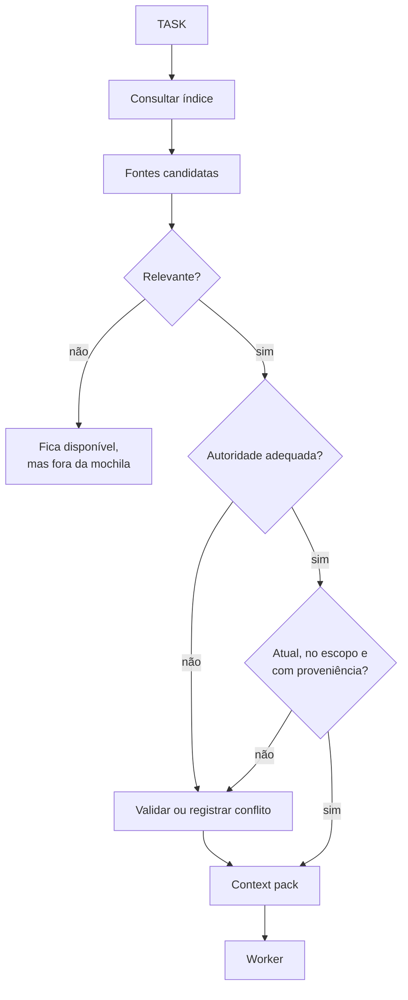
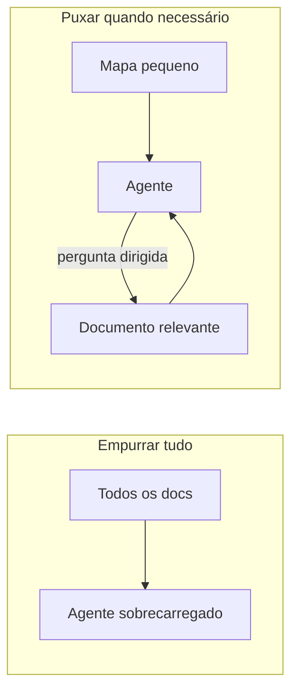
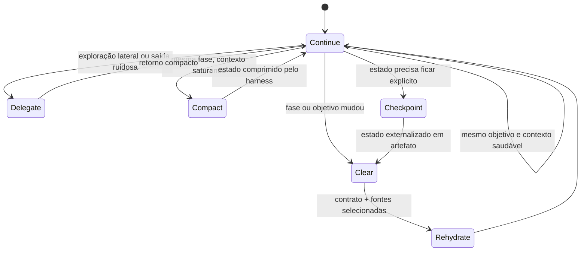
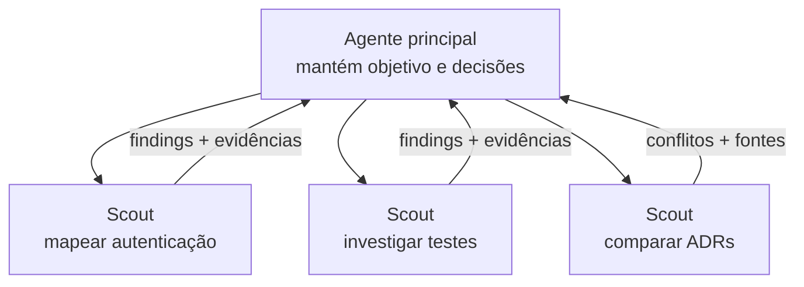

# Parte 4 — Engenharia de contexto operacional

## Capítulo 8 — Montagem do contexto

### A dor: tudo está documentado, mas nada é encontrado

Boa documentação resolve o problema de disponibilidade. Não resolve automaticamente o problema de
seleção. Para cada task, ainda precisamos decidir o que entra na “mochila”.

**Context assembly** (montagem do contexto) é o processo de selecionar, validar, comprimir e
apresentar a informação necessária para um agente cumprir um objetivo.



### Contexto em camadas

Uma forma prática de pensar:

| Camada | Conteúdo | Exemplo |
|---|---|---|
| L0 — Orientação | Identidade do projeto e regras globais | `AGENTS.md` |
| L1 — Contrato da task | Objetivo, escopo, critérios e validação | `TASK-004.md` |
| L2 — Memória selecionada | Trechos relevantes de SPEC, ADR e Research | links ou resumo |
| L3 — Descoberta em runtime | Código, logs e resultados encontrados durante a execução | buscas e testes |

As camadas superiores são pequenas e deliberadas. A última cresce durante o trabalho e precisa de
higiene.

### Context pack

Um **context pack** (pacote de contexto) não precisa ser um arquivo obrigatório. É o conjunto lógico
que responde:

- Qual é o objetivo?
- O que está dentro e fora do escopo?
- Quais decisões já foram tomadas?
- Que descobertas atuais importam?
- Onde está o código relevante?
- Que sinais provarão sucesso?
- O que ainda está incerto?

Ele deve ser **suficiente**, não completo.

Ao validar as fontes do pack, use os quatro eixos do Capítulo 4: autoridade, atualidade, escopo e
proveniência. Depois aplique relevância para decidir o que realmente entra na mochila.

### Copiar ou referenciar?

Copie para a task quando a informação for curta, crítica e necessária para interpretar o contrato.
Referencie quando for extensa, canônica ou puder mudar independentemente.

| Copiar | Referenciar |
|---|---|
| Um critério de aceitação central | A SPEC completa |
| Uma restrição de uma frase | Um ADR com contexto e consequências |
| Um finding específico do Research | Todo o arquivo de pesquisa |
| Um comando de validação | Um guia grande de testes |

A referência preserva a fonte. A cópia reduz navegação. O equilíbrio depende do custo de perder a
informação versus o custo de carregar ruído.

### Filtro de relevância

Para cada fonte, pergunte:

> Se eu remover isto, alguma decisão ou validação da task pode mudar?

Se não, mantenha a fonte disponível, mas fora do contexto inicial.

### Contexto puxado, não empurrado

Em vez de injetar toda documentação no início (**push everything**), ofereça um pequeno mapa e
permita que o agente carregue detalhes quando a tarefa exigir (**pull as needed**).



### Perguntas de revisão

1. Qual é a diferença entre ter uma fonte disponível e carregá-la?
2. O que deve existir num context pack mesmo que ele não vire arquivo?
3. Quando copiar um trecho para a task é melhor do que apenas referenciar?
4. Aplique o filtro de relevância a três documentos do seu projeto.

---

## Capítulo 9 — Ciclo de vida do contexto

### A dor: a conversa não termina quando a fase termina

Depois de uma longa pesquisa, o histórico contém caminhos descartados, grandes saídas de
ferramentas e perguntas já respondidas. Usar a mesma janela para implementar parece conveniente,
mas leva toda a poeira da exploração para uma fase que pede precisão.

O contexto também tem ciclo de vida.

### Cinco decisões



#### Continue — continuar

Use quando o objetivo não mudou, o histórico ainda ajuda e os próximos passos dependem do raciocínio
recente.

#### Delegate — delegar

Use quando uma exploração independente pode gerar muito ruído: analisar logs, mapear um módulo,
comparar alternativas ou executar uma bateria de testes. O agente secundário devolve uma resposta
compacta.

#### Checkpoint — externalizar o estado

Use quando o objetivo continua o mesmo, mas o histórico está pesado. Registre decisões, evidências,
estado, pendências e próximos passos em um **artefato** — um handoff, um Research atualizado, uma
task — e então limpe a janela.

Externalizar não é “resumir tudo por igual”. É escolher o que precisa sobreviver para a próxima
etapa e deixar o resto na história.

#### Compact — continuar a mesma fase com menos contexto

Use quando o objetivo, a autoridade e o tipo de trabalho continuam iguais, mas o histórico está
perto do limite. Um harness que implementa compaction de forma confiável pode preservar estado
relevante e reduzir a quantidade de tokens necessária para continuar. Compaction é mecanismo de
continuidade; não substitui um artefato auditável quando a próxima fase precisa de um contrato claro.

#### Clear — limpar

Use quando a fase ou o objetivo mudou. Research e implementação têm necessidades diferentes. Uma
nova janela pode começar com o Research consolidado, a task e as fontes relevantes — sem toda a
expedição.

### Compaction não substitui uma fronteira de fase

**Compaction** (compactação) reduz o estado da conversa para permitir continuidade. A implementação
depende do harness: pode ser um resumo textual ou uma representação opaca produzida pela própria
plataforma. Ela é útil, sobretudo, em trabalhos longos e tool-heavy que permanecem no mesmo
objetivo.

As fontes defendem ênfases diferentes. Dex Horthy descreve compactação intencional como proteção
do contexto; Matt Pocock prefere retornar a um estado inicial previsível; a documentação da OpenAI
apresenta compaction como recurso para preservar estado com menos contexto em workflows longos. A
reconciliação é separar continuidade de fase de mudança de fase.

A diferença central é esta:

```text
MESMA FASE / MESMO OBJETIVO
contexto saturando
→ compaction pode preservar continuidade

MUDANÇA DE FASE
Research → implementação
→ handoff explícito + clear + rehydrate
```

Uma compaction pode preservar a continuidade muito bem e ainda carregar escolhas que não foram
explicitamente auditadas para a próxima fase. O artefato de handoff tem outra função: selecionar o
estado necessário e expor decisões, evidências, riscos e pendências. Por isso, nas fronteiras de fase,
adotamos o segundo modelo como padrão:

> Não preserve necessariamente a conversa. Preserve o estado necessário para reconstruir a próxima
> conversa.

Isso não torna o livro anti-compaction. Torna o método pró-controle explícito de estado nas
fronteiras em que objetivo, autoridade ou consumidor mudam.

### Reidratação

**Rehydrate** (reidratar) é reconstruir contexto a partir de artefatos confiáveis:

```text
AGENTS + TASK + fontes selecionadas + estado atual do código
```

Se uma task não consegue sobreviver a uma nova janela, talvez seu contrato ou estado estejam
implícitos demais.

### Handoff compacto

Handoff não é transcrição da session nem memória de longo prazo. É um pacote temporário para um
consumidor e uma continuação específicos. Deve poder ser aceito, cancelado, substituído ou expirar;
caso contrário, um estado antigo pode reaparecer como se ainda fosse o próximo passo.

O `ai-memory`, apresentado como estudo de caso no Capítulo 3, ilustra essa diferença: handoffs
automáticos servem à próxima sessão compatível, e um handoff mais novo substitui o anterior daquele
diretório. O valor do exemplo está no lifecycle explícito, não na ferramenta.

Uma passagem de contexto deve conter:

```markdown
## Objetivo
O que estamos tentando concluir.

## Estado
O que foi alterado e o que permanece pendente.

## Decisões
Escolhas já feitas e suas razões essenciais.

## Evidências
Testes executados, resultados e falhas atuais.

## Proveniência
De onde vieram decisões e claims importantes e quando foram verificados.

## Riscos ou questões
O que o próximo agente não deve assumir.

## Próximo passo
A ação concreta recomendada.
```

### Armadilha: preservar a conversa como memória

Uma conversa longa é um bom registro histórico, mas uma fonte ruim para retomar trabalho: mistura
hipóteses, correções, decisões e ruído sem um contrato claro. Artefatos de estado tornam a retomada
mais confiável.

```text
SESSION ≠ HANDOFF ≠ MEMORY ≠ RULE
```

### Perguntas de revisão

1. Qual é a diferença entre compactar a conversa e externalizar o estado em um artefato?
2. Por que mudar de Research para implementação é um bom candidato a `clear`?
3. Que informação não pode faltar num handoff?
4. Por que um handoff precisa poder expirar ou ser substituído?
5. O que uma task que “sobrevive a uma nova janela” revela sobre sua qualidade?
6. Em que situação compaction é legítima e em que situação ela não substitui um handoff?

---

## Capítulo 10 — Subagentes como fronteiras de contexto

### A dor: o agente principal faz todas as explorações

Se o agente principal lê milhares de linhas de logs, estuda três bibliotecas e percorre cinco
módulos, toda essa saída contamina sua janela — mesmo quando a conclusão útil cabe em dez linhas.

Um **subagent** (subagente) pode isolar a exploração e devolver apenas resultados relevantes.

Esse isolamento não é gratuito. Cada subagente introduz novo estado, contrato de comunicação,
custo de contexto, latência, integração de resultados, possibilidade de decisões implícitas
divergirem e novos modos de falha. O benefício precisa compensar esses custos.

### Analogia: executivo e analista

Um executivo não precisa acompanhar cada planilha usada por um analista. Ele precisa receber
conclusões, evidências, riscos e limitações. O trabalho detalhado continua auditável, mas não ocupa a
reunião inteira.



O diagrama mostra uma possibilidade para explorações realmente independentes, não um formato
padrão para toda pesquisa.

### Papel é objetivo, não fantasia

“Você é um especialista brilhante em backend” é menos delimitador do que:

> “Descubra como sessões são revogadas. Não altere arquivos. Retorne símbolos relevantes, evidência
> e questões abertas em até 15 itens.”

Uma missão boa define:

- pergunta;
- escopo;
- ações permitidas;
- formato do retorno;
- evidência esperada;
- condição de parada.

### Scout, worker, reviewer e orchestrator

- **Scout** (explorador): pesquisa uma pergunta e retorna findings compactos.
- **Worker** (executor): assume uma unidade de trabalho e produz alteração verificável.
- **Reviewer** (revisor): procura falhas contra critérios definidos, preferencialmente em contexto
  fresco.
- **Orchestrator** (orquestrador): coordena dependências, estado e handoffs sem precisar ler todos os
  detalhes.

Os nomes importam menos que os contratos.

### Quando não delegar

Delegação tem custo. Não use subagente quando:

- a leitura é curta e diretamente necessária ao raciocínio atual;
- a pergunta depende intensamente do contexto tácito da thread principal;
- explicar a missão e integrar o resultado custa mais que fazer localmente;
- o trabalho toca os mesmos arquivos e decisões de outra execução ativa.

Subagentes tendem a pagar seu custo quando o trabalho é independente, paralelo ou intensivo em
leitura, pode ser descartado depois do retorno e possui fronteiras claras. Não os adicione apenas
porque múltiplos agentes parecem mais avançados.

### Retorno confiável

Um scout não deve devolver apenas “parece tudo certo”. Peça:

```markdown
## Conclusão
Resposta curta à pergunta.

## Evidências
- arquivo/símbolo e por que comprova a conclusão;

## Incertezas
- o que não foi possível confirmar;

## Impacto
- como isso muda o plano ou a task.
```

### Em uma frase

> Subagentes não servem apenas para paralelizar; servem para manter ruído fora do contexto principal.

### Perguntas de revisão

1. Qual é o benefício de um scout mesmo quando não existe paralelismo?
2. Por que perguntas delimitam melhor que personas?
3. Quando o retorno de um subagente é evidência fraca?
4. Escreva uma missão curta para investigar um problema real sem autorizar implementação.

[← Parte 3 — Especificação](03-especificacao-e-planejamento.md) · [Próximo: Parte 5 — Harness →](05-harness.md)
