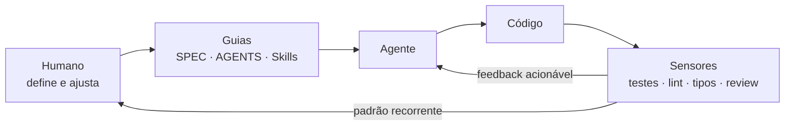
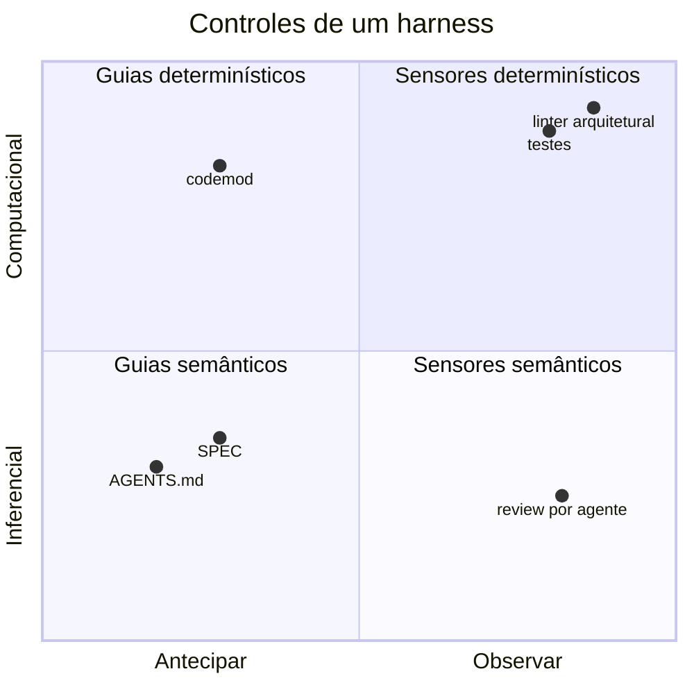
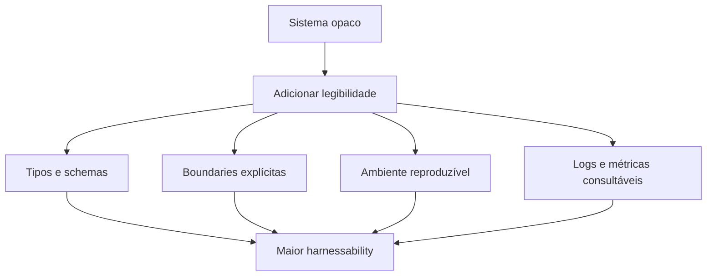
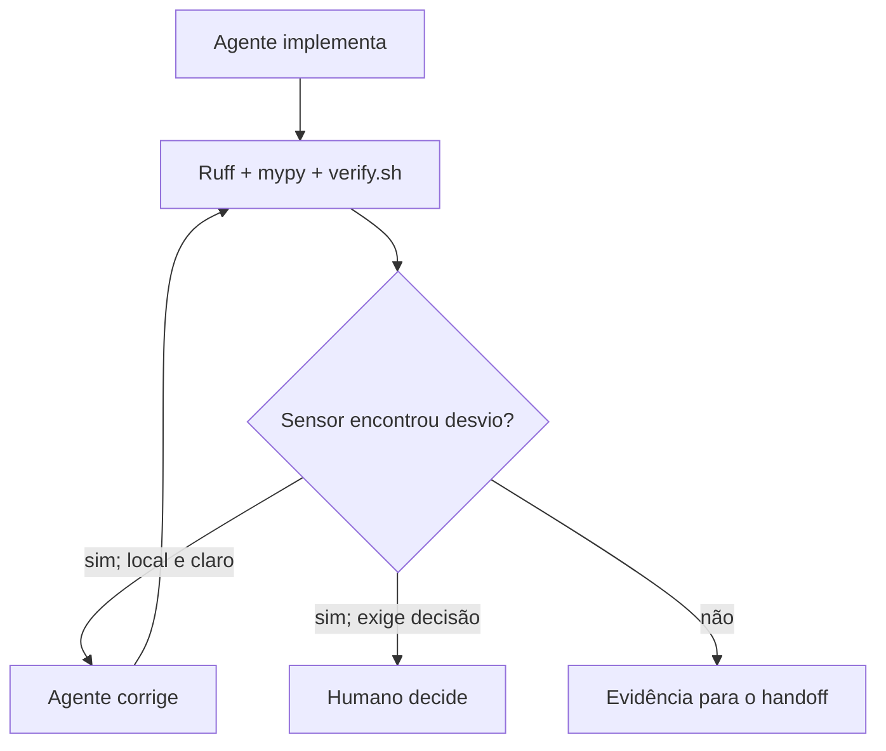
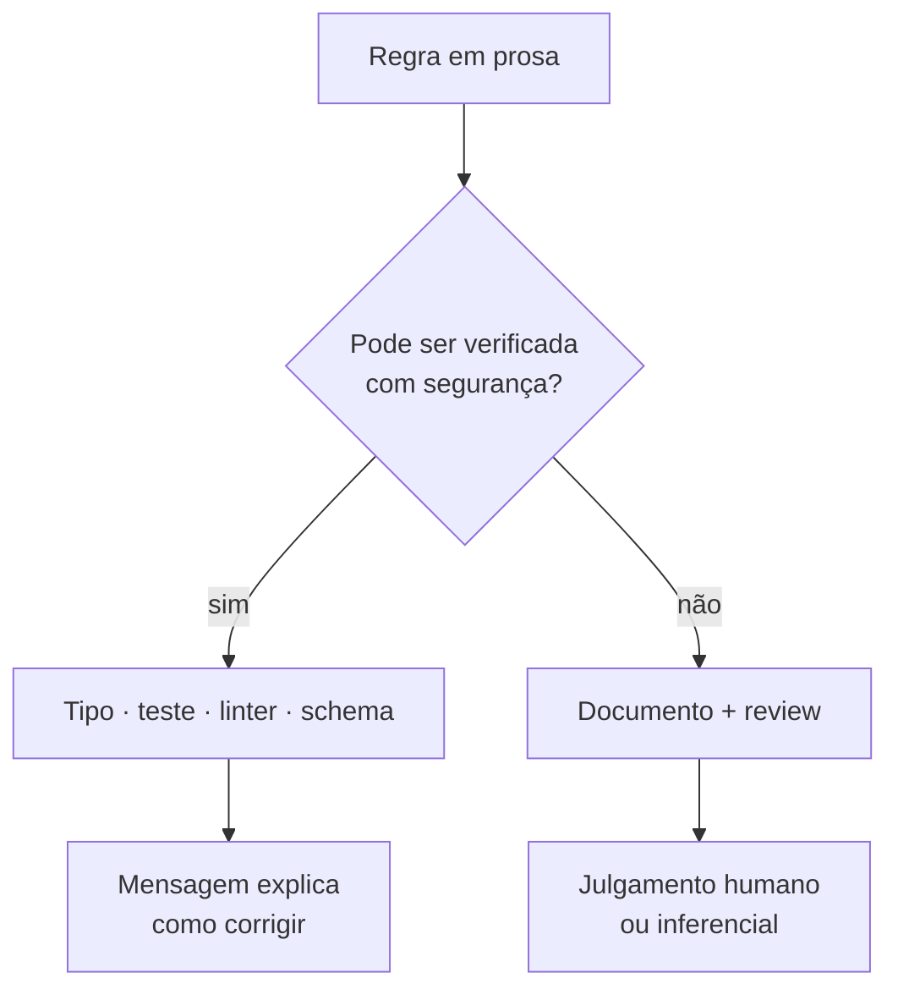
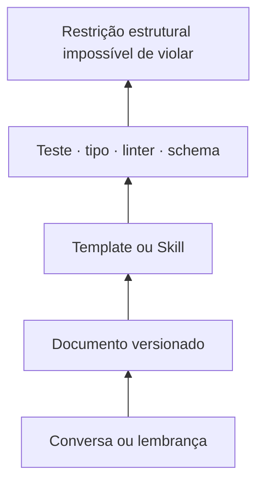

# Parte 5 — Engenharia de harness

## Capítulo 11 — Guias e sensores

### A dor: a instrução existe, mas ninguém sabe se funcionou

Escrever “mantenha a arquitetura limpa” tenta orientar o agente antes da mudança. Porém, após o
código ser produzido, como saber se a direção de dependências foi respeitada?

Um harness saudável combina mecanismos antes e depois da ação.

Harness não é uma disciplina nova que substitui engenharia tradicional. É o ambiente operacional de
ferramentas, contexto, sensores, feedback e limites dentro do qual o agente trabalha. Testes,
integração contínua, tipos, lint, observabilidade e review continuam sendo práticas de engenharia de
software; o harness permite que o agente as encontre, execute e use para se corrigir dentro da
autoridade concedida.

Comece pela ideia simples:

```text
execute → observe → corrija
```

O ciclo `implementar → testar → falhar → corrigir → testar` é um loop clássico de feedback. A
novidade operacional não é o loop: é o agente poder participar dele autonomamente e entregar a
evidência produzida.

### Feedforward e feedback

Na terminologia usada por Birgitta Böckeler:

- **Guides / feedforward controls** (guias ou controles antecipatórios): tentam aumentar a chance de
  um bom resultado antes da ação.
- **Sensors / feedback controls** (sensores ou controles de retorno): observam o resultado e
  produzem feedback; o agente ou o humano decide e executa a correção.



Só feedback faz o agente repetir erros até ser corrigido. Só feedforward cria regras sem mostrar se
elas foram obedecidas. O par forma um ciclo de direção.

### Computacional e inferencial

| Tipo | Característica | Exemplos |
|---|---|---|
| **Computacional** | Determinístico, rápido e barato | testes, typecheck, lint, análise estrutural |
| **Inferencial** | Usa julgamento semântico, mais caro e probabilístico | revisão por LLM, análise de clareza, avaliação de UX |

Use sensores computacionais cedo e com frequência. Reserve julgamento inferencial para aspectos que
não podem ser reduzidos com segurança a uma regra determinística.



### Três dimensões de regulação

1. **Maintainability harness** (harness de manutenibilidade): duplicação, complexidade, cobertura,
   legibilidade e convenções.
2. **Architecture fitness harness** (harness de aptidão arquitetural): limites, dependências,
   desempenho, observabilidade e outras características arquiteturais.
3. **Behaviour harness** (harness de comportamento): o software faz funcionalmente o que usuários e
   negócio precisam?

O terceiro é o mais difícil. Testes gerados pelo mesmo agente que implementou o código podem repetir
o mesmo mal-entendido. SPEC, fixtures aprovadas, testes independentes e validação humana continuam
importantes.

### Harnessability

**Harnessability** é o quanto um sistema permite ser orientado e verificado. Um codebase com tipos
fortes, limites claros, testes rápidos, ambiente reproduzível e boa observabilidade oferece mais
pontos de controle.



O relato da OpenAI exemplifica isso ao tornar aplicação, browser, logs, métricas, linters e testes
diretamente acessíveis ao agente. A autonomia veio da legibilidade e do feedback, não apenas do
modelo.

### Shift left

**Shift left** (deslocar para a esquerda) significa detectar problemas o mais cedo possível no
ciclo. Um linter local em segundos é melhor que uma descoberta no review; um teste de integração no
PR é melhor que um incidente em produção.

Posicione sensores conforme custo e velocidade:

- durante a edição: tipos, lint e testes rápidos;
- antes de integrar: suíte relevante, revisão focada e checks arquiteturais;
- depois de integrar: testes caros, segurança, mutação e sensores contínuos;
- em runtime: erros, latência, SLOs e amostras de qualidade.

### Experimento: Ruff, mypy e `verify.sh`

Um experimento controlado torna a separação entre observar e agir concreta. O projeto possui um
`verify.sh` que executa Ruff e mypy sem opções de correção automática. Introduzimos deliberadamente
um import não usado (`F401`) em um arquivo de teste e executamos o sensor.



O resultado esperado foi:

```text
F401 detectado
→ verify.sh falhou
→ o arquivo permaneceu inalterado
```

Isso demonstra a fronteira. `ruff check` é sensor: aponta o desvio. O agente pode usar a mensagem
para corrigir e executar o sensor novamente. Colocar `ruff check --fix` dentro de `verify.sh`
misturaria feedback e mutação, tornando a evidência menos clara.

### Perguntas de revisão

1. Por que um guide sem sensor é incompleto?
2. Quando uma revisão por LLM é mais adequada que um linter?
3. Por que o behaviour harness é especialmente difícil?
4. Cite duas mudanças que aumentariam a harnessability do seu projeto.
5. Por que o experimento com `F401` precisava verificar também que o arquivo não mudou?

---

## Capítulo 12 — Conhecimento executável

### A dor: pedir para lembrar o que a máquina poderia impedir

Considere a regra:

> “Componentes de UI nunca devem importar repositórios diretamente.”

Ela pode existir apenas num documento. Nesse caso, cada agente e pessoa precisa encontrá-la,
interpretá-la e lembrá-la. Ou pode existir também como uma verificação estrutural que falha com uma
mensagem clara.



### Executável não significa sem explicação

O sensor diz **se** uma regra foi violada. O documento pode explicar **por que** a regra existe, suas
exceções e como evoluí-la.

```text
guia + sensor > guia isolado
```

Precisão não deveria morar somente em prosa. Quando um comportamento estabiliza e pode ser
verificado computacionalmente, promova a parte verificável para teste, tipo, linter, schema ou
validator. Evite repetir a mesma regra em README, SPEC e prompts quando uma fonte canônica e um
sensor podem expressá-la melhor.

Isso não torna testes uma substituição da intenção:

```text
SPEC
→ expressa intenção

TESTE / SENSOR
→ torna parte da intenção executável
```

### Mensagens para autocorreção

Um erro como `ARCH001` é pouco útil. Prefira:

```text
ARCH001: `ui/ResetPasswordForm.tsx` não pode importar `repositories/`.
Componentes de UI chamam serviços de aplicação. Mova o acesso para `application/`
e injete a operação no componente. Veja `docs/architecture/layers.md`.
```

O sensor deixa de apenas rejeitar e passa a orientar a correção.

### Invariantes, não microgerenciamento

Um bom harness protege limites importantes e permite liberdade local.

- Invariante: dados externos são validados na fronteira.
- Microgerenciamento: use exatamente a biblioteca X em toda validação.

A primeira regra descreve uma propriedade do sistema. A segunda pode congelar uma implementação sem
necessidade.

### Pirâmide de força



Subir a pirâmide aumenta consistência, mas também custa. Nem toda preferência merece uma ferramenta.

### ROI do harness

**Harness ROI** (retorno sobre investimento do harness) compara o custo de criar e manter um
controle com o retrabalho ou risco que ele evita.

Invista quando a falha é:

- recorrente;
- cara ou perigosa;
- detectável com confiança;
- comum a muitas tarefas;
- mais barata de prevenir do que revisar repetidamente.

Não crie um linter complexo para um incidente único e improvável. Primeiro corrija o problema,
observe se existe padrão e escolha o controle proporcional.

### Exercício: promova uma regra

Escolha uma instrução real do seu projeto e preencha:

```markdown
Regra:
Por que existe:
Falhas observadas:
Frequência:
Pode ser verificada deterministicamente?
Melhor guide:
Melhor sensor:
Custo de manutenção:
```

### Perguntas de revisão

1. Por que memória executável costuma ser mais forte que prosa?
2. Quando ainda precisamos do documento junto com o sensor?
3. Qual é a diferença entre invariante e preferência de implementação?
4. O que torna um investimento em harness proporcional?

[← Parte 4 — Contexto](04-engenharia-de-contexto.md) · [Próximo: Parte 6 — Autonomia →](06-autonomia-e-coordenacao.md)
