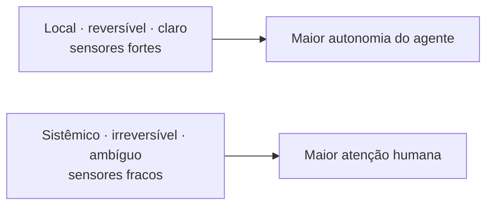
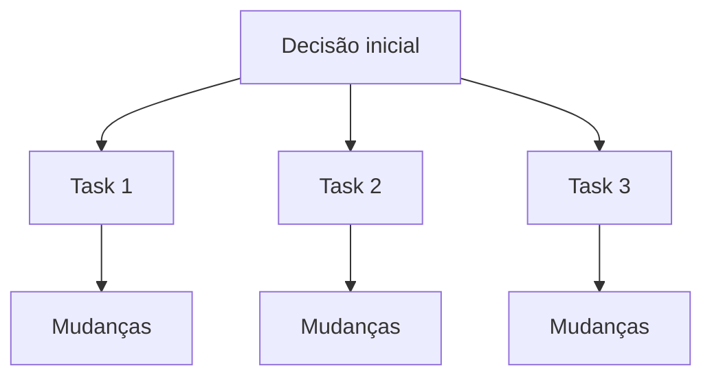
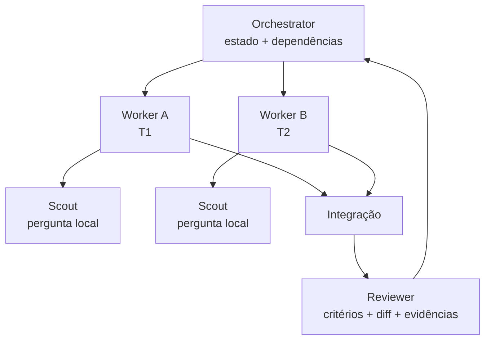
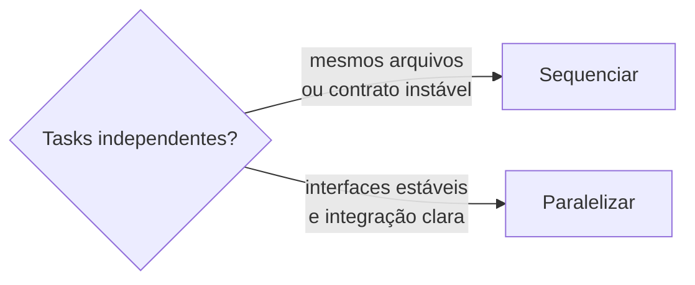
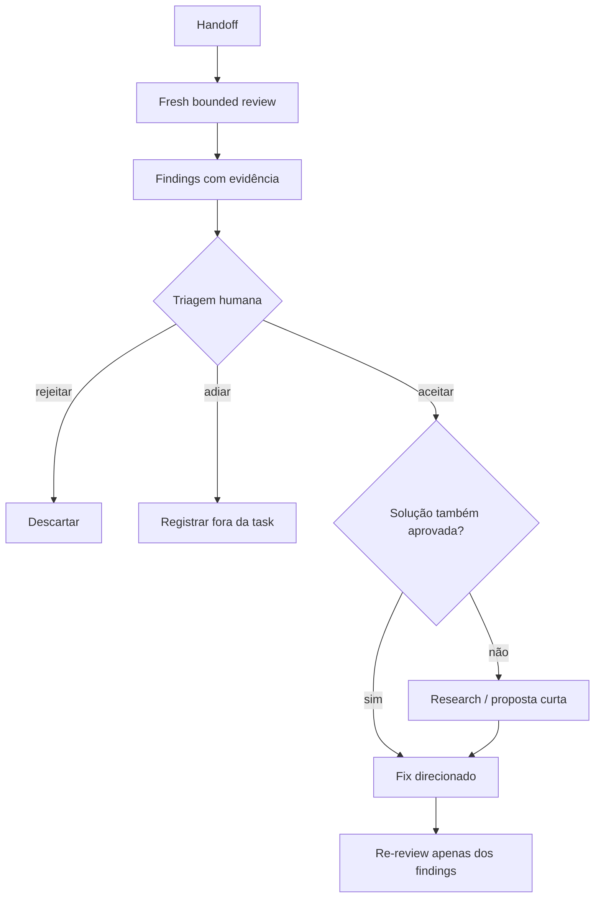

# Parte 6 — Autonomia e coordenação

## Capítulo 13 — Orçamento de atenção humana

### A dor: revisar tudo não escala; não revisar nada não é seguro

Quando agentes produzem alterações mais rápido, a atenção humana vira o recurso mais escasso. A
resposta não é distribuir a mesma quantidade de revisão para toda decisão. É posicionar atenção
onde ela muda mais o resultado.

### Fatores de autonomia

Uma tarefa aceita mais autonomia quando tem:

- baixo **blast radius** (raio de impacto);
- alta reversibilidade;
- pouca ambiguidade;
- bons sensores;
- feedback rápido;
- poucas decisões com efeito sistêmico.



### Execute, propose, escalate

Um modelo simples de autoridade:

| Modo | Significado | Exemplo |
|---|---|---|
| **Execute** (execute) | O agente pode agir e validar. | Corrigir lint em arquivos do escopo. |
| **Propose** (proponha) | O agente prepara uma mudança para aprovação. | Refatorar uma boundary arquitetural. |
| **Escalate** (escale) | O agente para e pede uma decisão. | Escolher comportamento de segurança ausente na SPEC. |

O modo deve ser definido por risco e informação disponível, não por confiança abstrata no modelo.

### Alavancagem da decisão

Uma decisão tem alta alavancagem quando muitas ações posteriores dependem dela. Aprovar a SPEC ou
o plano pode consumir poucos minutos e evitar centenas de linhas de implementação errada.



Por isso, intenção de produto, arquitetura e critérios de aceitação costumam merecer revisão humana
mais cedo. Execução bem delimitada pode ficar mais autônoma.

### Escalonamento de qualidade

Um pedido de ajuda útil traz:

- a decisão necessária;
- por que ela bloqueia o trabalho;
- opções reais;
- consequências conhecidas;
- recomendação, quando existe evidência suficiente;
- caminho reversível, se houver.

“O que você prefere?” transfere trabalho. “A SPEC não define se sessões antigas devem ser revogadas;
as opções A e B têm estes impactos” concentra atenção.

### Humano no loop certo

**Human in the loop** (humano no circuito) não significa aprovar cada comando. Significa manter
intervenção humana nos pontos onde julgamento, responsabilidade e contexto organizacional têm mais
valor.

### Perguntas de revisão

1. Por que revisão uniforme desperdiça atenção?
2. Dê um exemplo de decisão `execute`, `propose` e `escalate`.
3. O que torna uma decisão de alta alavancagem?
4. Como sensores fortes mudam o orçamento de autonomia?

---

## Capítulo 14 — Orquestração de agentes

### A dor: muitos agentes, mais conflitos

Adicionar agentes não divide magicamente um problema. Se todos recebem o mesmo contexto, tomam
decisões sobre os mesmos contratos e editam os mesmos arquivos, aumentamos coordenação e risco de
integração.

**Agent orchestration** (orquestração de agentes) coordena unidades de trabalho, dependências,
autoridade e passagens de estado.

### Analogia: cozinha

Uma cozinha não fica mais rápida apenas colocando dez pessoas diante do mesmo fogão. O serviço
precisa de pedidos claros, estações com responsabilidades, ordem de preparo e um ponto de montagem.

Na prática, esse “painel de comandas” é o quadro kanban apresentado no
[Capítulo 7](03-especificacao-e-planejamento.md#do-grafo-ao-quadro-o-kanban-como-documento-da-jornada):
o estado que o orchestrator coordena — grafo, bloqueios, status e quem está com cada task — já
vive nas issues e colunas de uma ferramenta como o Linear.



### Contrato de handoff

Agentes devem se relacionar como componentes com interfaces claras. Um handoff informa:

- identidade da task;
- resultado produzido;
- arquivos ou artefatos alterados;
- contratos afetados;
- validações executadas;
- falhas e incertezas;
- estado das dependências;
- próximo consumidor.

### Contexto por papel

Não entregue a todos o mesmo pacote:

| Papel | Precisa principalmente de |
|---|---|
| Orchestrator | grafo, status, riscos, contratos de handoff |
| Worker | task, fontes relevantes, código local, sensores |
| Scout | pergunta, escopo de busca, formato de evidência |
| Reviewer | critérios, diff, evidências e fontes de autoridade |

Um reviewer fresco pode perceber problemas que o implementador normalizou. Contexto menor e
independente pode ser uma vantagem.

### Paralelismo saudável

Duas tasks são boas candidatas a paralelo quando:

- não editam os mesmos arquivos centrais;
- não tomam decisões sobre o mesmo contrato ainda instável;
- possuem critérios de aceitação independentes;
- têm uma estratégia de integração conhecida;
- uma não depende do resultado semântico da outra.



> Não maximize o número de agentes. Maximize o trabalho verdadeiramente independente.

### Orquestrador não é onisciente

Ele coordena metadados e exceções. Se precisar absorver todo o raciocínio, logs e código de cada
worker, o contexto central volta a crescer. O objetivo da arquitetura é preservar **information
hiding** (ocultação de informação): cada unidade expõe o necessário para a próxima.

### Falha e recuperação

O contrato também deve dizer o que acontece quando uma task falha:

- Pode repetir automaticamente?
- Precisa de nova pesquisa?
- Que estado parcial é seguro manter?
- A dependência deve ser bloqueada?
- A falha revela uma questão de SPEC ou apenas implementação?

Sem isso, “tente novamente” pode repetir o mesmo erro em escala.

### Fresh Bounded Review

Revisão não concede ao reviewer autoridade ilimitada sobre o repositório. Depois do handoff, um
reviewer em contexto fresco recebe uma fronteira pequena:

```text
TASK
+
CLAIMS DO HANDOFF
+
DIFF
+
CONTEXTO IMEDIATO
```

Seu objetivo é tentar refutar a conclusão de que aquela task terminou corretamente. Ele procura
problemas introduzidos ou agravados pelo diff e violações que impedem os critérios da task. Não faz
uma auditoria aberta do repositório.

Uma heurística útil é perguntar: **se desfizermos somente este diff, o problema desaparece?** Se
não, provavelmente encontramos dívida preexistente, não uma regressão bloqueante da task. A
heurística controla escopo; não substitui julgamento.



Quatro limites preservam a arquitetura de autoridade:

- **dívida preexistente não é regressão:** pode merecer registro, mas não sequestra a task;
- **problema aceito não significa solução aceita:** a recomendação do reviewer ainda pode exigir
  decisão;
- **reviewer não é autoridade:** ele produz findings; a triagem decide aceitar, rejeitar, adiar ou
  escalar;
- **re-review não reabre o universo:** verifica somente se os findings aprovados foram resolvidos.

O fix recebe apenas findings e soluções aprovados. Isso reduz scope creep e impede que uma revisão
probabilística se transforme silenciosamente em novo contrato de produto ou arquitetura.

### Perguntas de revisão

1. Por que dar o mesmo contexto a todos os agentes pode ser ruim?
2. O que um orchestrator deve conhecer — e o que não precisa conhecer?
3. Quais critérios tornam duas tasks realmente paralelizáveis?
4. Por que um reviewer pode se beneficiar de contexto fresco?
5. Por que aceitar um finding não implica aceitar a solução proposta pelo reviewer?

[← Parte 5 — Harness](05-harness.md) · [Próximo: Parte 7 — Aprendizagem →](07-lifecycle-e-aprendizagem.md)
