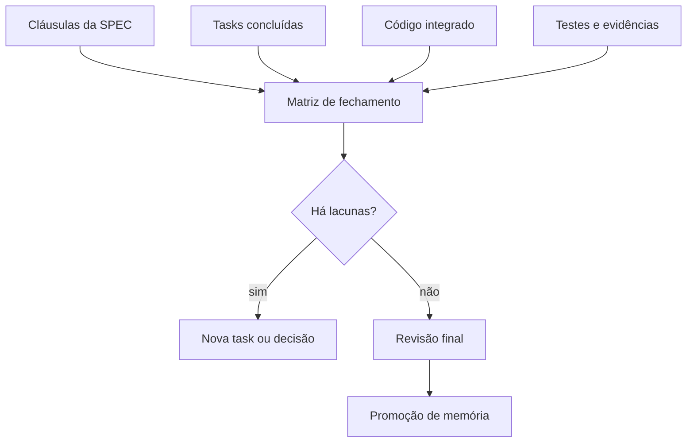
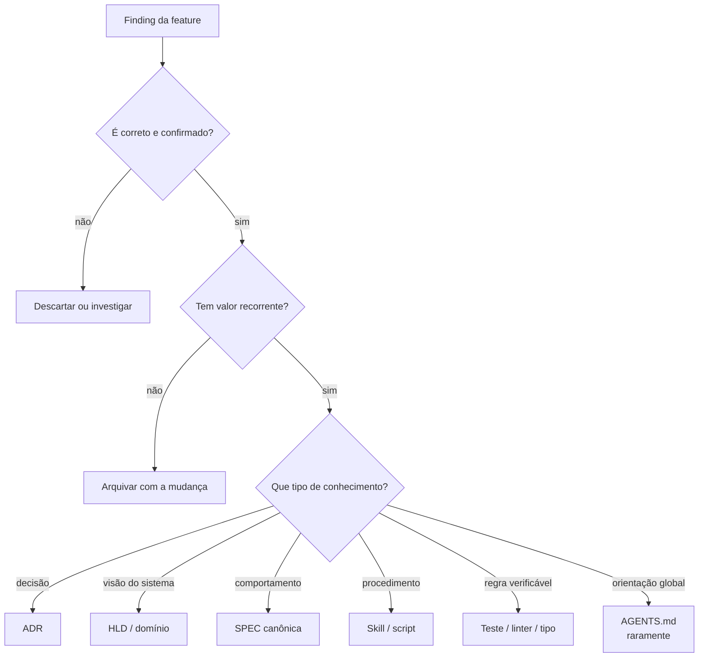
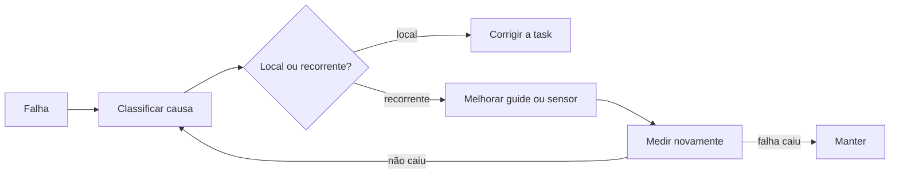
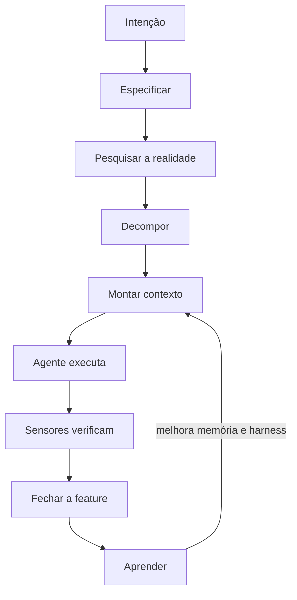

# Parte 7 — Fechamento e aprendizagem

## Capítulo 15 — Quando uma feature está realmente pronta?

### A dor: todas as tasks terminaram, mas o comportamento não fecha

Uma task pode passar em seus testes locais e a feature ainda falhar como conjunto. Talvez a UI use
um contrato antigo, um critério da SPEC não tenha task correspondente ou a integração revele uma
lacuna.

```text
TASK DONE ≠ FEATURE DONE
```

### Feature closure

**Feature closure** (fechamento da feature) reconcilia intenção, implementação e evidência antes de
declarar a mudança concluída.



### Matriz de fechamento

| Comportamento | Implementação | Evidência | Estado |
|---|---|---|---|
| Resposta não revela conta | endpoint + serviço | teste de integração com dois e-mails | coberto |
| Token expira em 15 min | validador + relógio | teste de borda em 14:59 e 15:00 | coberto |
| Token é de uso único | consumo atômico | teste concorrente | lacuna |
| Sessões antigas são revogadas | serviço de sessão | teste ponta a ponta | coberto |

A matriz não precisa viver para sempre. Sua função é tornar visível o que ficou sem prova.

### Quatro reconciliações

1. **SPEC ↔ tasks:** toda cláusula relevante foi implementada ou explicitamente adiada?
2. **Tasks ↔ código:** o trabalho registrado corresponde ao diff integrado?
3. **Código ↔ evidência:** há sensores adequados, incluindo integração?
4. **Resultado ↔ intenção:** a experiência resolve o problema original, não apenas os testes?

### Done local e done sistêmico

Um worker pode declarar: “minha task está completa e estes testes passaram”. Apenas o fechamento
sistêmico verifica interfaces entre tasks, comportamento completo e documentação afetada.

### Perguntas de revisão

1. Como todas as tasks podem terminar sem a feature estar pronta?
2. O que uma matriz de fechamento torna visível?
3. Quem deve resolver uma lacuna: o reviewer, um novo worker ou o humano? De que depende?
4. Diferencie evidência local e evidência integrada.

---

## Capítulo 16 — Promoção de memória

### A dor: a feature terminou; o que merece sobreviver?

Durante a implementação surgem fatos, decisões, atalhos, comandos e erros. Preservar tudo produz
entulho. Descartar tudo obriga a equipe a reaprender.

**Memory promotion** (promoção de memória) transforma uma descoberta local em conhecimento durável,
procedural ou executável quando ela possui valor recorrente.

Uma sessão ter produzido uma conclusão não torna essa conclusão verdadeira:

```text
sessão aconteceu
≠
conhecimento verdadeiro
```

Antes de promover, avalie **autoridade**, **atualidade**, **escopo**, **proveniência** e a evidência
que sustenta a descoberta. Uma afirmação plausível de um agente continua sendo hipótese quando não
pode ser ligada a uma decisão autorizada ou observação verificável.

Memory Promotion não é copiar texto da session para um arquivo permanente. É transformar um
registro local em conhecimento reavaliado, com escopo e origem explícitos. O caminho pode ser:

```text
observação da session
→ memória candidata
→ memória confirmada e recuperável
→ regra ou sensor, somente com aprovação adequada
```



### Quando promover para cada lugar

- **ADR:** escolha importante, alternativas reais e consequências duradouras.
- **HLD:** mudança relevante na forma geral do sistema.
- **Documento de domínio:** conceito ou regra de negócio recorrente.
- **SPEC canônica:** comportamento vigente do produto.
- **Skill:** procedimento repetido que pede julgamento e etapas.
- **Script:** procedimento repetido e majoritariamente determinístico.
- **Sensor:** falha verificável que vale impedir ou detectar cedo.
- **`AGENTS.md`:** orientação global, estável e necessária em quase toda tarefa.

### Esquecer deliberadamente

Uma lista de caminhos temporários, uma hipótese descartada ou um detalhe fácil de descobrir não
precisa virar memória. Esquecer também é engenharia de contexto.

**Retenção** é uma política, não a promessa de guardar para sempre. Uma memória pode perder valor
porque envelheceu, deixou de ser acessada, tornou-se barata de redescobrir, saiu do escopo ou foi
substituída. Dependendo do risco, ela pode ser marcada como histórica, ligada à sucessora ou
removida.

Feedback de retrieval também ajuda: uma memória frequentemente recuperada e rejeitada como
desatualizada deve perder prioridade e entrar em revisão, não continuar aparecendo apenas porque já
foi útil.

### Garbage collection documental

Memória saudável precisa de **garbage collection** (coleta de lixo): revisar documentos velhos,
links quebrados, regras duplicadas e decisões substituídas.

Algumas práticas:

- registrar status (`proposto`, `aceito`, `substituído`);
- apontar o documento sucessor em vez de apagar história;
- atribuir responsável e data de verificação quando fizer sentido;
- preservar escopo, proveniência e evidências essenciais junto da memória;
- automatizar links e estruturas verificáveis;
- remover cópias quando existe uma fonte canônica.

### De memória para regra

Uma memória recuperada pode informar uma decisão, mas não governa ações apenas por ter bom ranking,
tag canônica ou longa retenção. Para virar regra, precisa de autoridade humana ou organizacional e
deve ser promovida para a fonte apropriada: `AGENTS.md`, SPEC, ADR, Skill ou sensor. Quando a parte
essencial puder ser verificada computacionalmente, o sensor reduz a dependência de lembrar a prosa.

### Humano na promoção

Alterar memória ou harness tem efeito multiplicador sobre tarefas futuras. O agente pode sugerir a
promoção e até preparar o diff, mas mudanças sistêmicas merecem revisão proporcional ao impacto.

### Perguntas de revisão

1. Por que nem todo finding merece promoção?
2. Quando uma descoberta deveria virar Skill e quando deveria virar sensor?
3. Por que retrieval não concede autoridade para transformar memória em regra?
4. Quando uma memória deveria ser superseded, arquivada ou esquecida?
5. Por que alterações no harness podem ser mais arriscadas que uma mudança local de código?
6. Encontre um documento do seu projeto que precise de coleta de lixo.

---

## Capítulo 17 — Métricas e harness que aprende

### A dor: “parece que melhorou”

Sem observação, a equipe adiciona regras e ferramentas sem saber se reduziram falhas. Métricas devem
ajudar a diagnosticar o sistema, não virar metas isoladas.

### Métricas úteis

| Métrica | Pergunta diagnóstica |
|---|---|
| **First-pass correctness** (acerto na primeira passagem) | Guias e contexto permitem um bom primeiro resultado? |
| **Rework rate** (taxa de retrabalho) | Quanto trabalho precisa ser refeito após review ou integração? |
| **Repeated failure rate** (falhas repetidas) | O harness aprende ou pagamos pelo mesmo erro? |
| **Detection stage** (etapa de detecção) | O problema aparece localmente, no PR ou em produção? |
| **Closure gaps** (lacunas no fechamento) | Tasks e SPEC estão se reconciliando? |
| **Human intervention** (intervenção humana) | Humanos entram em decisões valiosas ou em correções mecânicas? |

### Loop de aprendizagem



### Classifique antes de automatizar

Uma falha pode vir de:

- intenção ambígua;
- contexto ausente ou incorreto;
- pesquisa ruim;
- task grande demais;
- implementação defeituosa;
- sensor ausente;
- sensor ruidoso;
- integração ou handoff falho.

Adicionar uma regra ao `AGENTS.md` para qualquer categoria é um remédio genérico demais.

### Goodhart e métricas

Quando uma medida vira alvo, ela pode deixar de ser boa medida. Maximizar PRs por dia pode produzir
PRs menores sem aumentar valor. Maximizar testes pode gerar testes redundantes.

Use um conjunto balanceado e leia os casos concretos por trás dos números.

### Harness ROI revisitado

Depois de criar um controle:

1. A falha que o motivou diminuiu?
2. O problema passou a ser detectado mais cedo?
3. Surgiram falsos positivos ou atrito?
4. O custo de manutenção continua menor que o retrabalho evitado?
5. O controle ainda protege um risco relevante?
6. Existe um mecanismo mais simples para obter o mesmo resultado?
7. A camada pode ser removida ou fundida sem tornar um erro concreto mais provável?

Sensores, guias e cerimônias também envelhecem. Falsos positivos, tempo de coordenação e documentos
que ninguém consulta consomem o Complexity/Ceremony Budget e devem entrar na avaliação de ROI.

### Síntese do livro



### Perguntas de revisão

1. Por que contar produção não basta para avaliar o sistema?
2. O que uma alta taxa de falhas repetidas indica?
3. Como a etapa de detecção orienta investimento em sensores?
4. Escolha uma falha recente e classifique sua causa antes de propor uma melhoria.

[← Parte 6 — Autonomia](06-autonomia-e-coordenacao.md) · [Próximo: Estudo de caso →](08-estudo-de-caso.md)
