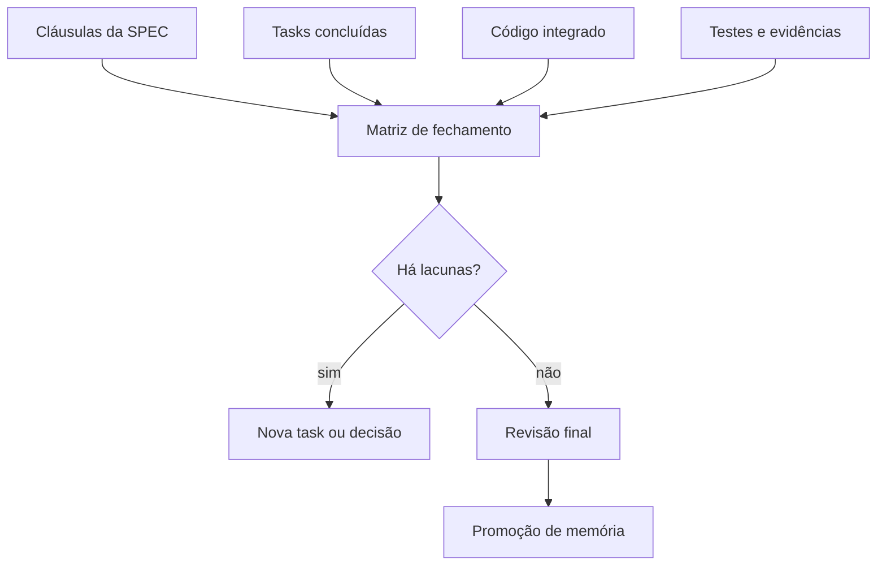
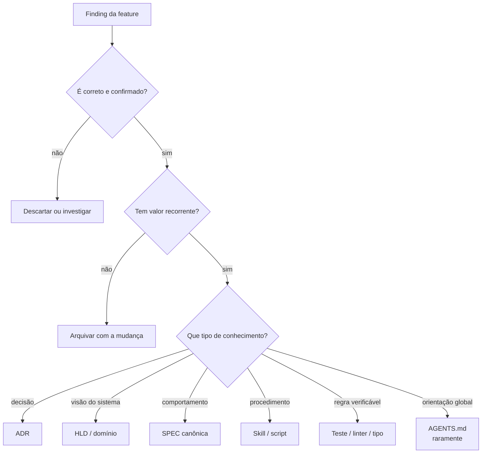
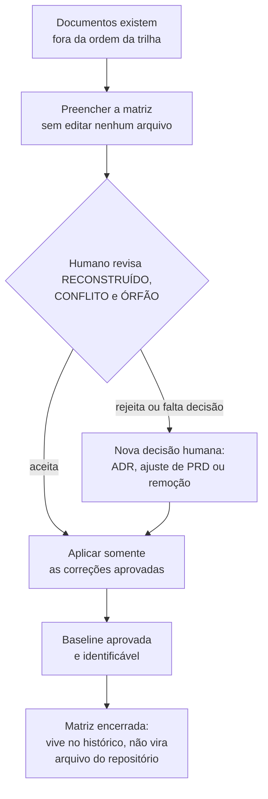
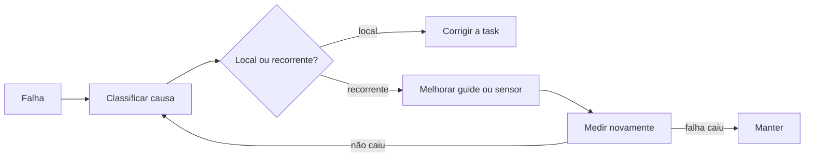
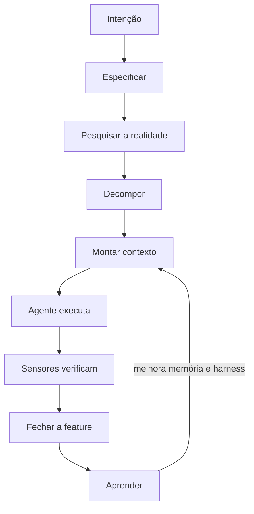

# Parte 8 — Fechamento e aprendizagem

## Capítulo 18 — Quando uma feature está realmente pronta?

### A dor: todas as tasks terminaram, mas o comportamento não fecha

Uma task pode passar em seus testes locais e a feature ainda falhar como conjunto. Talvez a UI use
um contrato antigo, um critério da SPEC não tenha task correspondente ou a integração revele uma
lacuna.

```text
TASK DONE ≠ FEATURE DONE
```

### Feature closure

**Feature closure** (fechamento da feature) reconcilia intenção, implementação e evidência antes de
declarar a mudança concluída.



### Matriz de fechamento

| Comportamento | Implementação | Evidência | Estado |
|---|---|---|---|
| Resposta não revela conta | endpoint + serviço | teste de integração com dois e-mails | coberto |
| Token expira em 15 min | validador + relógio | teste de borda em 14:59 e 15:00 | coberto |
| Token é de uso único | consumo atômico | teste concorrente | lacuna |
| Sessões antigas são revogadas | serviço de sessão | teste ponta a ponta | coberto |

A matriz não precisa viver para sempre. Sua função é tornar visível o que ficou sem prova.

### Quatro reconciliações

1. **SPEC ↔ tasks:** toda cláusula relevante foi implementada ou explicitamente adiada?
2. **Tasks ↔ código:** o trabalho registrado corresponde ao diff integrado?
3. **Código ↔ evidência:** há sensores adequados, incluindo integração?
4. **Resultado ↔ intenção:** a experiência resolve o problema original, não apenas os testes?

### Done local e done sistêmico

Um worker pode declarar: “minha task está completa e estes testes passaram”. Apenas o fechamento
sistêmico verifica interfaces entre tasks, comportamento completo e documentação afetada.

### Perguntas de revisão

1. Como todas as tasks podem terminar sem a feature estar pronta?
2. O que uma matriz de fechamento torna visível?
3. Quem deve resolver uma lacuna: o reviewer, um novo worker ou o humano? De que depende?
4. Diferencie evidência local e evidência integrada.

---

## Capítulo 19 — Promoção de memória

### A dor: a feature terminou; o que merece sobreviver?

Durante a implementação surgem fatos, decisões, atalhos, comandos e erros. Preservar tudo produz
entulho. Descartar tudo obriga a equipe a reaprender.

**Memory promotion** (promoção de memória) transforma uma descoberta local em conhecimento durável,
procedural ou executável quando ela possui valor recorrente.

Uma sessão ter produzido uma conclusão não torna essa conclusão verdadeira:

```text
sessão aconteceu
≠
conhecimento verdadeiro
```

Antes de promover, avalie **autoridade**, **atualidade**, **escopo**, **proveniência** e a evidência
que sustenta a descoberta. Uma afirmação plausível de um agente continua sendo hipótese quando não
pode ser ligada a uma decisão autorizada ou observação verificável.

Memory Promotion não é copiar texto da session para um arquivo permanente. É transformar um
registro local em conhecimento reavaliado, com escopo e origem explícitos. O caminho pode ser:

```text
observação da session
→ memória candidata
→ memória confirmada e recuperável
→ regra ou sensor, somente com aprovação adequada
```



### Quando promover para cada lugar

- **ADR:** escolha importante, alternativas reais e consequências duradouras.
- **HLD:** mudança relevante na forma geral do sistema.
- **Documento de domínio:** conceito ou regra de negócio recorrente.
- **SPEC canônica:** comportamento vigente do produto.
- **Skill:** procedimento repetido que pede julgamento e etapas.
- **Script:** procedimento repetido e majoritariamente determinístico.
- **Sensor:** falha verificável que vale impedir ou detectar cedo.
- **`AGENTS.md`:** orientação global, estável e necessária em quase toda tarefa.

### Esquecer deliberadamente

Uma lista de caminhos temporários, uma hipótese descartada ou um detalhe fácil de descobrir não
precisa virar memória. Esquecer também é engenharia de contexto.

**Retenção** é uma política, não a promessa de guardar para sempre. Uma memória pode perder valor
porque envelheceu, deixou de ser acessada, tornou-se barata de redescobrir, saiu do escopo ou foi
substituída. Dependendo do risco, ela pode ser marcada como histórica, ligada à sucessora ou
removida.

Feedback de retrieval também ajuda: uma memória frequentemente recuperada e rejeitada como
desatualizada deve perder prioridade e entrar em revisão, não continuar aparecendo apenas porque já
foi útil.

### Garbage collection documental

Memória saudável precisa de **garbage collection** (coleta de lixo): revisar documentos velhos,
links quebrados, regras duplicadas e decisões substituídas.

Algumas práticas:

- registrar status (`proposto`, `aceito`, `substituído`);
- apontar o documento sucessor em vez de apagar história;
- atribuir responsável e data de verificação quando fizer sentido;
- preservar escopo, proveniência e evidências essenciais junto da memória;
- automatizar links e estruturas verificáveis;
- remover cópias quando existe uma fonte canônica.

### De memória para regra

Uma memória recuperada pode informar uma decisão, mas não governa ações apenas por ter bom ranking,
tag canônica ou longa retenção. Para virar regra, precisa de autoridade humana ou organizacional e
deve ser promovida para a fonte apropriada: `AGENTS.md`, SPEC, ADR, Skill ou sensor. Quando a parte
essencial puder ser verificada computacionalmente, o sensor reduz a dependência de lembrar a prosa.

### Humano na promoção

Alterar memória ou harness tem efeito multiplicador sobre tarefas futuras. O agente pode sugerir a
promoção e até preparar o diff, mas mudanças sistêmicas merecem revisão proporcional ao impacto.

### Perguntas de revisão

1. Por que nem todo finding merece promoção?
2. Quando uma descoberta deveria virar Skill e quando deveria virar sensor?
3. Por que retrieval não concede autoridade para transformar memória em regra?
4. Quando uma memória deveria ser superseded, arquivada ou esquecida?
5. Por que alterações no harness podem ser mais arriscadas que uma mudança local de código?
6. Encontre um documento do seu projeto que precise de coleta de lixo.

---

## Capítulo 20 — Matriz de reconstrução

### A dor: os documentos existem, mas ninguém sabe de onde vieram

O projeto tem PRD, HLD, dois ADRs e uma SPEC. Parece maduro. Aí alguém pergunta por que o HLD prevê
uma fila de mensagens, e a conversa trava:

- o PRD não menciona nenhum requisito que exija fila;
- o ADR sobre persistência não decide isso;
- quem escreveu o HLD não lembra se foi decisão ou hipótese;
- e três tasks já foram planejadas assumindo que a fila existe.

Essa é a situação normal de qualquer projeto real. A trilha do
[Capítulo 5](02b-do-problema-a-capacidade.md#capítulo-5--os-cinco-níveis-de-decisão) descreve a
ordem em que as decisões **deveriam** nascer. Quase nenhum projeto nasceu nessa ordem. Os documentos
foram escritos em paralelo, sob pressão, por pessoas diferentes, e alguns nasceram depois do código
que deveriam ter guiado.

A reação usual é uma das duas piores possíveis: apagar tudo e recomeçar, ou seguir em frente
fingindo que a cadeia existe.

### Reconstrução retrospectiva de rastreabilidade

Existe uma terceira opção. **Reconstrução retrospectiva de rastreabilidade** é partir do problema e
verificar, elemento por elemento, se cada decisão registrada ainda possui fundamento — sem apagar
nada e sem inventar história.

O objetivo não é fingir que a cadeia existia no passado. É declarar com honestidade:

```text
o que estava registrado na época
+ o que conseguimos reconstruir agora
+ o que ainda não possui justificativa
+ o que precisa de nova decisão humana
```

Este capítulo fica ao lado da [promoção de memória](07-lifecycle-e-aprendizagem.md#capítulo-19--promoção-de-memória)
porque os dois resolvem o mesmo tipo de problema em direções opostas. A promoção pergunta o que
merece sobreviver a partir de agora; a reconstrução pergunta o que já sobreviveu sem justificativa.

### Os cinco estados de uma ligação

Cada ligação entre dois elementos recebe um estado. São cinco, e nenhum deles é “errado”:

| Estado | Significado | Ação |
|---|---|---|
| `CONFIRMADO` | existe fonte ou evidência anterior que sustenta a ligação | preservar e referenciar |
| `RECONSTRUÍDO` | a ligação faz sentido hoje, mas foi explicitada depois | registrar como reconstrução e obter aprovação humana |
| `DESCONHECIDO` | não há evidência suficiente para afirmar o motivo | pesquisar ou manter aberto |
| `CONFLITO` | documentos ou realidade atual se contradizem | pausar o trabalho afetado e decidir |
| `ÓRFÃO` | o elemento não realiza nenhum resultado, capacidade ou decisão aceita | remover, reduzir ou justificar conscientemente |

`RECONSTRUÍDO` é o estado mais importante e o mais fácil de falsificar. Ele não significa falso.
Significa apenas que essa justificativa não pode ser apresentada como a razão histórica original.
Um agente que audita sem essa distinção produz um relatório onde tudo aparece como `CONFIRMADO`,
porque tudo faz sentido em retrospecto — e sentido em retrospecto é exatamente o que uma alucinação
plausível produz.

### A matriz

A matriz **não é um documento novo do projeto**. É uma planilha temporária de auditoria: uma linha
por elemento já escrito, sempre as mesmas cinco colunas. Cada linha se lê como uma frase única:

```text
o elemento X deveria ter nascido de Y;
a evidência que encontrei é Z;
portanto a ligação está no estado E;
e a correção que proponho é C.
```

| Coluna | Pergunta que responde | Como é preenchida |
|---|---|---|
| Elemento existente | o que está escrito hoje? | copiado do documento, com a seção de origem |
| Deveria derivar de | de onde isso precisaria ter nascido? | fixo pela trilha; não se inventa |
| Evidência encontrada | onde está registrado que nasceu de lá? | citação de arquivo e seção, ou “nada encontrado” |
| Estado | qual dos cinco estados descreve a ligação? | escolhido na tabela acima |
| Correção proposta | o que fazer se a ligação não se sustenta? | proposta de quem audita; a decisão é humana |

### A coluna “deveria derivar de” é fixa

Essa coluna é a trilha do Capítulo 5 lida ao contrário. Ela não muda de projeto para projeto, e é
justamente por ser fixa que a auditoria não vira opinião:

| Elemento existente | Deveria derivar de |
|---|---|
| resultado do PRD | problema e decisão inicial |
| etapa da jornada do usuário | resultado do PRD |
| capacidade | etapa da jornada do usuário |
| responsabilidade do HLD | capacidade ou ADR |
| decisão do ADR | problema + alternativas + decisão humana |
| critério da SPEC | capacidade + PRD/HLD/ADR |
| task | critério ou fatia da SPEC |

É **uma linha por elemento real**, não uma linha por tipo. Se o PRD declara oito objetivos, são oito
linhas de “resultado do PRD”.

### Exemplo: auditando o Mercado Bom Preço

| Elemento existente | Deveria derivar de | Evidência encontrada | Estado | Correção proposta |
|---|---|---|---|---|
| `PRD §3.1` — produzir base derivada reproduzível | problema e decisão inicial | `PRD §2` exige provar a consulta sem depender do ERP em produção | `CONFIRMADO` | nenhuma; apenas referenciar a origem |
| capacidade “identificar informação obrigatória ausente” | etapa da jornada do usuário | não existe jornada escrita; a exigência aparece solta em `PRD §2` | `RECONSTRUÍDO` | escrever a jornada do usuário e submeter à aprovação |
| critérios `B1`…`B10` da SPEC Data Foundation | capacidade + PRD/HLD/ADR | a SPEC cita o Research do dump e a capacidade escolhida | `CONFIRMADO` | nenhuma; é o formato que os outros deveriam seguir |
| `PRD §3.5` — implementar o fluxo em LangGraph | capacidade + decisão registrada | PRD e HLD citam a biblioteca; `AGENTS.md` afirma que o caminho não foi decidido | `CONFLITO` | decidir por ADR ou reduzir o PRD; não instalar antes disso |
| `HLD §13` — topologia e persistência | capacidade ou ADR | nenhum ADR cobre; o próprio HLD declara em aberto | `DESCONHECIDO` | manter aberto até haver Research que sustente a decisão |

A linha do `CONFLITO` é o motivo de a matriz existir. Uma tecnologia aparece em dois documentos como
se tivesse sido escolhida, enquanto um terceiro afirma que a escolha continua aberta. Sem auditoria,
a próxima task instala a biblioteca e o conflito é resolvido por acidente, na direção de quem
programou primeiro.

Nenhuma linha `ÓRFÃO` apareceu neste recorte. Um exemplo seria uma task que não realiza nenhum
critério da SPEC — ela existiria sem nada acima dela justificando sua existência.

### Ordem da auditoria

Audite de cima para baixo. Auditar uma SPEC antes do PRD produz correções que serão descartadas
quando o nível de cima mudar.

```text
1. PRD    — extrair problema, atores, tese, critérios e casos já existentes
2. Jornada do usuário — reconstruir o caminho da pessoa; submeter à aprovação
3. Mapa de capacidades — derivar “o sistema precisa ser capaz de...” de cada etapa
4. HLD    — verificar se cada responsabilidade realiza capacidade ou decisão aceita
5. ADRs   — separar contexto comprovado de justificativa reconstruída
6. SPEC   — mapear objetivo, regras e critérios para capacidades aprovadas
7. Tasks  — conferir se cada uma realiza parte da SPEC e se cada dependência é real
```

### A matriz é descartável

Esse é o ponto que impede a auditoria de virar mais um documento a manter. A matriz vive apenas
entre “descobri que os documentos nasceram fora de ordem” e “aprovei uma nova baseline”.



Repare na primeira caixa: preencher **sem editar nenhum arquivo**. Auditar e corrigir na mesma
passada destrói a evidência que a auditoria deveria produzir — você deixa de conseguir distinguir o
que estava escrito do que você acabou de escrever.

### Armadilha: a auditoria que aprova a si mesma

Peça a um agente “verifique se os documentos são consistentes” e ele encontrará consistência. Cada
elemento tem uma explicação plausível disponível em retrospecto, e o modelo é excelente em produzir
explicações plausíveis.

O que torna a matriz útil é o formato: coluna fixa de derivação, exigência de citar arquivo e seção
na evidência, e um estado `RECONSTRUÍDO` separado de `CONFIRMADO`. Sem essas três restrições, a
saída é uma aprovação genérica.

```text
Preencha a matriz de reconstrução para os documentos deste projeto.

Uma linha por elemento real, não por tipo de documento. Para cada linha, use a
coluna “deveria derivar de” fixa pela trilha; cite arquivo e seção na evidência
ou escreva “nada encontrado”; classifique em CONFIRMADO, RECONSTRUÍDO,
DESCONHECIDO, CONFLITO ou ÓRFÃO.

Use CONFIRMADO somente quando houver registro anterior à criação do elemento.
Coerência em retrospecto é RECONSTRUÍDO, não CONFIRMADO.

Não edite nenhum arquivo. Não proponha implementação. Termine listando apenas
as decisões humanas necessárias para aprovar uma nova baseline.
```

### Em uma frase

Quando os documentos nascem fora de ordem, a saída não é apagar nem fingir: é uma auditoria
descartável que separa o que foi decidido do que foi reconstruído, e devolve ao humano só as
decisões que ainda faltam.

### Perguntas de revisão

1. Por que `RECONSTRUÍDO` não é sinônimo de errado — e por que separá-lo de `CONFIRMADO` importa?
2. O que aconteceria se a coluna “deveria derivar de” fosse preenchida caso a caso?
3. Por que auditar e corrigir na mesma passada destrói a evidência?
4. Um elemento em estado `ÓRFÃO` deve sempre ser removido? Justifique.
5. Escolha um documento do seu projeto e preencha três linhas da matriz.

---

## Capítulo 21 — Métricas e harness que aprende

### A dor: “parece que melhorou”

Sem observação, a equipe adiciona regras e ferramentas sem saber se reduziram falhas. Métricas devem
ajudar a diagnosticar o sistema, não virar metas isoladas.

### Métricas úteis

| Métrica | Pergunta diagnóstica |
|---|---|
| **First-pass correctness** (acerto na primeira passagem) | Guias e contexto permitem um bom primeiro resultado? |
| **Rework rate** (taxa de retrabalho) | Quanto trabalho precisa ser refeito após review ou integração? |
| **Repeated failure rate** (falhas repetidas) | O harness aprende ou pagamos pelo mesmo erro? |
| **Detection stage** (etapa de detecção) | O problema aparece localmente, no PR ou em produção? |
| **Closure gaps** (lacunas no fechamento) | Tasks e SPEC estão se reconciliando? |
| **Human intervention** (intervenção humana) | Humanos entram em decisões valiosas ou em correções mecânicas? |

### Loop de aprendizagem



### Classifique antes de automatizar

Uma falha pode vir de:

- intenção ambígua;
- contexto ausente ou incorreto;
- pesquisa ruim;
- task grande demais;
- implementação defeituosa;
- sensor ausente;
- sensor ruidoso;
- integração ou handoff falho.

Adicionar uma regra ao `AGENTS.md` para qualquer categoria é um remédio genérico demais.

### Goodhart e métricas

Quando uma medida vira alvo, ela pode deixar de ser boa medida. Maximizar PRs por dia pode produzir
PRs menores sem aumentar valor. Maximizar testes pode gerar testes redundantes.

Use um conjunto balanceado e leia os casos concretos por trás dos números.

### Harness ROI revisitado

Depois de criar um controle:

1. A falha que o motivou diminuiu?
2. O problema passou a ser detectado mais cedo?
3. Surgiram falsos positivos ou atrito?
4. O custo de manutenção continua menor que o retrabalho evitado?
5. O controle ainda protege um risco relevante?
6. Existe um mecanismo mais simples para obter o mesmo resultado?
7. A camada pode ser removida ou fundida sem tornar um erro concreto mais provável?

Sensores, guias e cerimônias também envelhecem. Falsos positivos, tempo de coordenação e documentos
que ninguém consulta consomem o Complexity/Ceremony Budget e devem entrar na avaliação de ROI.

### Síntese do livro



### Perguntas de revisão

1. Por que contar produção não basta para avaliar o sistema?
2. O que uma alta taxa de falhas repetidas indica?
3. Como a etapa de detecção orienta investimento em sensores?
4. Escolha uma falha recente e classifique sua causa antes de propor uma melhoria.

[← Parte 7 — Autonomia](06-autonomia-e-coordenacao.md) · [Próximo: Estudo de caso →](08-estudo-de-caso.md)
