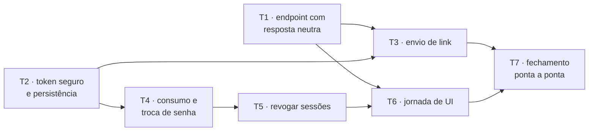
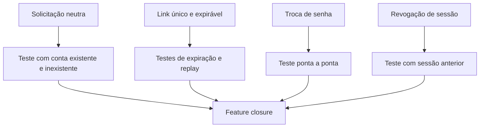
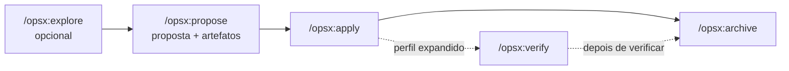

# Estudo de caso — recuperação de senha

Este estudo junta o livro inteiro em uma única mudança. O objetivo não é oferecer uma arquitetura
universal de autenticação, mas mostrar como os artefatos e ciclos se conectam.

Recuperação de senha justifica um ciclo mais explícito porque combina segurança, comportamento de
produto, persistência, interface e várias decisões cujo erro tem custo. Isso não transforma o ciclo
abaixo em template obrigatório. Para um typo ou uma correção local de comportamento já coberta, um
prompt claro e um teste podem bastar.

Cada estrutura usada aqui paga por um risco concreto:

| Estrutura | Risco que ajuda a reduzir |
|---|---|
| SPEC | decisões de segurança e produto virarem acidentes de implementação |
| Research | o plano contrariar o brownfield existente |
| Grafo de tasks | dependências entre superfícies ficarem implícitas |
| Sensores | regressões e claims sem evidência |
| Review focado | o implementador normalizar o próprio engano em uma mudança sensível |
| Closure | tasks locais passarem sem o fluxo completo funcionar |

## Cenário

O Mercado Bom Preço já possui login por e-mail e senha. Seu Renato relata:

> “Quando alguém esquece a senha, precisa ligar para o mercado. Quero que a pessoa consiga resolver
> sozinha, mas sem facilitar invasão de conta.”

É uma intenção útil, ainda não uma SPEC.

## 1. Enquadrar a mudança

Antes de chamar um agente para programar, registramos:

```markdown
# Proposta — recuperação de senha

## Problema
Usuários dependem de atendimento manual quando esquecem a senha.

## Resultado desejado
Uma pessoa consegue recuperar o acesso pelo e-mail cadastrado sem revelar contas e sem permitir
reutilização do link.

## Fora do escopo
- recuperação por telefone ou SMS;
- troca do provedor de e-mail;
- autenticação multifator.
```

### Decisões humanas iniciais

- A resposta não revelará se a conta existe.
- O link expirará em 15 minutos.
- A troca revogará sessões anteriores.

Essas decisões possuem impacto de produto e segurança. Não devem nascer por acidente durante a
implementação.

## 2. Escrever a SPEC

```markdown
# SPEC — recuperação de senha

## Solicitação

### Cenário: e-mail cadastrado
- QUANDO a pessoa solicita recuperação com e-mail cadastrado
- ENTÃO recebe resposta pública neutra
- E um e-mail com link de uso único é agendado

### Cenário: e-mail não cadastrado
- QUANDO a pessoa solicita recuperação com e-mail não cadastrado
- ENTÃO recebe a mesma resposta pública neutra
- E nenhum e-mail é agendado

## Redefinição

### Cenário: token válido
- QUANDO a pessoa envia nova senha com token válido
- ENTÃO a senha é atualizada
- E o token é consumido
- E sessões anteriores são revogadas

### Cenário: token inválido, expirado ou consumido
- QUANDO a pessoa tenta redefinir a senha
- ENTÃO nenhuma credencial ou sessão é alterada
- E uma mensagem segura permite reiniciar o fluxo
```

## 3. Pesquisar o codebase

Em uma janela dedicada, o agente recebe a proposta, a SPEC e perguntas específicas. Ele não recebe
ordem para implementar.

### Prompt de pesquisa

```text
Investigue como implementar a SPEC de recuperação de senha neste repositório.

Responda:
1. Como usuários, senhas e sessões funcionam hoje?
2. Como e-mails transacionais são enviados?
3. Quais boundaries arquiteturais devem ser preservadas?
4. Quais testes e utilitários existentes podem servir de modelo?
5. Que decisões ou lacunas ainda impedem um plano seguro?

Não altere arquivos. Diferencie fatos, inferências e perguntas. Produza um RESEARCH.md compacto com
símbolos e evidências relevantes; não registre o diário de comandos.
```

### Saída esperada

```markdown
## Fatos
- F1. `AuthService` é a única porta para hash de senha (`src/...`).
- F2. Sessões persistidas possuem `createdAt` e podem ser revogadas por usuário (`src/...`).
- F3. `EmailGateway` é assíncrono e já possui fake para testes (`src/...`).
- F4. Testes usam `Clock` injetável (`ADR-006`, `src/...`).

## Inferências
- I1. O padrão existente sugere armazenar apenas hash do token, mas não há regra canônica.

## Perguntas
- Q1. O limite de tentativas pertence a esta entrega ou a uma task posterior de hardening?
```

O humano valida Q1 e transforma a resposta em escopo ou nova cláusula.

## 4. Externalizar o estado e abrir uma fase limpa

Como mudaremos de Research para decomposição, preferimos um handoff explícito a depender apenas de
compaction: o estado útil já vive no `RESEARCH.md` revisado. A nova fase começa em uma janela limpa,
reidratada com:

```text
AGENTS.md
proposta
SPEC aprovada
RESEARCH.md revisado
```

Não carregamos buscas, logs completos e hipóteses descartadas.

## 5. Criar o grafo de tasks



T1 e T2 podem ser executadas em paralelo se seus contratos estiverem definidos e não disputarem os
mesmos arquivos. T7 não é “escrever testes no final”; é reconciliar o fluxo completo.

Na prática, T1 a T7 viram issues em um quadro (Linear, por exemplo), com as setas do grafo como
relações de bloqueio. O quadro mostra a cada momento o que está Ready: no início, apenas T1 e T2.
T7 é o cartão de fechamento, bloqueado por todas as outras.

## 6. Executar uma task

### Contrato de T2

```markdown
# T2 — Token seguro e persistência

## Objetivo
O sistema consegue emitir um segredo de recuperação, persistindo somente a representação necessária
para validá-lo, com expiração de 15 minutos.

## Fora do escopo
- endpoint HTTP;
- envio de e-mail;
- troca de senha.

## Contexto
- SPEC: cláusulas de token único e expiração;
- Research: F4 e I1;
- ADR-006: relógio injetável.

## Critérios
- token público tem entropia adequada;
- valor público não é persistido em texto puro;
- expiração usa o relógio injetável;
- apenas um token ativo por finalidade e usuário, conforme decisão aprovada.

## Validação
- testes de emissão, expiração e armazenamento;
- typecheck e lint do módulo.
```

### Ciclo do worker


O handoff informa o que mudou, evidências, decisões locais e qualquer desvio do contrato. Em
seguida, outra task recebe um contexto fresco.

## 7. Aplicar o harness

### Guides

- SPEC com comportamento de segurança;
- ADR do relógio;
- task com escopo e critérios;
- Skill de testes do domínio;
- documento de boundaries arquiteturais.

### Sensors

- typecheck;
- testes unitários de expiração;
- teste de integração para consumo atômico;
- linter de dependências;
- teste ponta a ponta da jornada;
- revisão de segurança focada em enumeração de conta, replay e vazamento do token.

Uma revisão genérica de “qualidade do código” não substitui perguntas de segurança concretas.

## 8. Fechar a feature



Além dos testes, alguém valida a experiência: a mensagem é compreensível? O usuário consegue pedir
outro link? A resposta neutra é realmente indistinguível?

## 9. Promover o que foi aprendido

Possíveis resultados:

| Finding | Destino |
|---|---|
| Decisão de armazenar apenas hash do token | ADR, se for uma escolha arquitetural recorrente |
| Comportamento vigente da recuperação | SPEC canônica |
| Novo padrão para testes com tempo | Skill de testes, se o procedimento se repetir |
| UI importou repository duas vezes durante as tasks | linter estrutural, se a falha for recorrente |
| Caminhos exatos dos arquivos tocados | não promover; Git preserva o histórico |

## 10. Onde OpenSpec entra

Até aqui usamos conceitos, não uma ferramenta obrigatória. O perfil padrão atual do OpenSpec pode
padronizar a camada de gestão da mudança:

| Conceito deste livro | OpenSpec atual |
|---|---|
| Exploração | `/opsx:explore` (opcional) |
| Proposta + specs/design/tasks | `/opsx:propose` |
| Implementação | `/opsx:apply` |
| Fechamento e atualização das specs | `/opsx:archive` |
| Verificação explícita | `/opsx:verify`, no perfil expandido |
| Research brownfield compacto | extensão do nosso método, quando necessária |



Esse desenho é um loop cotidiano, não uma sequência rígida de gates. Os artefatos habilitam o
próximo trabalho e podem ser revisitados quando a implementação revela algo novo. OpenSpec organiza
artefatos e lifecycle; não substitui seleção de contexto, confiança nas fontes, qualidade das tasks,
sensores, boundaries multiagente ou julgamento humano.

> Conceitos devem envelhecer mais devagar que comandos. Confirme o perfil e a documentação da
> versão instalada antes de transformar nomes de uma ferramenta em processo organizacional.

### Quando adotar

Considere a ferramenta quando o fluxo manual já revelou necessidade de:

- formato consistente entre mudanças;
- várias mudanças simultâneas;
- histórico e atualização de specs canônicas;
- dependências claras entre artefatos;
- coordenação de equipe.

Aprender primeiro o fluxo manual torna os benefícios e custos visíveis. Ferramenta sem modelo mental
pode automatizar burocracia; ferramenta com uma necessidade real pode reduzir trabalho operacional.

## Exercício final

Escolha uma mudança pequena do seu projeto e selecione apenas os artefatos que ela realmente pede.
Para cada estrutura escolhida — proposta, SPEC, Research, task, grafo, guide, sensor ou matriz de
fechamento — registre em uma frase que problema resolve e qual erro ficaria mais provável sem ela.
Se prompt + sensor bastarem, explique por quê.

Não implemente durante o exercício. O objetivo é perceber quais decisões ficariam escondidas dentro
do código sem transformar todos os artefatos do estudo em ritual.

[← Parte 7 — Aprendizagem](07-lifecycle-e-aprendizagem.md) ·
[Próximo: mini-estudo Data Foundation →](08b-mini-estudo-data-foundation.md)
