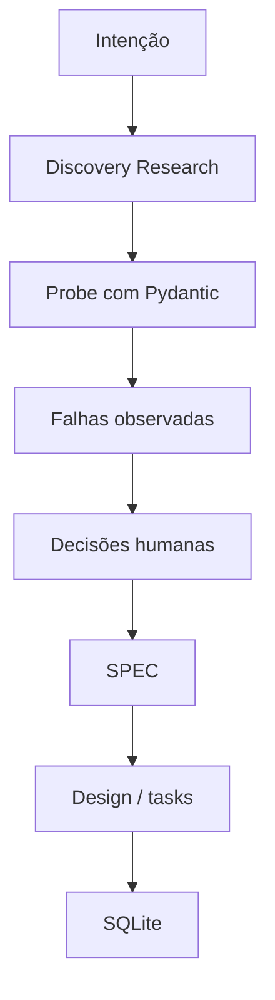

# Mini-estudo de caso — Data Foundation

O estudo de recuperação de senha parte de um comportamento desejado relativamente claro e usa
Research depois da SPEC para entender um codebase brownfield. Este mini-estudo mostra o caminho
complementar: quando os dados brutos ainda são desconhecidos, pesquisar antes da SPEC evita que o
agente invente semântica.

## 1. A intenção ainda não é especificável

O pedido inicial é:

> “Precisamos construir uma base SQLite confiável a partir dos arquivos raw recebidos dos
> fornecedores.”

Ainda não sabemos quais registros existem, se os campos mantêm a mesma forma ou o que valores
anômalos significam. Escrever imediatamente “quantidade deve ser positiva” produziria um requisito
plausível, mas sem autoridade.



## 2. Discovery Research

O agente recebe autoridade para observar, não para normalizar:

```text
Investigue os arquivos raw e descreva os formatos encontrados.

Diferencie:
- fatos reproduzíveis;
- inferências;
- perguntas de significado.

Não altere os arquivos.
Não invente defaults.
Não deduplique.
Não interprete valores anômalos.
```

Uma saída compacta pode registrar:

```markdown
## Fatos
- `quantity` aparece como inteiro, texto numérico e texto não numérico.
- existem valores negativos em registros estruturalmente completos.
- alguns identificadores se repetem entre arquivos.

## Perguntas
- texto numérico pode ser convertido ou deve ser rejeitado?
- quantidade negativa representa devolução, correção ou erro?
- identificadores são globais ou locais por fornecedor?
```

## 3. Pydantic como probe de fronteira

Um modelo mínimo transforma suposições em resultados executáveis. Ele não serve, nesta fase, para
fazer todos os dados passarem.

```python
from pydantic import BaseModel, ConfigDict


class RawItem(BaseModel):
    model_config = ConfigDict(strict=True)

    item_id: str
    quantity: int
```

Executado contra uma amostra real, o probe separa duas classes de descoberta:

```text
"banana" em quantity
→ falha estrutural: não satisfaz o contrato inteiro

-2 em quantity
→ estruturalmente válido
→ significado de negócio ainda desconhecido
```

### Atenção ao modo estrito

Pydantic valida segundo o contrato configurado. Por padrão, pode converter valores compatíveis,
como `"123"` para `123`. O modo estrito pode ser escolhido por chamada, campo ou modelo quando a
política de fronteira deve rejeitar essa coerção.

Portanto, nem sucesso nem falha representam “a verdade” por si só. Representam a política que o
probe executou.

## 4. Decisões humanas antes da SPEC

O probe torna perguntas concretas, mas não concede autoridade ao agente para respondê-las. Produto
e engenharia podem decidir, por exemplo:

- aceitar texto numérico apenas de fornecedores legados identificados;
- preservar quantidade negativa como devolução, com proveniência do registro;
- compor a identidade com fornecedor + identificador externo;
- rejeitar registros cujo significado continue ambíguo e gerar relatório de quarentena.

Essas escolhas deixam de ser acidentes de uma biblioteca e viram comportamento aprovado.

## 5. A SPEC nasce da evidência e das decisões

```markdown
# SPEC — ingestão da Data Foundation

## Fronteira
- Cada registro aceito preserva fornecedor e identificador externo.
- Texto numérico é aceito somente para fornecedores marcados como legados.
- Valor sem interpretação aprovada não é normalizado silenciosamente.

## Devoluções
- Quantidade negativa é persistida como devolução quando a origem suporta essa semântica.

## Quarentena
- Registro rejeitado preserva origem, motivo estruturado e conteúdo necessário para auditoria.

## Idempotência
- Reprocessar o mesmo conjunto de arquivos produz o mesmo estado lógico.
```

Agora design e tasks podem escolher tabelas SQLite, chaves, relatórios e testes sem precisar
inventar o comportamento durante a implementação.

## 6. O contraste que resolve a ordem de Research

| Recuperação de senha | Data Foundation |
|---|---|
| comportamento desejado conhecido | realidade insuficiente para definir comportamento |
| SPEC primeiro | Discovery Research primeiro |
| Research mapeia o brownfield | Research e probe revelam decisões necessárias |
| tasks localizam a mudança | decisões humanas autorizam a SPEC |

Research não possui uma posição universal. Ele entra onde existe incerteza relevante:

```text
incerteza sobre o que devemos exigir
→ Discovery Research antes da SPEC

incerteza sobre como o sistema funciona hoje
→ Implementation Research depois da SPEC
```

## Perguntas de revisão

1. Por que os valores negativos não deveriam ser rejeitados apenas porque parecem estranhos?
2. O que muda no experimento ao ativar strict mode?
3. Qual descoberta pertence ao Research e qual decisão pertence à SPEC?
4. Que sensor provaria a idempotência da carga?

[← Estudo de caso — recuperação de senha](08-estudo-de-caso.md) ·
[Próximo: Estado da arte →](09-estado-da-arte.md)
