# Estado da arte — engenharia de software com agentes

## Guia de ciclo de vida para estudos e formação de engenheiros de IA

Este guia consolida, em formato de referência, o modelo de trabalho construído e testado na
prática. Ele reúne o que os capítulos anteriores apresentaram por partes e acrescenta o detalhe
operacional: o que cada fase produz, o que o agente pode decidir e um prompt base para cada etapa.
Use-o como roteiro de aprendizado e como material de consulta durante o trabalho real.

> O modelo completo:
>
> **intenção → contexto → pesquisa → contrato → tarefa → implementação → sensores → evidência → review → decisão humana → correção → re-review → closure → memória → automação**
>
> A ideia central é simples:
>
> > **O agente não deve apenas gerar código. Ele deve trabalhar dentro de um sistema de contexto, autoridade, sensores e evidências.**

---

## 1. O modelo mental completo

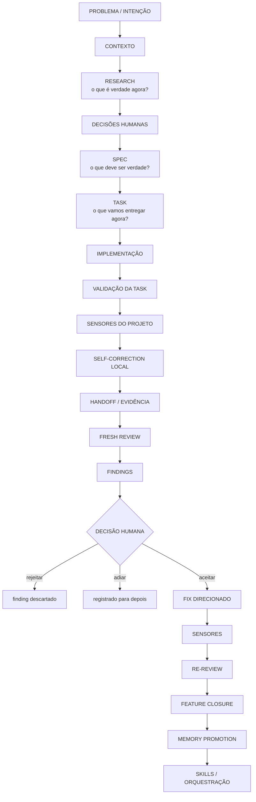

Não precisamos usar todas as etapas para toda mudança.

A regra é:

> **Quanto maior a incerteza ou o impacto, mais explícito deve ser o ciclo.**

---

## 2. Antes de qualquer prompt: qual fase estamos executando?

O erro mais comum é pedir várias atividades ao mesmo tempo.

Exemplo ruim:

```text
Analise o projeto, proponha uma arquitetura, implemente,
corrija os testes e atualize a documentação.
```

Esse prompt mistura:

```text
RESEARCH
+
DECISÃO
+
SPEC
+
IMPLEMENTAÇÃO
+
REVIEW
+
DOCUMENTAÇÃO
```

O agente perde uma fronteira clara de autoridade.

Antes de escrever o prompt, pergunte:

```text
Qual é a única fase que quero executar agora?
```

---

## 3. Estrutura geral de um bom prompt operacional

O padrão que usamos é:

```text
[CONTEXTO]
Quais fontes realmente importam?

[FASE]
O que estamos fazendo agora?

[OBJETIVO]
Qual é o único resultado principal?

[AUTORIDADE]
O que o agente pode decidir?
O que continua sendo decisão humana?

[CONTRATO]
O que deve ser verdade no resultado?

[FORA DE ESCOPO]
Que expansões naturais não queremos agora?

[VALIDAÇÃO]
Que evidência deve ser produzida?

[OUTPUT]
Como queremos receber o resultado?

[STOP CONDITION]
Onde o agente deve parar?
```

Para juniores, reduza para quatro perguntas:

```text
1. O que o agente precisa saber?
2. O que quero que ele faça?
3. O que ele não pode decidir sozinho?
4. Como sei que terminou?
```

---

## 4. Etapa 0 — Problema e intenção

Antes do código, precisamos saber o que estamos tentando mudar.

Exemplo:

```text
Problema:
precisamos transformar os dados brutos de produtos e vendas
em uma base confiável e reconstruível.

Ainda não sabemos:
- qualidade real dos dados;
- significado de alguns valores;
- identidade de produtos parecidos.
```

Não tente transformar incerteza em implementação.

### Prompt de enquadramento

```text
Estamos iniciando uma nova frente de trabalho.

Problema:

<PROBLEMA>

Ainda não quero implementação.

Ajude a separar:

- fatos já conhecidos;
- hipóteses;
- decisões já tomadas;
- decisões ainda abertas;
- perguntas que precisam ser respondidas antes de especificar comportamento.

Não proponha arquitetura ainda.

Entregue somente um mapa curto da incerteza.
```

---

## 5. Etapa 1 — RESEARCH

Pergunta central:

> **O que é verdade agora?**

Research é redução de incerteza, não implementação.

```text
RESEARCH
=
snapshot da realidade atual
```

Não é autoridade sobre o comportamento futuro.

### Estrutura do prompt de Research

```text
CONTEXTO
↓
OBJETO DE INVESTIGAÇÃO
↓
PERGUNTAS
↓
LIMITES
↓
EVIDÊNCIA
↓
STOP
```

### Exemplo

```text
Leia AGENTS.md.

Estamos somente pesquisando os dados.

Analise:

- data/raw/produtos.csv.gz
- data/raw/vendas.csv.gz

Não implemente nada.
Não crie SQLite.
Não limpe dados.
Não deduplique.
Não interprete valores suspeitos sem evidência.

Investigue:

- estrutura;
- colunas;
- volumes;
- datas;
- campos ausentes;
- formatos inconsistentes;
- valores suspeitos;
- relações entre produtos e vendas.

Separe:

- fatos observados;
- hipóteses;
- perguntas abertas.

Primeiro apresente os resultados.
```

### O que observar no review do Research

Pergunte:

```text
É fato ou inferência?
Existe evidência?
O agente resolveu significado sem autoridade?
Ele começou a propor solução?
```

Research deve responder:

```text
WHAT IS
```

e não:

```text
WHAT SHOULD BE
```

---

## 6. Etapa 2 — Probe / experimento exploratório

Às vezes o Research textual não basta.

Precisamos executar um pequeno experimento para reduzir incerteza.

Exemplo:

```text
Pydantic como probe
```

A pergunta é:

> **Os dados realmente cabem nos contratos que imaginamos?**

### Exemplo de prompt

```text
Leia:

- AGENTS.md
- work/data-foundation/RESEARCH.md

Ainda NÃO crie SQLite.

Use Pydantic como uma sonda exploratória para tornar explícita
a fronteira dos dados.

Crie modelos mínimos para os registros relevantes.

Não tente fazer todos os dados passarem.

Não:
- normalize silenciosamente;
- invente defaults;
- deduplique;
- interprete quantidade negativa;
- altere os arquivos raw;
- crie banco.

Execute os modelos contra dados reais.

Quero observar:

- o que valida;
- o que falha;
- em quais campos;
- quais falhas são estruturais;
- quais parecem exigir decisão de negócio.

Não corrija as falhas ainda.

Primeiro apresente os resultados.
```

---

## 7. Estrutural versus semântico

Esta distinção é fundamental.

```text
"banana" como quantidade
→ problema estrutural / tipo

-2 como quantidade
→ número estruturalmente válido
→ significado de negócio desconhecido
```

Pydantic, Zod e ferramentas similares:

```text
validam a forma
```

O humano:

```text
decide o significado
```

Frase para aula:

> **Pydantic executa decisões; Pydantic não deve inventar decisões.**

---

## 8. Etapa 3 — Decisões humanas

Quando o probe revela ambiguidade:

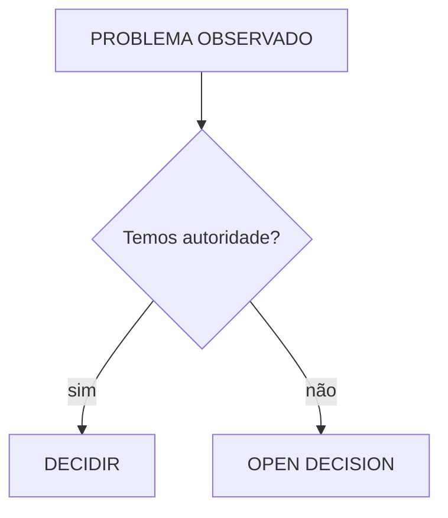

Exemplo:

```text
quantidade negativa
```

Possíveis interpretações:

```text
devolução
erro
ajuste
outro significado
```

O agente não deve escolher porque uma opção parece plausível.

---

## 9. Etapa 4 — SPEC

Pergunta central:

> **O que deve ser verdade no sistema?**

```text
RESEARCH
"O que encontramos?"

SPEC
"O que queremos garantir?"
```

A SPEC deve descrever comportamento, não receita de implementação.

### Estrutura do prompt de SPEC

```text
FONTES DE REALIDADE
+
DECISÕES APROVADAS
↓
COMPORTAMENTO
↓
OUT OF SCOPE
↓
OPEN DECISIONS
↓
HUMAN GATE
```

### Exemplo

```text
Leia:

- AGENTS.md
- work/data-foundation/RESEARCH.md
- os contratos Pydantic experimentais

Considere SOMENTE as decisões explicitamente aprovadas.

Não implemente código.

Proponha uma SPEC pequena para Data Foundation.

Os modelos Pydantic são implementação/probe.
A SPEC não deve descrever classes, validators ou arquivos Python.

Ela deve registrar comportamento.

Queremos garantir:

1. raw é somente leitura;
2. dados externos passam por validação explícita;
3. falhas estruturais são tratadas explicitamente;
4. significado desconhecido não é inventado;
5. correções determinísticas aprovadas são observáveis;
6. o processamento produz evidência;
7. a base derivada pode ser reconstruída a partir do bruto.

Não copie contagens específicas do Research.

Mantenha decisões não tomadas em Open decisions.

Estrutura:

# Data Foundation

## Goal
## Behaviour
## Out of scope
## Open decisions

Apresente o draft primeiro.
Não altere arquivos ainda.
```

---

## 10. Review de SPEC

Perguntas simples:

```text
Tem fato do Research virando requisito por acidente?
O agente decidiu algo sozinho?
Tem detalhe de implementação?
Alguma Open Decision foi fechada?
A SPEC está pequena e verificável?
```

Um bom princípio:

> **Texto plausível não ganha autoridade só porque foi produzido pelo agente.**

---

## 11. Etapa 5 — TASK

Pergunta central:

> **Qual unidade executável e verificável faremos agora?**

```text
SPEC
→ feature inteira

TASK
→ próximo incremento
```

### Estrutura mínima

```text
Goal
Scope
Out of scope
Relevant context
Acceptance criteria
Validation
```

### Prompt

```text
Leia:

- AGENTS.md
- specs/data-foundation.md

Crie uma task pequena para:

<OBJETIVO>

Inclua:

## Goal
## Scope
## Out of scope
## Relevant context
## Acceptance criteria
## Validation

A task deve ser implementável de forma independente.

Não implemente código.
Não adicione decisões de negócio.
Não expanda o escopo da SPEC.
```

---

## 12. Acceptance Criteria versus Validation

Não confunda.

```text
ACCEPTANCE CRITERIA
"O que deve ser verdade?"
```

Exemplo:

```text
- raw continua intacto;
- base pode ser reconstruída;
- registros rejeitados são observáveis.
```

```text
VALIDATION
"Como vamos provar?"
```

Exemplo:

```text
- pytest tests/test_loader.py
- executar loader
- apagar banco
- executar novamente
- comparar resultados lógicos
- ./scripts/verify.sh
```

---

## 13. Etapa 6 — Implementação

Agora o agente recebe mais autonomia.

Pergunta:

> **Como tornamos a task verdadeira?**

### Prompt padrão de implementação

```text
Leia:

- AGENTS.md
- <TASK>

Implemente somente esta task.

Use apenas as referências necessárias indicadas pela task.

Não:
- expanda escopo;
- resolva Open Decisions;
- altere contratos da feature silenciosamente;
- faça refactors não necessários.

Se surgir uma decisão fora da autoridade da task:
pare e reporte.

Ao concluir:

1. execute as verificações específicas da task;
2. corrija falhas locais introduzidas pela implementação;
3. execute ./scripts/verify.sh;
4. repita os sensores após cada correção necessária.

Não silencie sensores apenas para obter PASS.

No handoff, informe:

- arquivos alterados;
- comportamento entregue;
- comandos de validação executados;
- resultado dos sensores;
- correções locais realizadas;
- decisões abertas;
- limitações.
```

---

## 14. Quando o agente pode se autocorrigir?

Use esta árvore:

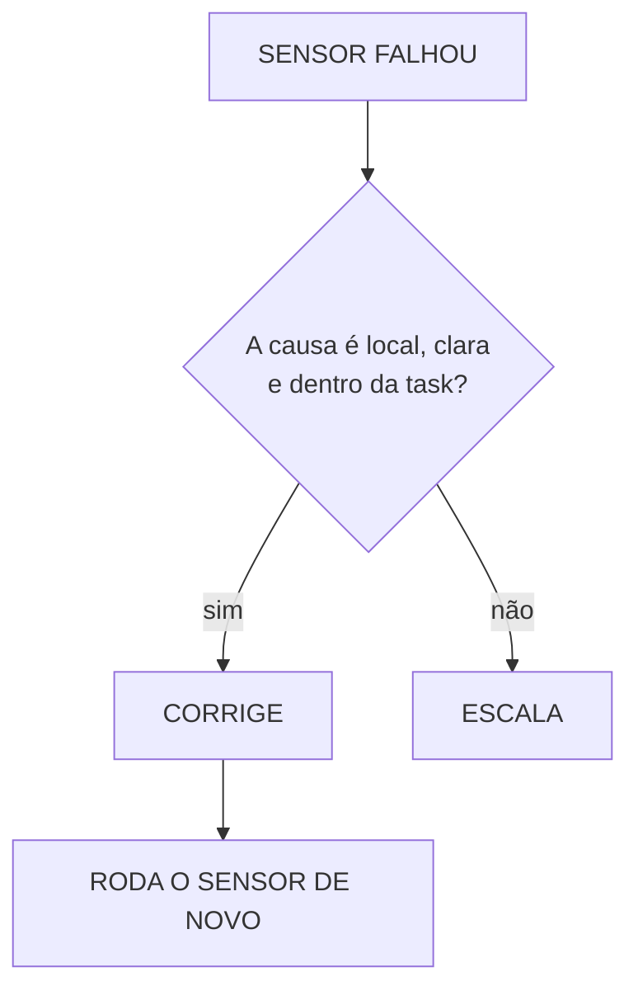

Exemplo de correção autônoma:

```text
Ruff:
unused import
```

Pode corrigir.

Exemplo de escalada:

```text
teste falha porque precisamos decidir
se quantidade negativa representa devolução
```

Não pode decidir sozinho.

---

## 15. Sensores

Sensores transformam estado do projeto em evidência.

Tipos:

```text
Ruff
→ regras estáticas de qualidade/consistência

mypy
→ coerência dos contratos de tipos

pytest unitário
→ comportamento de unidade

pytest integração
→ comportamento entre componentes

teste de feature
→ comportamento específico da feature

verify.sh
→ saúde geral do projeto
```

---

## 16. Testes também são sensores

Sim.

Exemplo:

```text
Feature:
mesmo raw deve gerar mesmo resultado lógico
```

Ruff não prova.

Mypy não prova.

Precisamos de um sensor comportamental:

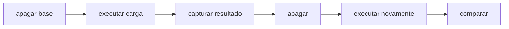

---

## 17. Guia versus sensor

Modelo:

```text
setup.sh
→ GUIA
→ age

verify.sh
→ SENSOR
→ observa
```

Frase:

> **Guia instala/configura. Sensor verifica. Sensor não conserta.**

Exemplo:

```text
ruff check .
```

é sensor.

```text
ruff check . --fix
```

dentro de `verify.sh` mistura observação e mutação.

---

## 18. Etapa 7 — Validação da task

Existem dois níveis.

```text
TASK VALIDATION
"A mudança que acabei de fazer funciona?"
```

Exemplo:

```bash
uv run pytest tests/test_loader.py
```

Depois:

```text
PROJECT VALIDATION
"O repositório continua saudável?"
```

Exemplo:

```bash
./scripts/verify.sh
```

Fluxo:

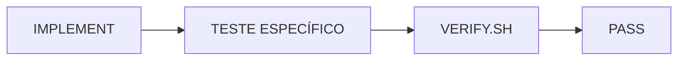

---

## 19. Sensores não são solução

Um sensor responde:

```text
"há um desvio"
```

Não necessariamente:

```text
"esta é a solução correta"
```

Exemplo:

```text
mypy:
str enviado onde int era esperado
```

A causa pode ser:

```text
conversão ausente
anotação errada
contrato errado
```

O finding é evidência.

A correção ainda exige raciocínio.

---

## 20. Não silencie sensores

Anti-padrão:

```text
FAIL
↓
# noqa
ou type: ignore
↓
PASS
```

Sem entender a causa.

Padrão:

```text
FAIL
↓
investigar
↓
corrigir causa
↓
PASS
```

Silenciar um sensor pode ser correto, mas deve ser decisão explícita e justificada.

---

## 21. Etapa 8 — Handoff

O agente não deve terminar com:

```text
"Pronto."
```

O handoff deve comprimir o que aconteceu.

Modelo:

```text
Status

Behaviour delivered

Changed files

Validation

Sensor results

Open decisions

Limitations
```

Exemplo:

```text
Status: concluído

Arquivos alterados:
- app/loader.py
- app/models/produto.py

Validação:
- pytest tests/test_loader.py → 12 passed
- ruff check . → passed
- mypy app → passed
- ./scripts/verify.sh → passed

Open decisions:
- significado de quantidade negativa continua aberto
```

---

## 22. Handoff é diferente de log

```text
LOG
→ jornada inteira

HANDOFF
→ estado necessário para a próxima pessoa/agente
```

Frase:

> **O log da execução não é a entrega. O handoff compacto é a entrega.**

---

## 23. Etapa 9 — Fresh Review

O mesmo agente que implementou pode fazer self-review, mas isso não é equivalente a um reviewer em contexto limpo.

Fluxo maduro:

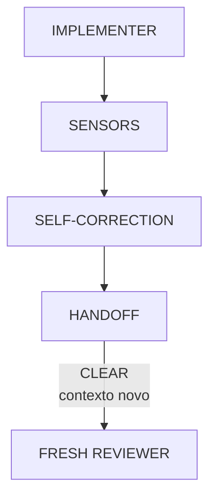

---

## 24. O erro que descobrimos nos testes: review amplo demais

Prompt amplo:

```text
Leia todos os documentos.
Procure duplicações, contradições, problemas arquiteturais...
```

Resultado:

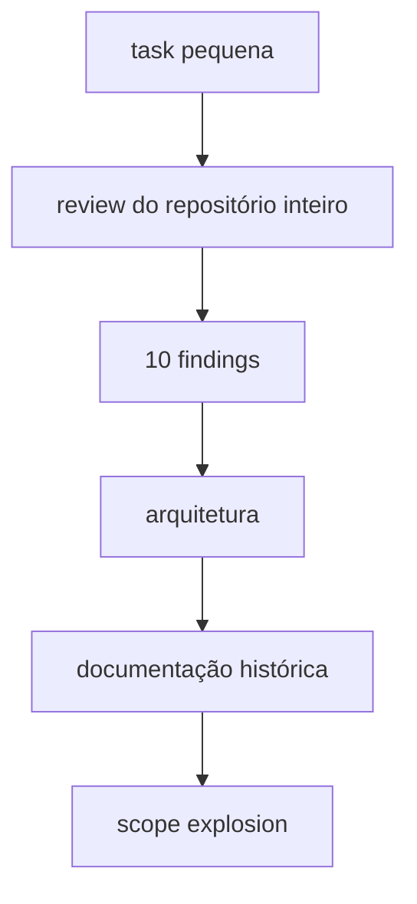

O reviewer tecnicamente fez o que pedimos.

O problema era o prompt.

---

## 25. Bounded Review — revisão limitada pela mudança

Nova regra:

> **Um review de task procura evidência de que a mudança está errada, não tudo que está errado no repositório.**

Review deve ser limitado por:

```text
TASK
+
CLAIMS DO HANDOFF
+
DIFF
+
CONTEXTO IMEDIATO
```

---

## 26. Estrutura de um prompt de Bounded Review

```text
ALVO
qual mudança?

INPUT
task + diff + evidências

CRITÉRIOS
o que testar?

BOUNDARY
o que NÃO investigar?

SEVERIDADE
o que realmente bloqueia?

OUTPUT
findings pequenos

STOP
não expandir
```

---

## 27. Prompt de review de implementação

```text
Atue somente como reviewer desta task.

Leia:

- SPEC relevante;
- a TASK;
- o diff atual;
- o handoff;
- resultados dos sensores.

Objetivo:

tentar refutar as alegações de que esta task foi concluída
corretamente.

Revise somente problemas:

1. introduzidos por este diff;
2. diretamente agravados por este diff;
3. que impeçam um acceptance criterion desta task.

Não transforme problemas preexistentes em findings bloqueantes
desta task.

Verifique:

1. acceptance criteria atendidos?
2. SPEC respeitada?
3. alguma Open Decision foi resolvida silenciosamente?
4. houve scope creep?
5. os testes realmente cobrem os critérios?
6. os sensores sustentam o handoff?

Classifique:

- BLOCKING
- NON-BLOCKING
- OPEN DECISION
- OUT OF SCOPE

Para cada finding:
- evidência;
- relação direta com a mudança;
- impacto.

Não corrija.
Não investigue problemas fora do escopo.
Entregue no máximo 5 findings.
```

---

## 28. Heurística poderosa: regression versus dívida preexistente

Pergunta:

> **Se eu desfizer somente o diff desta task, o problema desaparece?**

Se:

```text
SIM
→ provavelmente pertence ao review
```

Se:

```text
NÃO
→ provavelmente é pre-existing debt
```

Não é uma regra matemática, mas é excelente para controlar scope.

---

## 29. Review Budget

O reviewer também precisa de limite.

Exemplo:

```text
- no máximo 5 findings;
- somente diff + contexto imediato;
- não revisar arquitetura global;
- não propor novos documentos;
- não investigar débitos preexistentes.
```

Sem isso, agentes tendem a encontrar melhorias infinitas.

---

## 30. Review de documentação com Context Economy

Cada documento deve ter uma responsabilidade.

Exemplo:

```text
README
→ como usar?

SCRIPTS
→ como nossos scripts devem funcionar?

GLOSSARIO
→ o que o termo significa?

AGENTS
→ quais regras universais o agente precisa saber?
```

Aplicamos um SRP documental.

### Prompt bounded de documentação

```text
Atue somente como reviewer das alterações documentais
introduzidas por esta task.

Leia:

- o git diff atual;
- somente os trechos modificados;
- algumas linhas ao redor quando necessário.

Responsabilidades:

README.md
→ uso cotidiano.

docs/SCRIPTS.md
→ convenções duráveis de scripts, guias e sensores.

docs/GLOSSARIO.md
→ definições curtas.

AGENTS.md
→ regras universais e roteamento.

Revise somente problemas:

1. introduzidos pelo diff;
2. diretamente agravados pelo diff.

Não investigue:
- arquitetura geral;
- documentação não alterada;
- débitos anteriores;
- novos documentos;
- HLD/ADR não relacionados.

Procure:

1. informação nova no documento errado;
2. duplicação nova;
3. detalhe interno desnecessário no README;
4. documentação que não corresponde ao comportamento real.

Classifique:

- BLOCKING
- NON-BLOCKING
- OUT OF SCOPE

Entregue no máximo 5 findings.

Não altere arquivos.
```

---

## 31. Etapa 10 — Humano julga findings

Review não gera automaticamente correção.

Fluxo:


Para cada finding, faça três perguntas:

```text
1. Concordo que é um problema?

2. Concordo com a severidade?

3. A solução já está decidida?
```

---

## 32. Problema aceito ≠ solução aceita

Exemplo:

Reviewer:

```text
Ruff pode ser influenciado por configuração externa.
Recomendação: use --isolated.
```

Podemos aceitar:

```text
PROBLEMA
sensores não deveriam depender de configuração pessoal
```

sem aceitar:

```text
SOLUÇÃO
--isolated
```

Talvez a solução melhor seja configuração versionada no projeto.

Logo:

```text
aceitar finding
≠
aceitar implementação sugerida
```

---

## 33. Triagem de findings

Use:

```text
ACCEPT
→ corrigir

REJECT
→ finding não procede

DEFER
→ válido, mas não bloqueia agora

OPEN DECISION
→ precisa de autoridade humana/cliente

OUT OF SCOPE
→ não pertence à task atual
```

---

## 34. Quando solução ainda não está decidida

Não mande corrigir.

Volte a um mini Research/proposal.

Prompt:

```text
O review encontrou um problema que aprovamos:

<PROBLEMA>

O comportamento desejado é:

<COMPORTAMENTO>

Ainda NÃO decidimos a solução técnica.

Antes de alterar arquivos:

1. investigue como o comportamento atual funciona;
2. proponha a menor solução;
3. compare apenas alternativas realmente relevantes.

Não:
- amplie escopo;
- altere comportamento não relacionado;
- resolva outros findings.

Apresente a proposta primeiro.

Não altere arquivos ainda.
```

---

## 35. Etapa 11 — Fix direcionado

Quando problema e solução já estão decididos:

```text
FINDING APROVADO
+
SOLUÇÃO APROVADA
↓
FIX
```

Prompt:

```text
Aprovamos os seguintes findings:

1. <finding>
2. <finding>

Aplique somente estas correções:

- <mudança 1>
- <mudança 2>

Não:
- revise outros trechos;
- corrija problemas preexistentes;
- expanda escopo;
- altere contratos não relacionados.

Depois:

1. execute a validação específica;
2. execute ./scripts/verify.sh;
3. apresente o diff resumido;
4. reporte os findings resolvidos.

Pare depois disso.
```

---

## 36. Etapa 12 — Re-review

Não faça outro review aberto.

O re-review deve responder somente:

> **Os findings aprovados foram resolvidos?**

Prompt:

```text
Atue somente como reviewer da correção dos findings anteriores.

Os findings eram:

1. <finding 1>
2. <finding 2>

Leia somente:
- o diff da correção;
- o contexto imediato necessário;
- resultados das validações.

Para cada finding, responda:

- RESOLVED
- NOT RESOLVED

Também verifique:

Scope → OK / VIOLATED

Não procure novos problemas.
Não revise o repositório inteiro.
Não altere arquivos.
```

Isso evita:


---

## 37. Quando encerrar uma task

Task pode ser considerada pronta quando:

```text
acceptance criteria atendidos
+
validação específica passa
+
sensores do projeto passam
+
findings bloqueantes resolvidos
+
nenhuma decisão fora de autoridade foi escondida
```

---

## 38. Etapa 13 — Feature Closure

Importante:

```text
última task pronta
≠
feature fechada
```

Precisamos reconciliar:

```text
SPEC
↔
implementação
↔
evidências
↔
open decisions
```

### Prompt de Feature Closure

```text
Atue somente como reviewer de fechamento da feature.

Leia:

- SPEC;
- Research relevante;
- tasks concluídas;
- implementação final;
- handoffs;
- resultados dos sensores;
- reviews;
- problemas conhecidos.

Para cada comportamento da SPEC:

- implementado?
- verificado?
- qual evidência?

Procure também:

- decisão aberta implementada sem aprovação;
- requisito sem sensor/evidência;
- mudança fora de escopo;
- raw ou fonte de verdade alterada;
- problema conhecido escondido.

Responda:

CLOSED

ou

NOT CLOSED

Se NOT CLOSED:
liste apenas gaps concretos.

Não implemente correções durante closure.
```

---

## 39. Gap de closure vira nova task

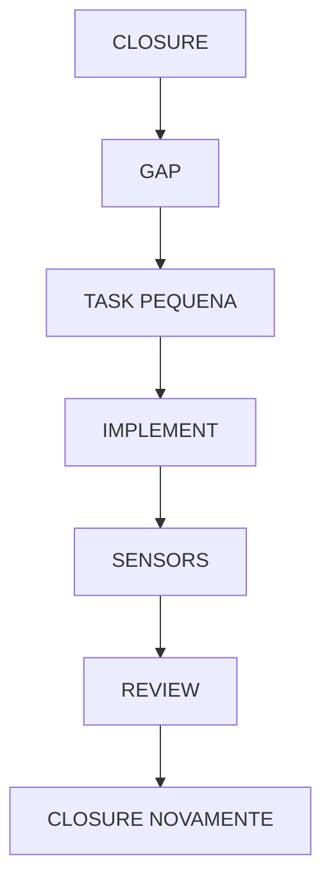

Closure não corrige.

Closure reconcilia.

---

## 40. Etapa 14 — Memory Promotion

Nem toda descoberta merece memória permanente.

Classificação:

```text
DURÁVEL
→ promove

TEMPORÁRIO
→ deixa no Research / handoff

HISTÓRICO DE EXECUÇÃO
→ descarta
```

Exemplo:

```text
raw é imutável
→ durável

identidade de produto é problema conhecido
→ durável enquanto aberto

contagem exata encontrada num dump
→ Research snapshot

comando temporário usado numa investigação
→ descartável
```

---

## 41. Onde cada tipo de conhecimento vive

```text
AGENTS.md
→ mapa, regras globais, roteamento

README.md
→ uso cotidiano

SPEC
→ comportamento desejado

RESEARCH
→ snapshot da realidade

TASK
→ unidade de execução

TESTS / SENSORS
→ conhecimento executável

SCRIPTS.md
→ convenções duráveis dos scripts

GLOSSARIO.md
→ significado curto de termos

KNOWN PROBLEMS
→ dívida conhecida / ambiguidade não resolvida
```

---

## 42. Princípio de Context Economy

```text
MUITA DOCUMENTAÇÃO NO REPO
≠
MUITA DOCUMENTAÇÃO NO CONTEXTO
```

Pense:

```text
biblioteca grande
mochila pequena
```

O agente deve carregar apenas o necessário para a fase atual.

---

## 43. Source of Intent versus Source of Reality

Não misture.

```text
SOURCE OF INTENT
SPEC / PRD / decisões aprovadas
```

```text
SOURCE OF REALITY
código / testes / schema / runtime / dados / outputs
```

```text
RESEARCH
snapshot
```

```text
TASK / REVIEW / HANDOFF
derivados
```

Fórmula mental:

```text
WHAT IS
≠
WHAT SHOULD BE
```

---

## 44. Autoridade

Antes de permitir decisão, pergunte:

```text
AUTHORITY
+
FRESHNESS
+
SCOPE
+
PROVENANCE
```

Um agente pode gerar uma solução ótima e ainda assim não ter autoridade para escolher aquela solução.

---

## 45. Etapa 15 — Skills

Quando um procedimento aparece repetidamente:

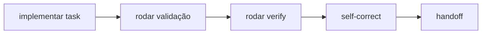

deixe de reescrever isso em todo prompt.

Transforme em procedimento reutilizável.

Conceitualmente:

```text
implement-task
```

Skill:

```text
TASK
→ contexto
→ implementação
→ sensores
→ self-correction
→ handoff
```

Uma Skill é um pacote reutilizável de instruções, referências e eventualmente scripts.

---

## 46. Separação útil

```text
TASK
"O que precisa ser feito?"

SKILL
"Como fazemos esse tipo de trabalho?"

ORCHESTRATOR
"Qual trabalho fazemos agora e quem faz?"
```

---

## 47. Etapa 16 — Orquestração

Quando existem múltiplas tasks:

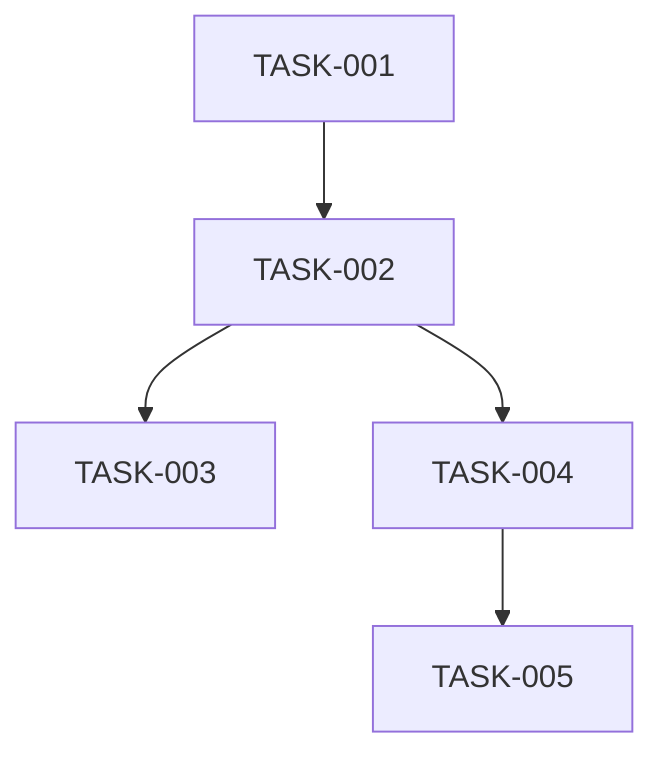

O orquestrador decide:

```text
quais estão READY?
quais estão BLOCKED?
quais dependem de quais?
quais podem rodar em paralelo?
qual precisa de review?
quando escalar para humano?
```

### O kanban é a materialização do grafo

No workshop de Matt Pocock, a feature tem dois documentos: o PRD é o **documento de destino** e o
quadro kanban é o **documento de jornada**. Em vez de um plano multi-fase sequencial gigante, a
decomposição vira tickets com relações de bloqueio explícitas.

No nosso ciclo, o quadro nasce no fim da **Etapa 5 (TASK)** — quando a SPEC é decomposta em várias
tasks e o grafo de dependências fica visível — e é o instrumento de trabalho da **Etapa 16
(orquestração)**: o estado do quadro **é** o estado da jornada. As perguntas do orquestrador acima
são, literalmente, consultas ao quadro.

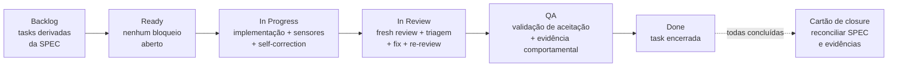

Cada coluna corresponde a uma etapa que este guia já descreveu:

| Coluna do quadro | Etapa do ciclo | Quem atua |
|---|---|---|
| Backlog | Etapa 5 — decomposição da SPEC em tasks | humano + agente |
| Ready | dependências resolvidas no grafo | orquestrador ou o próprio quadro |
| In Progress | Etapas 6 a 8 — implementação, sensores, self-correction, handoff | worker, muitas vezes AFK |
| In Review | Etapas 9 a 12 — fresh review, triagem de findings, fix, re-review | reviewer fresco + humano |
| QA | validação de aceitação da task e evidência comportamental | humano ou agente com sensores |
| Done | task encerrada (seção 37) | — |

### QA e code review já estão no ciclo

O quadro não adiciona etapas novas; ele dá coluna a etapas que já existem. O **code review** da
equipe é o par Fresh Bounded Review + triagem humana (Etapas 9 a 12). O **QA** é a validação de
aceitação apoiada em sensores — provar os acceptance criteria com evidência, não reler o código.

O único cartão especial é o de **feature closure**: uma issue bloqueada por todas as outras, que só
fecha quando SPEC, implementação e evidências reconciliam. Ele protege contra o anti-padrão 54.8:
“5/5 tasks done” não move a feature para Done — quem move é a reconciliação.

### Na prática com Linear

Qualquer ferramenta de quadro serve (Linear, GitHub Issues, Jira). Com Linear, o mapeamento fica
natural:

- cada task do grafo vira uma **issue**; as relações *blocked by / blocking* codificam o DAG;
- **Ready** é derivável: issue sem bloqueios abertos — o orquestrador (ou o humano) só escolhe
  entre elas;
- labels `human-in-the-loop` e `AFK` marcam o tipo de tarefa da palestra: o humano varre o quadro
  procurando o que **só ele** pode destravar, e delega o resto;
- o PRD/SPEC vive como documento do projeto (destino); as issues são a jornada;
- o corpo da issue carrega o contrato da task (Goal, Scope, Acceptance criteria, Validation), e os
  handoffs viram comentários — o quadro acumula a evidência da jornada.

> **O quadro é memória de orquestração, não memória de conhecimento.** Decisões duráveis continuam
> sendo promovidas para SPEC, ADR e AGENTS (Etapa 14); a issue arquivada guarda a história.

---

## 48. Orquestração madura

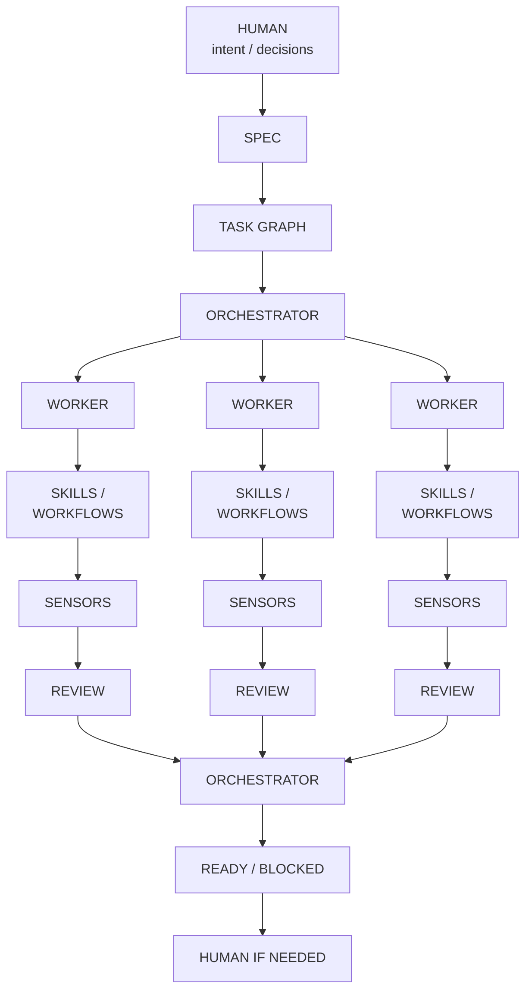

---

## 49. Não pule direto para orquestração

Progressão pedagógica:

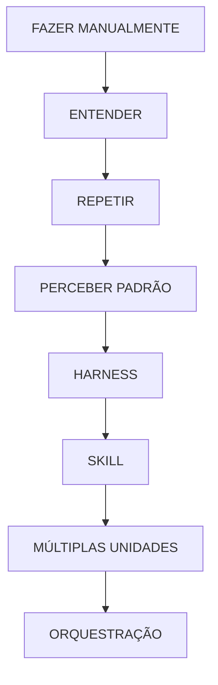

Não:

```text
framework multiagente
↓
ninguém entende o processo
```

---

## 50. O papel do humano muda com a maturidade

No início:

```text
HUMANO
→ escreve prompt
→ acompanha código
→ manda testar
→ manda corrigir
→ decide próximo passo
```

No sistema maduro:

```text
HUMANO
→ define intenção
→ aprova contratos
→ resolve decisões de alta alavancagem
→ julga findings
→ aprova closure
```

O trabalho mecânico fica com:

```text
agentes
+
sensores
+
harness
```

---

## 51. Human Attention Budget

Objetivo:

> **Gastar atenção humana onde ela adiciona julgamento, não onde uma máquina pode produzir evidência.**

Humano não deveria ser:

```text
um verify.sh caro
```

Ele deve atuar em:

```text
semântica
prioridade
trade-offs
autoridade
risco
aceitação
```

---

## 52. Ciclo de implementação em uma frase

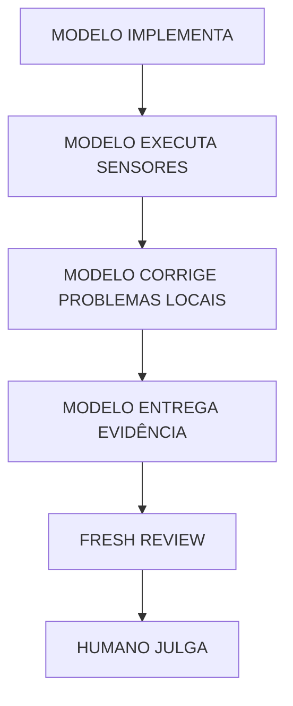

Com a exceção:

```text
se correção exige nova decisão
→ agente escala
```

---

## 53. Ciclo de review em uma frase

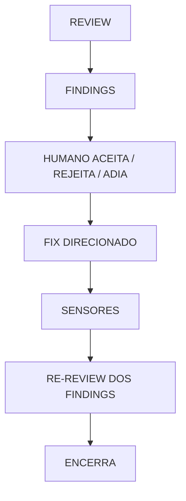

Não:

```text
review
↓
corrija tudo
↓
novo review aberto
↓
corrija tudo
↓
...
```

---

## 54. Anti-padrões que descobrimos na prática

### 54.1 Prompt multi-fase

```text
pesquise + decida + implemente + revise
```

Problema: autoridade confusa.

### 54.2 Review sem limite

```text
procure tudo de errado
```

Problema: scope explosion.

### 54.3 Reviewer como autoridade

```text
reviewer sugeriu
→ implementador executa
```

Problema: recomendação vira decisão silenciosa.

### 54.4 Pre-existing debt bloqueando task

```text
problema antigo detectado
→ task nova fica bloqueada
```

Problema: brownfield nunca termina.

### 54.5 Sensor que corrige

```text
verify
→ auto-fix
```

Problema: observação e mutação misturadas.

### 54.6 Silenciar sensor

```text
FAIL
→ ignore
→ PASS
```

Problema: indicador verde sem resolver causa.

### 54.7 Documentação duplicada

```text
README explica profundamente
+
SCRIPTS explica profundamente
+
GLOSSARIO explica profundamente
```

Problema: drift e context waste.

### 54.8 Feature done porque todas as tasks acabaram

```text
5/5 tasks
→ closed
```

Problema: falta reconciliação com SPEC.

---

## 55. Prompts por fase — mapa rápido

### Research

```text
Leia <fontes>.
Estamos pesquisando.
Não implemente.
Separe fatos, hipóteses e perguntas.
Mostre evidência.
Pare.
```

### Probe

```text
Use <ferramenta> para testar <hipótese>.
Não faça os dados passarem a qualquer custo.
Não corrija ainda.
Mostre onde falha.
Pare.
```

### SPEC

```text
Use Research + decisões aprovadas.
Defina comportamento.
Não implemente.
Mantenha Open Decisions.
Mostre draft.
Pare.
```

### TASK

```text
Derive uma unidade pequena da SPEC.
Goal / Scope / Out / AC / Validation.
Não implemente.
```

### Implementation

```text
Leia AGENTS + TASK.
Implemente só a task.
Valide localmente.
Rode verify.
Corrija problemas locais.
Escalone decisões.
Entregue evidência.
```

### Review

```text
Leia task + diff + handoff + sensors.
Tente refutar as claims.
Somente problemas introduzidos/agravados pelo diff.
Não corrija.
No máximo N findings.
```

### Human triage

```text
Concordo com o problema?
Com a severidade?
A solução já está decidida?
```

### Fix

```text
Aprovamos findings X/Y.
Aplique somente essas correções.
Valide.
Pare.
```

### Re-review

```text
Finding X → resolved?
Finding Y → resolved?
Scope → OK?
Não procure novos problemas.
```

### Closure

```text
Reconcilie SPEC + implementação + evidência.
CLOSED / NOT CLOSED.
Não corrija.
```

---

## 56. Prompt base reutilizável — Implement Task

```text
Leia:

- AGENTS.md
- <TASK>

Implemente somente esta task.

Não:
- expanda escopo;
- resolva Open Decisions;
- altere contratos silenciosamente;
- faça refactors não necessários.

Se surgir decisão fora da task:
pare e reporte.

Validação:

1. rode os checks específicos;
2. corrija falhas locais;
3. rode ./scripts/verify.sh;
4. repita após correções.

Não silencie sensores.

Handoff:

- Status
- Behaviour delivered
- Changed files
- Tests
- Sensor results
- Open decisions
- Limitations
```

---

## 57. Prompt base reutilizável — Bounded Review

```text
Atue somente como reviewer desta mudança.

Leia:

- SPEC relevante;
- TASK;
- diff;
- handoff;
- sensores.

Revise somente problemas:

- introduzidos pelo diff;
- agravados pelo diff;
- que impedem acceptance criteria.

Problemas preexistentes:
OUT OF SCOPE.

Verifique:

- comportamento;
- escopo;
- decisões silenciosas;
- cobertura de validation;
- coerência entre claims e evidência.

Classifique:

BLOCKING
NON-BLOCKING
OPEN DECISION
OUT OF SCOPE

No máximo 5 findings.

Não corrija.
Não expanda investigação.
```

---

## 58. Prompt base reutilizável — Fix

```text
Aprovamos estes findings:

<FINDINGS>

Solução aprovada:

<SOLUÇÃO>

Aplique somente esta correção.

Não:
- corrija outros problemas;
- altere decisões;
- expanda escopo.

Depois:

1. rode validação específica;
2. rode ./scripts/verify.sh;
3. mostre diff resumido;
4. reporte resultados.

Pare.
```

---

## 59. Prompt base reutilizável — Re-review

```text
Revise somente a correção destes findings:

<FINDINGS>

Leia:
- diff da correção;
- evidências.

Para cada um:

RESOLVED
ou
NOT RESOLVED

Depois:

Scope → OK / VIOLATED

Não procure novos problemas.
Não altere arquivos.
```

---

## 60. Prompt base reutilizável — Feature Closure

```text
Atue como reviewer de fechamento.

Leia:
- SPEC
- tasks
- implementação
- handoffs
- sensores
- reviews
- open problems

Para cada comportamento da SPEC:

implemented?
verified?
evidence?

Resultado:

CLOSED
ou
NOT CLOSED

Se NOT CLOSED:
liste somente gaps.

Não implemente.
```

---

## 61. Regra de ouro do lifecycle

Cada fase produz um artefato ou evidência que reduz a liberdade da fase seguinte.

```text
RESEARCH
reduz incerteza

SPEC
reduz ambiguidade de intenção

TASK
reduz tamanho do trabalho

TESTS / SENSORS
reduzem liberdade de implementação

REVIEW
reduz risco residual

CLOSURE
reduz dúvida sobre o estado da feature
```

---

## 62. O que estamos realmente construindo

Não é apenas um conjunto de prompts.

Estamos construindo:

```text
um sistema de engenharia
```

formado por:

```text
CONTEXT
+
CONTRACTS
+
BOUNDED AUTONOMY
+
SENSORS
+
EVIDENCE
+
HUMAN JUDGMENT
```

O prompt é apenas uma das interfaces.

---

## 63. Estado da arte — versão de bolso

```text
1. Descubra a realidade.
   RESEARCH

2. Faça probes quando necessário.
   EXPERIMENT

3. Separe fato de significado.
   HUMAN DECISION

4. Registre comportamento.
   SPEC

5. Quebre em unidade pequena.
   TASK

6. Implemente dentro do contrato.
   CODE

7. Execute sensores.
   TEST / LINT / TYPE / VERIFY

8. Corrija somente problemas locais.
   SELF-CORRECTION

9. Comprima a entrega.
   HANDOFF

10. Revise a mudança, não o universo.
    BOUNDED FRESH REVIEW

11. Julgue findings.
    HUMAN

12. Corrija somente o aprovado.
    FIX

13. Verifique os findings.
    RE-REVIEW

14. Reconcilie a feature inteira.
    CLOSURE

15. Promova somente conhecimento durável.
    MEMORY

16. Automatize padrões já compreendidos.
    SKILLS / ORCHESTRATION
```

---

## 64. Frases para ensinar aos juniores

> **O agente não termina quando termina de escrever código. Ele termina quando consegue apresentar evidência.**

> **Sensor aponta o desvio; engenheiro decide a correção.**

> **Pydantic valida a forma; nós decidimos a semântica.**

> **Problema aceito não significa solução aceita.**

> **Reviewer não é autoridade. Ele produz findings.**

> **Um bom reviewer não procura tudo que está errado; procura evidência de que a mudança sob revisão está errada.**

> **Pre-existing debt não é automaticamente regression.**

> **Task done não significa feature closed.**

> **Guia age. Sensor observa.**

> **Quanto melhores os sensores, menos precisamos observar o agente trabalhando e mais podemos avaliar o resultado.**

> **Skills automatizam procedimentos já entendidos. Orquestração coordena unidades de trabalho já bem definidas.**

> **Automatize um processo bom; não automatize confusão.**

---

## 65. Mapa final

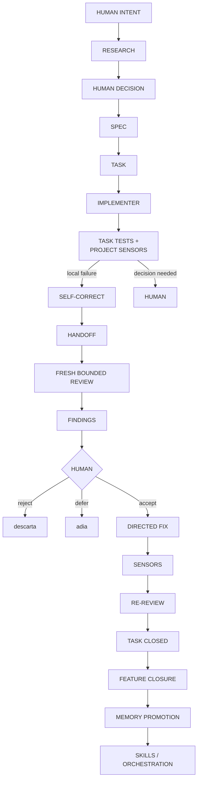

---

## Conclusão

O objetivo não é escrever prompts cada vez maiores.

É o contrário.

No início:

```text
o prompt carrega o processo
```

Depois:

```text
scripts carregam verificações
tasks carregam escopo
SPEC carrega comportamento
AGENTS carrega regras globais
Skills carregam procedimentos
orquestração carrega coordenação
```

O prompt vai ficando menor porque o sistema ao redor dele fica melhor.

Esse é o ponto de maturidade que buscamos:

> **menos instrução improvisada, mais contexto estruturado, contratos explícitos, sensores executáveis e decisões humanas nos pontos de maior alavancagem.**

[← Estudo de caso](08-estudo-de-caso.md) · [Próximo: Glossário →](10-glossario-essencial.md)
