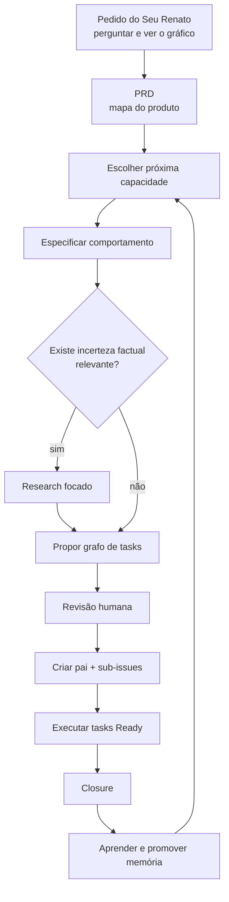
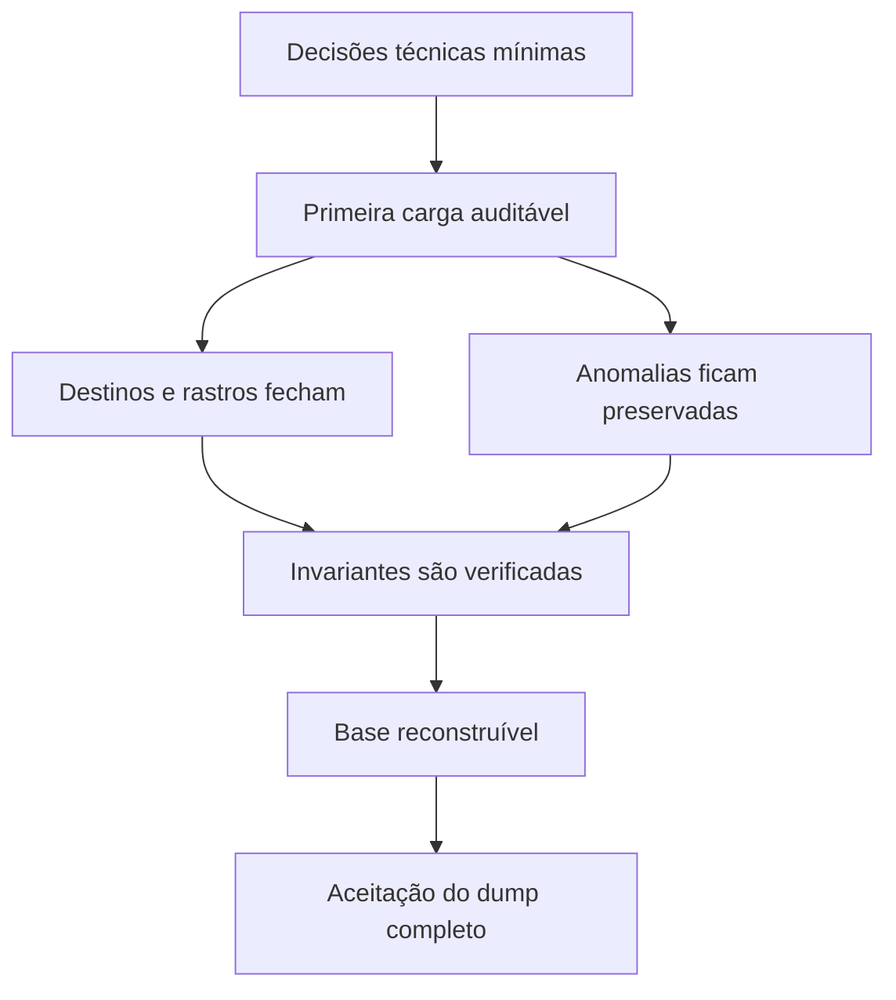
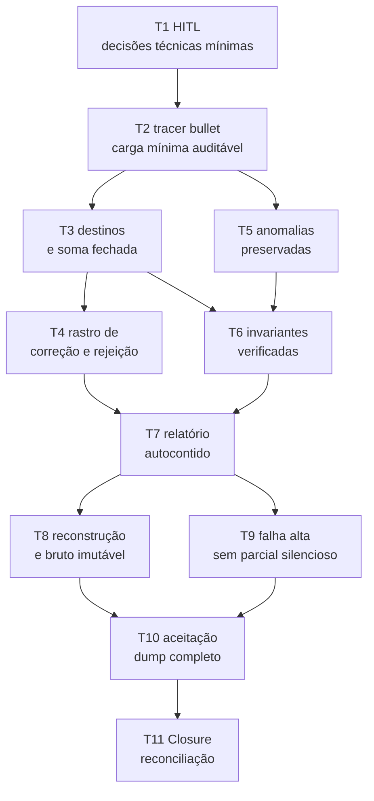
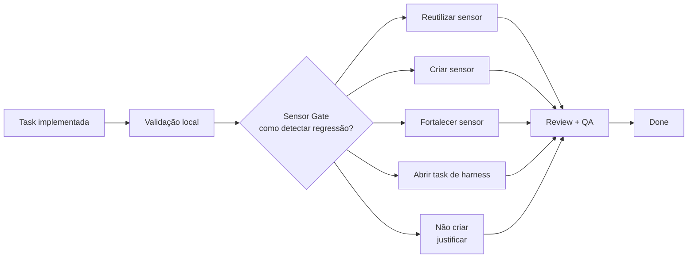
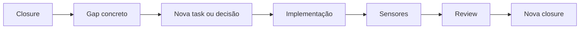

# Linear como memória operacional da SPEC

## Um experimento de XP, agentes, tasks verificáveis e sensores proporcionais ao risco

Seu Renato não pediu um backlog.

Ele pediu algo bem mais concreto:

> “Eu não quero aprender a mexer em nada. Eu quero perguntar igual eu pergunto pro meu sobrinho,
> e ver o gráfico.”

Toda segunda-feira, ele precisa decidir as compras do Mercado Bom Preço. Hoje, olha a prateleira,
estima o que saiu e liga para Juninho quando precisa de um número. O relatório chega dois dias
depois, quando a decisão já foi tomada.

O projeto que pretende mudar essa rotina já possui:

- a solicitação do cliente;
- uma pesquisa sobre o dump do ponto de venda;
- uma SPEC para a fundação de dados;
- um repositório preparado para agentes;
- modelos capazes de pesquisar, implementar e revisar;
- um projeto no Linear.

A primeira reação parece natural:

> “Vamos criar milestones, cycles, estimativas, labels e todas as issues do projeto.”

O pedido “quanto vendeu de papel higiênico semana passada?” rapidamente vira dezenas de cartões:
carga, banco, agente, embeddings, gráfico, observabilidade, avaliação, interface e deploy. Cada fase
ganha um milestone. As próximas semanas viram cycles. O backlog parece completo.

Por alguns minutos, existe uma agradável sensação de controle.

Depois, a pesquisa encontra duas convenções de data e número no mesmo dump, 5.195 linhas com
quantidade negativa, 11.129 divergências entre quantidade vezes valor unitário e total do item, e
18 pares de códigos com descrições equivalentes. Ainda não sabemos o significado comercial dessas
anomalias. Parte do plano já nasceu sustentada por decisões que ninguém tomou.

O PRD vira tarefas especulativas. Os milestones representam fases que ainda podem mudar. O backlog
cresce antes de o caminho ser conhecido. A ferramenta passa a exigir manutenção, mas ainda não
ajuda a responder ao Seu Renato.

A pergunta que orienta este capítulo é outra:

> **E se o Linear não for o gerente do projeto, mas a memória operacional da jornada entre uma
> SPEC e sua evidência?**

Este capítulo descreve um experimento. Ele se inspira em desenvolvimento orientado por
especificações — *Spec-Driven Development*, ou SDD —, Programação Extrema — *Extreme
Programming*, ou XP —, engenharia de contexto e engenharia de harness.

Não é apresentado como a forma correta de desenvolver software. É uma hipótese operacional,
adotada conscientemente, instrumentada e aberta a refutação.

O caso do Seu Renato está apresentado na página [O caso](https://erick-marinho.github.io/do-zero-ao-agente/o-caso).
A fundação técnica usada neste capítulo pode ser consultada no repositório
[Mercado Bom Preço — Assistente de Análise de Vendas](https://github.com/Erick-Marinho/proj-agent-mercado-bom-preco).
Os números do dump vêm do
[Research da Data Foundation](https://github.com/Erick-Marinho/proj-agent-mercado-bom-preco/blob/main/work/data-foundation/RESEARCH.md),
e os comportamentos B1–B10 vêm da
[SPEC versionada](https://github.com/Erick-Marinho/proj-agent-mercado-bom-preco/blob/main/specs/data-foundation.md).

---

## 1. A tese do experimento

> **A SPEC registra o destino; as tasks registram mudanças verificáveis; o Linear registra o estado
> da jornada; os sensores produzem feedback; e o closure reconcilia intenção, implementação e
> evidência.**

Cada superfície possui uma responsabilidade:

```text
SOLICITAÇÃO DO SEU RENATO
→ qual problema de negócio precisa desaparecer?

PRD
→ quais capacidades importam para a solução?

SPEC
→ qual comportamento queremos construir agora?

TASK
→ qual nova verdade verificável será produzida?

QUADRO
→ em que estado está a jornada?

SENSOR
→ que evidência temos sobre a realidade?

CLOSURE
→ o resultado final ainda corresponde à intenção?
```

A SPEC é fonte de intenção. O código, os testes, os dados derivados e o runtime são fontes de
realidade. A task liga uma pequena parte da intenção a uma mudança observável.

O quadro não substitui nenhuma dessas fontes. Ele registra coordenação:

```text
o que está bloqueado?
o que está pronto?
o que está sendo implementado?
o que espera review?
o que já possui evidência?
```

> **O quadro é memória operacional, não memória canônica de conhecimento.**

O Linear é a ferramenta de referência deste estudo, mas não é requisito do paradigma. Atualmente
ele oferece issues e sub-issues, relações de bloqueio, workflows configuráveis, labels, comentários,
templates e views filtradas. Projetos também podem conter documentos e recursos. Essas são
capacidades do produto; o método descrito aqui é uma decisão nossa sobre como combiná-las.

Fontes oficiais: [parent e sub-issues](https://linear.app/docs/parent-and-sub-issues),
[relações entre issues](https://linear.app/docs/issue-relations),
[status](https://linear.app/docs/configuring-workflows),
[comentários](https://linear.app/docs/comment-on-issues) e
[views](https://linear.app/docs/custom-views).

---

## 2. Estrutura mínima

O experimento começa com esta organização:

```text
Project: Mercado Bom Preço
│
├── SPEC — Data Foundation
│   ├── Task 1
│   ├── Task 2
│   ├── Task 3
│   ├── ...
│   └── Closure da Data Foundation
│
├── SPEC — próxima capacidade
│   ├── Task 1
│   └── Closure da próxima capacidade
│
└── ...
```

| Conceito | Representação |
|---|---|
| Produto ou solução | Project |
| Especificação ativa | Issue-pai |
| Mudança verificável | Sub-issue |
| Dependência | Relação `blocked by` / `blocking` |
| Estado da execução | Coluna do quadro |
| Handoff e evidências | Comentários |
| Decisão durável | SPEC, ADR, guia ou sensor |
| Fechamento | Task especial de closure |

A issue-pai não recebe uma cópia completa da SPEC. Ela contém:

- resultado esperado;
- link para a SPEC versionada;
- estado da especificação;
- resumo do escopo;
- principais exclusões;
- regra de fechamento.

A SPEC no repositório continua sendo a fonte canônica. A issue-pai representa progresso e
reconciliação.

Se copiarmos o documento completo para o Linear, passamos a ter duas fontes que podem divergir sem
aviso:

```text
SPEC no Git
+
cópia no Linear
↓
duas versões plausíveis
↓
drift
```

As sub-issues registram a jornada. Os comentários registram handoffs, evidências e decisões
temporárias. Comentários, entretanto, não substituem documentação durável:

```text
decisão arquitetural
→ ADR

comportamento aprovado
→ SPEC

regra universal
→ AGENTS.md

procedimento recorrente
→ guia, skill ou script

regressão determinística
→ sensor

história da execução
→ comentário
```

> **O comentário guarda a viagem; a SPEC, ADR, skill ou sensor guarda o que merece sobreviver à
> viagem.**

---

## 3. A política inicial não usa toda a ferramenta

O estado inicial do experimento é:

```text
1 Project
0 Initiatives
0 Milestones
0 Cycles
1 issue-pai por SPEC ativa
1 task de closure por SPEC
WIP = 1 task
```

Isso não declara milestones ou cycles inúteis.

Milestones representam estágios significativos dentro de um projeto. Cycles são períodos
recorrentes e limitados no tempo para planejar um conjunto de issues. Initiatives agrupam projetos
ao redor de objetivos mais amplos. Essas capacidades existem no Linear, mas o experimento ainda não
observou um problema que exija essas camadas.

Fontes oficiais: [milestones](https://linear.app/docs/project-milestones),
[cycles](https://linear.app/docs/use-cycles) e
[initiatives](https://linear.app/docs/initiatives).

Milestones podem ganhar valor quando houver entregas intermediárias que precisem ser comunicadas ou
coordenadas. Cycles podem ganhar valor quando capacidade temporal, cadência ou previsibilidade se
tornarem problemas reais. Orquestração e paralelismo podem surgir quando existirem tasks realmente
independentes.

> **Ausência de cerimônia agora não é proibição futura; é adiamento consciente até que exista
> evidência de necessidade.**

Cada nova estrutura consome atenção e precisa pagar aluguel:

```text
Qual problema observado ela resolve?

Que risco aumenta se ela for removida?

Que custo ela introduz?
```

Sem resposta concreta, ela permanece fora do experimento.

---

## 4. O PRD não é uma fábrica de tasks

O pedido do Seu Renato é o norte. O PRD apresenta o mapa do produto. Nenhum dos dois conhece todas
as descobertas que acontecerão durante a implementação.

Por isso, não entregamos o PRD inteiro a um modelo com a instrução:

> “Crie toda a cerimônia ágil deste projeto.”

O fluxo é incremental:



O PRD informa quais capacidades importam. A SPEC ativa define qual comportamento será implementado
agora. Somente então propomos o grafo de tasks.

A revisão humana ocorre antes de transformar a proposta em estado operacional. O modelo pode
sugerir uma decomposição excelente e ainda desconhecer prioridades, limites de risco ou decisões
que dependem do cliente.

---

## 5. Tasks como fatias verificáveis

Uma decomposição horizontal costuma seguir as camadas do sistema:

```text
Criar modelos
Criar banco
Criar services
Criar testes
Criar documentação
```

Cada task parece pequena, mas nenhuma produz sozinha um comportamento observável. O feedback
importante chega apenas quando todas são integradas.

Uma fatia vertical — *vertical slice* — atravessa somente as fronteiras necessárias para produzir
uma nova verdade observável.

Exemplo:

```text
Uma cópia mínima do dump, contendo registros nas duas convenções observadas,
produz uma base derivada consultável e um relatório que fecha a contagem das linhas.
```

“Vertical” não significa obrigatoriamente tocar interface, API e banco. A fatia é vertical em
relação ao comportamento que entrega.

Um projétil traçante — *tracer bullet* — é a primeira implementação fina de ponta a ponta. Seu
objetivo não é ser completa. É provar cedo que o caminho escolhido funciona.

As dependências entre as fatias formam um DAG — *Directed Acyclic Graph*, ou grafo direcionado
acíclico:



O grafo responde:

```text
o que precisa existir antes?
o que pode avançar agora?
o que está bloqueado?
onde existe paralelismo real?
```

O Kanban é uma projeção desse grafo no tempo. Ele não substitui o grafo.

---

## 6. Caso real: Data Foundation do Mercado Bom Preço

Antes de responder quanto vendeu de papel higiênico, precisamos saber de onde virá o número.

O dump do PDV contém:

- 716 produtos cadastrados;
- 374.474 itens de venda;
- 77.536 cupons;
- 912 dias com vendas;
- dois formatos de data e número;
- anomalias cujo significado comercial continua aberto.

A SPEC Data Foundation não tenta responder às perguntas do cliente. Seu objetivo é transformar o
dump bruto numa base derivada consultável sem perder a verdade sobre o que foi descartado, corrigido
ou preservado.

Ela define dez comportamentos:

```text
B1  bruto somente-leitura
B2  validação explícita antes da carga
B3  formato ambíguo falha em vez de ser adivinhado
B4  toda linha possui destino e a soma fecha
B5  correção nunca é silenciosa
B6  anomalia sem decisão é preservada e marcada
B7  invariante observada vira verificação
B8  cada execução produz evidência
B9  base derivada é reconstruível e descartável
B10 falha é alta e específica
```

A issue-pai seria:

```text
Data Foundation — carga auditável do dump do PDV
```

Um corpo mínimo poderia ser:

```markdown
# Resultado esperado

O dump bruto do PDV produz uma base derivada consultável e um relatório auditável,
sem alterar a origem nem decidir silenciosamente o significado das anomalias.

## Fonte canônica

specs/data-foundation.md

## Status da SPEC

Contrato de comportamento existente, com decisões técnicas ainda abertas.

## Escopo resumido

- leitura e validação do bruto;
- carga da base derivada;
- classificação e rastreabilidade de cada linha;
- preservação das anomalias abertas;
- verificação de invariantes;
- relatório da execução;
- reconstrução determinística.

## Fora do escopo

- agente e LangGraph;
- linguagem natural e gráficos;
- decidir o significado comercial das devoluções;
- deduplicar produtos;
- normalizar categorias;
- carga incremental;
- otimização de consultas.

## Regra de fechamento

A issue-pai somente poderá ir para Done quando a task de closure reconciliar
B1–B10 com implementação, evidências e sensores e declarar CLOSED.
```

### 6.1. Primeira hipótese de grafo

1. `[HITL] Fechar as decisões técnicas mínimas da Data Foundation`
2. `Uma cópia mínima aceita os dois formatos e produz uma carga auditável`
3. `Toda linha termina em aceita, corrigida ou rejeitada e a soma fecha`
4. `Correções e rejeições preservam origem, regra e motivo`
5. `Anomalias sem decisão permanecem consultáveis e sinalizadas`
6. `Invariantes medidas no dump viram verificações da carga`
7. `Cada execução produz um relatório suficiente para explicar o resultado`
8. `A base derivada é reconstruível sem alterar o bruto`
9. `Falhas estruturais não deixam uma base parcial silenciosa`
10. `O dump completo satisfaz B1–B10 com evidência repetível`
11. `[Closure] Reconciliar Data Foundation, implementação e evidências`

As dependências principais poderiam ser:



Isso ainda é uma proposta. Antes de criar as issues, precisamos confrontá-la com a SPEC.

### 6.2. O que a revisão encontra

| Task | Finding da decomposição |
|---|---|
| T1 | Necessária. A fronteira entre corrigida e rejeitada, o destino do relatório, a granularidade do rastro e a política de base parcial ainda exigem decisão técnica. |
| T2 | Bom tracer bullet, desde que use uma cópia microscópica do bruto e não tente cobrir todas as anomalias. |
| T3 | B4 é uma nova verdade observável. A classificação precisa ser exclusiva e a igualdade deve funcionar como invariante, não como texto no relatório. |
| T4 | Pode ser integrada a T3 se origem, regra e motivo couberem no mesmo incremento. Deve ser separada se o rastro exigir um contrato próprio. |
| T5 | Não pode “corrigir” quantidades negativas, divergências monetárias ou códigos equivalentes. A autoridade disponível é preservar e sinalizar. |
| T6 | Integridade referencial e coerência de cupom possuem contraprovas diferentes. Se o diff crescer, devem virar fatias separadas. |
| T7 | O relatório é comportamento, não documentação posterior. Precisa nascer com um contrato verificável. |
| T8 | Combina hash do bruto e duas execuções determinísticas. É aceitável se o publicador da base continuar pequeno; caso contrário, dividir. |
| T9 | Depende da decisão tudo-ou-nada versus resultado parcial declarado. Não pode entrar em Ready antes de T1. |
| T10 | É uma task de aceitação, não uma fase tardia de testes. Consolida sensores criados nas fatias anteriores. |
| T11 | Não implementa nem corrige. Reconcilia. |

Raio de impacto — *blast radius* — é a extensão do dano que uma decisão ou falha pode produzir.
Alterar o bruto ou publicar uma base parcial possui raio de impacto maior que formatar uma linha do
relatório. Essa diferença deve afetar decomposição, review e sensores.

### 6.3. A solicitação do Seu Renato não vira decisão técnica silenciosa

Quatro perguntas afetam qualquer número de faturamento:

1. um cupom 100% negativo anula um cupom positivo?
2. o que significa uma linha negativa dentro de um cupom positivo?
3. qual coluna representa receita quando `quantidade × valor_unitario` diverge de
   `valor_total_item`?
4. `VALE` conta como receita?

Essas perguntas precisam do cliente. Elas não bloqueiam a fundação de dados porque B6 manda
preservar e sinalizar a anomalia. Entretanto, bloqueiam a futura afirmação:

```text
“Seu Renato, o faturamento foi R$ X.”
```

Criá-las como sub-issues bloqueadoras da Data Foundation seria incorreto. A SPEC explicitamente
permite carregar os valores enquanto a semântica permanece aberta. Elas devem viver como decisões
humanas ligadas à próxima capacidade que calcule faturamento, com referência ao finding da
pesquisa.

Isso mostra por que bloqueio não significa “assunto importante”. Bloqueio significa:

> **Sem este resultado ou decisão, o contrato desta task não pode ser executado com segurança.**

---

## 7. O estado mínimo do quadro

```text
Backlog → Ready → In Progress → In Review → QA → Done
```

O Linear permite configurar status específicos por equipe. O conjunto acima é uma decisão do
experimento, não um workflow obrigatório do produto.

Fonte oficial: [configuração de status](https://linear.app/docs/configuring-workflows).

| Estado | Significado operacional |
|---|---|
| Backlog | Task derivada, mas bloqueada, insuficientemente contratada ou aguardando decisão. |
| Ready | Contrato suficiente, nenhuma decisão humana pendente e nenhuma dependência aberta. |
| In Progress | Implementação, sensores e autocorreção local. |
| In Review | Revisão fresca e limitada à task, ao diff e às evidências. |
| QA | Demonstração dos critérios de aceitação. |
| Done | Task local concluída com evidência, Sensor Gate e handoff. |

> **Ready não é opinião; é uma propriedade derivada do contrato e das dependências.**

Isso não significa que o Linear calcula automaticamente todas as condições de Ready. “Ready” é
derivado pela nossa política, por uma consulta ou por uma automação que a equipe venha a validar.

Uma task não está Ready se:

- possui relação `blocked by` aberta;
- depende de uma decisão não aprovada;
- não possui critério de aceitação;
- não informa como será validada;
- exige contexto que ainda não existe;
- está marcada como AFK, mas contém autoridade humana escondida.

As relações `blocked by` e `blocking` são capacidades nativas do Linear. Quando uma issue
bloqueadora é resolvida, a relação deixa a área de bloqueio e passa para relacionadas. O quadro é
adequado para consultar bloqueios atuais; o handoff e a closure ainda preservam a evidência
histórica relevante.

Fonte oficial: [relações entre issues](https://linear.app/docs/issue-relations).

Também existe uma automação opcional que fecha a issue-pai quando todas as sub-issues terminam.
Neste experimento, ela deve permanecer desativada, porque “todas as tasks Done” não equivale a
“SPEC fechada”.

Fonte oficial: [automação entre pai e sub-issues](https://linear.app/docs/parent-and-sub-issues).

---

## 8. Labels mínimas

Começamos com três labels:

- `AFK` — *away from keyboard*: task bem contratada que um modelo pode executar sem supervisão
  contínua;
- `human-in-the-loop`: task ou decisão que exige presença humana;
- `closure`: reconciliação sistêmica de uma SPEC.

Labels são uma capacidade de categorização e filtragem do Linear. Limitar a taxonomia a três labels
é uma decisão experimental.

Fonte oficial: [labels](https://linear.app/docs/labels).

As consultas operacionais são:

```text
O que um modelo pode executar agora?
→ Ready + AFK

Onde o humano precisa participar?
→ human-in-the-loop

Qual especificação espera reconciliação?
→ closure
```

Views customizadas permitem salvar e compartilhar conjuntos filtrados de issues. Podemos usá-las
quando essas consultas manuais se tornarem recorrentes. Isso corresponde ao nível 5 da escada de
maturidade, não ao primeiro passo.

Fonte oficial: [Custom Views](https://linear.app/docs/custom-views).

`AFK` não significa autonomia ilimitada. Significa somente que:

```text
contrato suficiente
+
dependências resolvidas
+
autoridade explícita
+
sensores proporcionais ao risco
```

permitem executar sem acompanhamento contínuo.

---

## 9. O contrato da task

Uma task funciona como cápsula de contexto.

Ela não contém o projeto inteiro. Contém o necessário para mudar uma parte do sistema com
segurança.

```markdown
# Objetivo

Qual nova verdade observável esta task produzirá?

## Escopo

O que pode ser alterado ou implementado?

## Fora do escopo

O que não deve ser resolvido nesta task?

## Dependências

Quais tasks, contratos ou decisões precisam existir antes?

## Contexto relevante

Quais seções da SPEC, findings, ADRs, símbolos e arquivos são necessários?

## Autoridade

- Execute
- Propose
- Escalate

Explique decisões que o modelo pode executar, apenas propor ou deve escalar.

## Critérios de aceitação

Que comportamentos precisam ser demonstrados?

## Validação planejada

Como cada critério será verificado nesta execução?

## Hipótese de sensor

Que sensor existente ou novo poderá detectar uma regressão futura?
```

Esse contrato protege o Context Budget:

```text
MUITO CONHECIMENTO NO REPOSITÓRIO
≠
MUITO CONHECIMENTO NA TASK
```

A task deve apontar para fontes canônicas e carregar apenas o necessário para a mudança. Contexto
insuficiente produz suposições. Contexto excessivo aumenta ruído, custo e chance de o modelo
perseguir problemas fora do escopo.

Templates de issues podem preservar essa estrutura e preencher propriedades iniciais. A capacidade
existe no Linear, mas só vale automatizá-la depois que o contrato tiver sido praticado e ajustado
manualmente.

Fonte oficial: [templates de issues](https://linear.app/docs/issue-templates).

---

## 10. Política operacional V0.1

> Esta política é provisória. Seu valor será medido pelos problemas que evita, não pela fidelidade
> com que é seguida.

### Estrutura

1. A solução possui um único Project no Linear.
2. Cada SPEC ativa possui uma issue-pai.
3. A SPEC versionada no repositório continua sendo a fonte canônica.
4. A issue-pai contém apenas resumo, link, estado e regra de fechamento.
5. Tasks são sub-issues pequenas e verificáveis.
6. Dependências entre tasks são relações explícitas de bloqueio.
7. O PRD não é decomposto integralmente de forma antecipada.
8. Milestones, cycles e orquestração só serão adotados diante de uma necessidade observada.

### Execução

9. Uma task entra em Ready somente quando não possui bloqueios ou decisões humanas abertas.
10. O WIP inicial é uma task.
11. Cada task inclui implementação, validação e evidência.
12. Testes não são uma fase posterior separada.
13. O modelo deve implementar somente o escopo da task.
14. Decisões ausentes da SPEC devem ser escaladas, não tomadas silenciosamente.
15. Mudanças são integradas com frequência para manter o feedback próximo.

### Sensores

16. Toda task precisa de validação.
17. Toda mudança comportamental passa pelo Sensor Gate.
18. Nem toda task precisa criar um teste novo.
19. Se um comportamento relevante e determinístico não possui cobertura repetível, o padrão é criar
    ou fortalecer um sensor na própria task.
20. Bug reproduzível deve receber teste de regressão, salvo justificativa explícita.
21. Um sensor transversal, caro ou reutilizável pode virar task própria.
22. A decisão de não criar sensor deve ser registrada e proporcional ao risco.
23. Sensores podem ser testes, tipos, schemas, linters, benchmarks, evals, logs, métricas ou revisão
    inferencial.

### Review e handoff

24. O implementador registra resultado, alterações, evidências, decisões, limitações e dependências
    desbloqueadas.
25. A revisão deve ser fresca, limitada à task, ao diff e aos critérios.
26. O reviewer procura refutar claims; ele não recebe autoridade automática para decidir solução.
27. Findings passam por triagem antes de virar correção.
28. Conhecimento durável não permanece escondido em comentários.

### Fechamento

29. Toda SPEC possui uma task final de closure.
30. A closure é bloqueada pelas demais tasks necessárias ao contrato da SPEC.
31. Todas as tasks concluídas não significam automaticamente SPEC concluída.
32. Closure reconcilia:
    - SPEC e tasks;
    - tasks e código;
    - código e evidências;
    - resultado e intenção;
    - comportamentos e sensores.
33. A issue-pai só vai para Done quando a closure declarar `CLOSED`.
34. Lacunas encontradas geram novas tasks ou decisões explícitas.
35. O reviewer de closure não implementa correções durante o fechamento.

### Evolução do método

36. Falhas locais são corrigidas localmente.
37. Falhas recorrentes podem justificar novo guia, skill, script ou sensor.
38. Uma nova cerimônia só é adotada quando reduz risco ou incerteza observados.
39. Métricas servem para diagnosticar, não para produzir metas de vaidade.
40. O processo também passa por *garbage collection*: práticas sem retorno podem ser removidas.

---

## 11. Sensor Gate

Três perguntas parecem semelhantes, mas possuem ciclos de vida diferentes:

| Conceito | Pergunta |
|---|---|
| Critério de aceitação | O que precisa ser verdadeiro? |
| Validação | Como provamos que ficou verdadeiro agora? |
| Sensor | Como saberemos se deixar de ser verdadeiro depois? |

Pense numa sala:

```text
critério
→ a sala não pode pegar fogo

validação
→ alguém inspecionou a sala hoje

sensor
→ existe um detector de fumaça observando continuamente
```

Uma execução manual pode validar o comportamento atual e ainda deixar o sistema desprotegido contra
regressão.



Template:

```markdown
## Sensor Gate

### Comportamento alterado

O que pode regredir depois desta task?

### Sensor existente

Qual teste, tipo, schema, lint, script ou avaliação já cobre esse comportamento?

### Contraprova

Se introduzirmos uma implementação incorreta, esse sensor falhará?

- [ ] Sim
- [ ] Não
- [ ] Não foi possível determinar

### Decisão

- [ ] Reutilizar sensor existente
- [ ] Adicionar sensor nesta task
- [ ] Fortalecer sensor existente
- [ ] Abrir task de sensor transversal
- [ ] Não adicionar sensor

### Justificativa

Por que essa decisão é proporcional ao risco?

### Evidência

Quais sensores foram executados e quais resultados produziram?
```

A contraprova é importante. Um teste pode passar e ainda não observar o comportamento que afirma
proteger.

> **Toda task precisa de evidência. Nem toda task precisa de um teste novo. Se a task altera
> comportamento verificável e nenhum sensor repetível detectaria sua regressão, o padrão é adicionar
> ou fortalecer um sensor.**

---

## 12. Sensores na Data Foundation

| Comportamento | Validação atual | Sensor durável |
|---|---|---|
| O bruto não muda | Comparar hashes antes e depois | Teste de integração sobre cópia controlada |
| Dois formatos produzem o mesmo significado | Executar exemplos dos dois blocos | Teste parametrizado de contrato |
| Toda linha possui exatamente um destino | Conferir o relatório | Invariante `lidas = aceitas + corrigidas + rejeitadas` |
| Correção preserva origem e regra | Inspecionar uma linha | Teste de rastreabilidade |
| Quantidade negativa não é normalizada | Consultar fixture controlado | Teste de preservação de anomalia |
| Venda só referencia produto existente | Executar a carga conhecida | Teste negativo com violação injetada |
| Total do cupom fecha | Recalcular uma amostra | Teste de propriedade por cupom |
| Duas cargas produzem o mesmo resultado | Apagar e executar novamente | Teste de integração determinístico |
| Falha não deixa base parcial | Provocar arquivo inválido | Teste com diretório temporário |
| Mensagem ajuda a corrigir | Ler a saída | Teste de contrato + review inferencial |

“Teste unitário para tudo” seria uma simplificação incorreta.

A reconstrução da base atravessa parser, validação, persistência e relatório. Um teste de integração
é mais adequado que vários testes unitários isolados. A mensagem que ajuda uma pessoa a corrigir o
problema possui uma parte estrutural verificável e uma parte inferencial: nomear arquivo e regra pode
ser testado; clareza pode exigir review.

Sensores possíveis incluem:

```text
teste unitário
teste de integração
teste de propriedade
teste de contrato
schema
tipo estático
lint
benchmark
eval
log
métrica
review inferencial
```

O sensor deve observar o risco relevante no limite que o controla.

---

## 13. Definição de pronto — Definition of Done — da task

```markdown
## Definition of Done

- [ ] Critérios de aceitação demonstrados
- [ ] Validação específica executada
- [ ] Sensor Gate preenchido
- [ ] Sensor reutilizado, criado ou fortalecido
- [ ] Ausência de novo sensor justificada, quando aplicável
- [ ] Sensores relevantes aprovados
- [ ] Sensor global do projeto executado
- [ ] Handoff registrado
- [ ] Dependências desbloqueadas atualizadas
```

No projeto do Mercado Bom Preço, o sensor global atual é:

```text
./scripts/verify.sh
```

Ele verifica a saúde geral do ambiente e do repositório. Não substitui o teste específico da task:

```text
teste específico
→ esta mudança funciona?

verify.sh
→ o repositório continua apto?
```

O `verify.sh` é sensor. Ele observa e reporta. Não deve alterar arquivos nem corrigir
automaticamente o estado.

---

## 14. Handoff nos comentários

O handoff comprime a mudança para o próximo consumidor.

```markdown
## Resultado

O que passou a ser verdadeiro?

## Alterações

Quais arquivos, contratos ou comportamentos mudaram?

## Evidências

Quais testes e sensores foram executados?

## Sensor Gate

Qual decisão foi tomada sobre proteção futura?

## Decisões

Houve decisão nova ou alteração de contrato?

## Riscos e limitações

O que permanece conhecido e fora do escopo?

## Dependências desbloqueadas

Quais tasks podem passar para Ready?
```

Comentários e threads são capacidades nativas das issues no Linear. Usá-los como handoff é uma
decisão do experimento.

Fonte oficial: [comentários e threads](https://linear.app/docs/comment-on-issues).

Um comentário não precisa narrar cada comando. Ele precisa permitir que a próxima pessoa ou modelo
compreenda:

```text
o que mudou?
o que foi provado?
o que não foi decidido?
o que pode avançar agora?
```

O log é a jornada detalhada. O handoff é a entrega compacta.

---

## 15. Revisão fresca e limitada — Fresh Bounded Review

Revisão fresca — *fresh review* — significa que o reviewer entra com contexto reconstruído a partir
do contrato, do diff e das evidências, em vez de continuar automaticamente o raciocínio do
implementador.

Revisão limitada — *bounded review* — restringe a investigação a:

```text
TASK
+
DIFF
+
CLAIMS DO HANDOFF
+
SENSORES
+
CONTEXTO IMEDIATO
```

O reviewer tenta refutar claims como:

```text
o critério foi realmente atendido?
o teste falharia com uma implementação incorreta?
houve decisão silenciosa?
o diff expandiu o escopo?
a evidência sustenta o handoff?
```

Ele não recebe autoridade automática para escolher a correção.

Findings passam por triagem:

```text
ACCEPT
REJECT
DEFER
OPEN DECISION
OUT OF SCOPE
```

Um modelo no mesmo contexto pode repetir o mesmo pressuposto errado. Um reviewer fresco reduz essa
correlação, mas não elimina o risco.

Fresh review também possui custo. Uma alteração editorial pequena pode não justificar um segundo
contexto. Uma mudança que possa alterar o bruto, esconder rejeições ou produzir faturamento
incorreto provavelmente justifica.

A independência deve ser proporcional ao risco.

---

## 16. Closure da SPEC

A última task terminar não prova que a feature terminou.

A closure reconcilia:

```text
SPEC
↔
TASKS
↔
CÓDIGO
↔
EVIDÊNCIAS
↔
SENSORES
↔
RESULTADO
```

Uma matriz inicial para a Data Foundation poderia ser:

| Comportamento | Task | Implementação | Evidência | Sensor | Estado |
|---|---|---|---|---|---|
| Bruto somente-leitura | T8 | Leitor da origem | Hash antes/depois | Integração | Coberto |
| Soma dos destinos fecha | T3 | Classificador da carga | Relatório do fixture | Invariante | Coberto |
| Anomalias são preservadas | T5 | Registro sinalizado | Fixture negativo | Integração | Coberto |
| Falha não deixa base parcial | T9 | Publicação da base | — | Teste de falha | Lacuna |
| Relatório explica B4 e B7 | T7 | Emissor do relatório | Amostra | Contrato | Pendente |

A closure responde somente:

```text
CLOSED
```

ou:

```text
NOT CLOSED

Gaps:
- falha estrutural ainda deixa arquivo temporário tratado como base válida;
- relatório não identifica a invariante de cupom que falhou.
```

Ela não corrige código.

Se existir uma lacuna:



A issue-pai só vai para Done depois de `CLOSED`.

---

## 17. Relação com XP

O experimento é inspirado em XP. Não é uma implementação canônica ou completa de Extreme
Programming.

| Princípio | Manifestação no experimento |
|---|---|
| Feedback rápido | Sensores executados dentro da task |
| Pequenas entregas — small releases | Fatias pequenas integradas frequentemente |
| Design simples — simple design | Estrutura mínima antes de adicionar cerimônia |
| Testes — testing | Validação e Sensor Gate dentro da execução |
| Refatoração — refactoring | Melhoria interna protegida por sensores |
| Integração contínua — continuous integration | Integração após pequenas mudanças |
| Programação em par — pair programming | Humano e modelo colaborando com autoridade explícita |
| Aprendizagem coletiva — collective learning | Handoffs e promoção seletiva de memória |

A analogia possui limites:

- um modelo não substitui automaticamente o papel humano do par;
- revisão pelo mesmo modelo e contexto pode repetir o mesmo erro;
- testes escritos pelo implementador podem codificar o mesmo mal-entendido;
- responsabilidade e decisões de produto continuam humanas;
- mais agentes não significam mais XP nem mais produtividade;
- feedback rápido não ajuda se o sensor observa a coisa errada;
- integração frequente não compensa tasks sem contrato.

O elemento comum é a aproximação entre mudança e feedback.

---

## 18. Protocolo experimental

O método precisa ser refutável. Sem hipótese e observação, ele vira preferência pessoal apresentada
como verdade.

### 18.1. Hipóteses

- **H1.** Uma issue-pai por SPEC reduz reconstrução manual de contexto.
- **H2.** Tasks pequenas com Goal, Scope, Out, Acceptance Criteria e Validation reduzem expansão de
  escopo.
- **H3.** O Sensor Gate reduz regressões e validações meramente ocasionais.
- **H4.** WIP igual a um reduz conflitos enquanto o método está sendo aprendido.
- **H5.** Fresh review encontra problemas que o contexto implementador normalizou.
- **H6.** Closure reduz casos em que todas as tasks terminaram, mas a SPEC não foi realmente
  cumprida.

### 18.2. Métricas diagnósticas

| Métrica | Pergunta |
|---|---|
| Correção na primeira passagem — first-pass correctness | Quantas tasks chegam à revisão sem correção estrutural? |
| Taxa de retrabalho — rework rate | Quanto trabalho retorna depois da revisão ou integração? |
| Taxa de falha repetida — repeated failure rate | Quantas vezes o mesmo tipo de falha reaparece? |
| Intervenção humana — human intervention | Em que tipo de decisão o humano precisou entrar? |
| Lacunas de fechamento — closure gaps | Quantas lacunas aparecem somente no fechamento? |
| Decisão de sensor — sensor decision | Quantas tasks reutilizam, criam, fortalecem ou dispensam sensores? |
| Etapa de detecção — detection stage | Os problemas aparecem na implementação, review, closure ou depois? |

Essas métricas não são metas.

Maximizar “testes criados por task” incentivaria testes redundantes. Minimizar intervenção humana
poderia incentivar decisões silenciosas. Maximizar *first-pass correctness* poderia levar a tasks
triviais ou esconder rework.

> **A métrica ajuda a investigar o sistema; não serve para ensinar pessoas a manipular o número.**

### 18.3. Diário do experimento

Para cada SPEC:

```markdown
## Hipóteses testadas

## O que funcionou

## Onde houve atrito

## Falhas recorrentes

## Sensores criados ou fortalecidos

## Intervenções humanas

## Mudanças propostas ao método

## O que não merece ser preservado
```

A última seção é necessária. Aprender também significa descartar estruturas que deixaram de pagar
aluguel.

---

## 19. Escada de maturidade

| Nível | Estrutura |
|---|---|
| 0 | Conversa, código e validação manual |
| 1 | SPEC-pai e tasks pequenas |
| 2 | Dependências e Ready derivado |
| 3 | Sensor Gate e handoffs |
| 4 | Review fresco e closure |
| 5 | Views, templates e automações úteis |
| 6 | Orquestração somente onde existe independência real |

> **Avançar de nível não é promoção. Um nível maior só é melhor quando resolve um problema já
> observado.**

Um projeto pode permanecer no nível 2 por meses e funcionar bem. Outro pode precisar de views
rapidamente. Um terceiro pode descobrir que WIP 1 atrasa trabalho independente sem reduzir
conflitos.

A maturidade está na capacidade de escolher e remover mecanismos, não em acumular todos eles.

---

## 20. Armadilhas

### 20.1. Copiar toda a SPEC para o Linear

Cria duas fontes de verdade.

### 20.2. Transformar todo o PRD em backlog

Converte hipóteses distantes em tarefas com aparência de decisão.

### 20.3. Criar milestones e cycles para parecer ágil

A cerimônia antecede o problema de coordenação.

### 20.4. Dividir somente por camada técnica

O feedback comportamental chega tarde.

### 20.5. Marcar todas as tasks como AFK

Decisões humanas ficam escondidas dentro da execução.

### 20.6. Criar testes como fase posterior

Mudança e feedback ficam separados.

### 20.7. Confundir validação com sensor

O comportamento foi observado uma vez, mas continua desprotegido.

### 20.8. Exigir um teste novo para toda alteração

Incentiva sensores redundantes e ignora risco, tipo e contrato.

### 20.9. Usar o mesmo contexto para tudo

Implementação, validação e julgamento podem compartilhar o mesmo erro.

### 20.10. Fechar o pai porque todos os filhos terminaram

Progresso local é confundido com reconciliação sistêmica.

### 20.11. Guardar decisão arquitetural em comentário

A decisão desaparece da fonte que deveria governar trabalho futuro.

### 20.12. Criar labels para toda dimensão

A taxonomia exige mais manutenção do que consulta útil.

### 20.13. Maximizar paralelismo cedo

Aumentam conflitos, integração e handoffs antes de o fluxo ser compreendido.

### 20.14. Automatizar antes de praticar

Cristaliza um processo ainda mal compreendido.

### 20.15. Transformar métricas em metas

O comportamento passa a otimizar o indicador, não o resultado.

---

## 21. A postura do humano

No início, o humano costuma operar assim:

```text
Humano:
- escreve prompt;
- acompanha cada alteração;
- manda testar;
- manda corrigir;
- decide o próximo comando.
```

Num experimento amadurecido:

```text
Humano:
- define intenção;
- aprova a SPEC;
- revisa o grafo de tasks;
- resolve decisões de alta alavancagem;
- faz triagem de findings;
- julga exceções ao Sensor Gate;
- aprova o closure;
- decide o que o sistema deve aprender.
```

No Mercado Bom Preço, existe ainda uma distinção essencial:

```text
MODELO
→ pesquisa o dump
→ propõe contratos
→ implementa dentro da autoridade
→ produz evidência

EQUIPE TÉCNICA
→ aprova arquitetura e fronteiras técnicas
→ julga findings e risco

SEU RENATO
→ decide o significado do próprio negócio
→ aceita ou rejeita o resultado para sua rotina
```

O objetivo não é remover o humano. É deslocar sua atenção para os pontos em que julgamento,
semântica, autoridade e responsabilidade possuem maior valor.

O humano não deveria funcionar como um `verify.sh` caro.

---

## 22. Linear como referência, não dependência

| Necessidade do método | Linear | Alternativa genérica |
|---|---|---|
| SPEC operacional | Parent issue | Cartão-pai |
| Tasks | Sub-issues | Cartões filhos |
| DAG | Blocking relations | Dependências |
| Estado | Workflow statuses | Colunas |
| Handoff | Comments | Registro da task |
| Visões | Custom views | Consultas filtradas |
| Fonte canônica | Link para Git | Documento versionado |

O experimento pode ser reproduzido em GitHub Issues, Jira ou outra ferramenta que ofereça:

- issues;
- relação pai–filho;
- estados;
- bloqueios;
- comentários;
- filtros.

O método depende das relações conceituais, não da interface do Linear.

---

## 23. Exercício prático

Escolha uma SPEC real e:

1. crie uma issue-pai que apenas referencie a fonte canônica;
2. derive de três a cinco fatias verificáveis;
3. desenhe o DAG;
4. marque quais tasks são AFK e quais são `human-in-the-loop`;
5. preencha uma task com o contrato completo;
6. execute o Sensor Gate;
7. produza um handoff;
8. monte uma matriz de closure;
9. identifique uma decisão que precisa ser promovida;
10. registre uma hipótese sobre o método que possa ser refutada.

Ao terminar, pergunte:

```text
Qual estrutura reduziu risco?

Qual estrutura apenas consumiu tempo?

Que informação faltou na task?

Que contexto estava sobrando?

Onde o primeiro feedback útil apareceu?
```

---

## 24. Perguntas de revisão

1. Por que a issue-pai não deve duplicar a SPEC?
2. Qual é a diferença entre solicitação do cliente, PRD, SPEC, task e estado do quadro?
3. Quando uma task está realmente Ready?
4. Qual é a diferença entre validação e sensor?
5. Toda task precisa criar um teste novo?
6. Quando a ausência de sensor é aceitável?
7. Por que todas as tasks Done não significam SPEC concluída?
8. Quando milestones ou cycles passariam a ter valor?
9. Qual é o risco de dar autonomia antes de fortalecer os sensores?
10. Como saber se o método está reduzindo retrabalho ou apenas adicionando cerimônia?
11. Por que as decisões de faturamento do Seu Renato não bloqueiam a carga auditável?
12. Que evidência permitirá ligar uma futura resposta do agente ao dump original?

---

## 25. Síntese

O experimento não usa o Linear para dizer ao desenvolvedor como trabalhar. Usa-o para tornar
visível o caminho entre intenção e evidência.

A solicitação do Seu Renato preserva o problema. A SPEC preserva o destino técnico atual. As tasks
limitam a mudança. O quadro registra o estado da jornada. Os sensores devolvem realidade. O review
tenta refutar as alegações do implementador. O closure impede que progresso aparente seja
confundido com comportamento concluído.

```text
PEDIDO DO CLIENTE
→ problema que importa

SPEC
→ destino do incremento

TASK
→ mudança verificável

LINEAR
→ estado da jornada

SENSOR
→ feedback da realidade

CLOSURE
→ reconciliação
```

O rigor não vem da quantidade de cerimônia. Vem de tornar explícitos contrato, autoridade,
dependências, evidências e lacunas.

Quando Seu Renato finalmente perguntar quanto vendeu de papel higiênico, o número não poderá ser
apenas plausível. Precisará carregar uma linha de proveniência até o dump, as decisões de negócio e
os sensores que protegem o cálculo.

> **A política é provisória. Deve sobreviver apenas enquanto reduzir incerteza, retrabalho ou risco
> melhor do que as alternativas.**

[← Estado da arte](09-estado-da-arte.md) · [Próximo: Glossário →](10-glossario-essencial.md)
