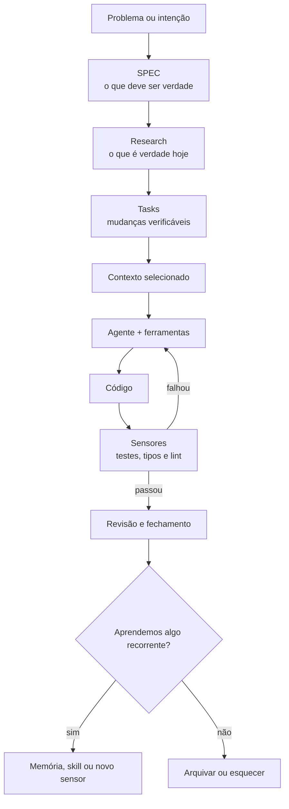

# Do zero ao agente

## Engenharia de contexto, especificações e harnesses para sistemas de IA confiáveis

> **Edição 0.1 · agosto de 2026**

Este livro é uma introdução prática para quem quer trabalhar com agentes de IA em projetos de
software, mas ainda se sente perdido entre termos como *context engineering*, SDD, `AGENTS.md`,
*skills*, subagentes e *harness engineering*.

A ideia central é simples:

> Um agente não trabalha bem porque recebeu “um prompt perfeito”. Ele trabalha bem quando existe
> um sistema que lhe oferece direção, contexto, ferramentas, limites e feedback.

Não é necessário conhecer agentes, arquitetura de software ou modelos de linguagem antes de
começar. Termos importantes aparecem primeiro em português e, em seguida, em inglês.

---

## Como usar este livro

Cada capítulo começa com uma dificuldade concreta e só então apresenta os conceitos que ajudam a
resolvê-la. Ao final, você encontra uma síntese, perguntas de revisão e, quando fizer sentido, um
exercício prático.

Você pode seguir três rotas:

1. **Primeiro contato:** leia as partes em ordem e faça apenas as perguntas de revisão.
2. **Consulta:** use o sumário e o [glossário essencial](09-glossario-essencial.md) para voltar a um
   conceito específico.
3. **Mão na massa:** depois da Parte 3, acompanhe o [estudo de caso](08-estudo-de-caso.md) em
   paralelo com as partes seguintes.

### Convenções visuais

| Elemento | Significado |
|---|---|
| **Analogia** | Uma imagem cotidiana para formar o primeiro modelo mental. |
| **Exemplo** | Um caso concreto, normalmente baseado em uma feature de autenticação. |
| **Armadilha** | Uma ideia que parece útil, mas costuma gerar ruído ou burocracia. |
| **Em uma frase** | A menor síntese que vale guardar. |
| **Perguntas de revisão** | Um teste de entendimento, não uma prova de memorização. |

---

## Sumário

### Antes de começar

- [Introdução — do prompt ao sistema](00-introducao.md)

### Parte 1 — Fundamentos

- [Capítulo 1 — Por que prompts não bastam](01-fundamentos.md#capítulo-1--por-que-prompts-não-bastam)
- [Capítulo 2 — `AGENTS.md` e divulgação progressiva](01-fundamentos.md#capítulo-2--agentsmd-e-divulgação-progressiva)

### Parte 2 — Arquitetura da memória

- [Capítulo 3 — Memória durável, procedural, executável e efêmera](02-memoria.md#capítulo-3--quatro-formas-de-memória)
- [Capítulo 4 — Em qual fonte confiar?](02-memoria.md#capítulo-4--em-qual-fonte-confiar)

### Parte 3 — Especificação e planejamento

- [Capítulo 5 — SPEC como contrato de comportamento](03-especificacao-e-planejamento.md#capítulo-5--spec-como-contrato-de-comportamento)
- [Capítulo 6 — Research: descobrir antes de decidir](03-especificacao-e-planejamento.md#capítulo-6--research-descobrir-antes-de-decidir)
- [Capítulo 7 — Fatias verticais e grafo de tarefas](03-especificacao-e-planejamento.md#capítulo-7--fatias-verticais-e-grafo-de-tarefas)

### Parte 4 — Engenharia de contexto operacional

- [Capítulo 8 — Montagem do contexto](04-engenharia-de-contexto.md#capítulo-8--montagem-do-contexto)
- [Capítulo 9 — Ciclo de vida do contexto](04-engenharia-de-contexto.md#capítulo-9--ciclo-de-vida-do-contexto)
- [Capítulo 10 — Subagentes como fronteiras de contexto](04-engenharia-de-contexto.md#capítulo-10--subagentes-como-fronteiras-de-contexto)

### Parte 5 — Engenharia de harness

- [Capítulo 11 — Guias e sensores](05-harness.md#capítulo-11--guias-e-sensores)
- [Capítulo 12 — Conhecimento executável](05-harness.md#capítulo-12--conhecimento-executável)

### Parte 6 — Autonomia e coordenação

- [Capítulo 13 — Orçamento de atenção humana](06-autonomia-e-coordenacao.md#capítulo-13--orçamento-de-atenção-humana)
- [Capítulo 14 — Orquestração de agentes](06-autonomia-e-coordenacao.md#capítulo-14--orquestração-de-agentes)

### Parte 7 — Fechamento e aprendizagem

- [Capítulo 15 — Quando uma feature está realmente pronta?](07-lifecycle-e-aprendizagem.md#capítulo-15--quando-uma-feature-está-realmente-pronta)
- [Capítulo 16 — Promoção de memória](07-lifecycle-e-aprendizagem.md#capítulo-16--promoção-de-memória)
- [Capítulo 17 — Métricas e harness que aprende](07-lifecycle-e-aprendizagem.md#capítulo-17--métricas-e-harness-que-aprende)

### Prática e consulta

- [Estudo de caso — recuperação de senha](08-estudo-de-caso.md)
- [Glossário essencial](09-glossario-essencial.md)
- [Fontes e leituras recomendadas](10-fontes.md)

---

## O mapa do livro

Quase todos os conceitos dos próximos capítulos ocupam um lugar nesse ciclo.

---

## Três ideias para levar até o fim

1. **Minimize o conhecimento ativo, não o conhecimento disponível.** Tenha uma biblioteca grande e
   uma mochila pequena.
2. **Transforme intenção em feedback executável.** Uma regra importante fica mais forte quando o
   ambiente consegue verificá-la.
3. **Faça o sistema aprender com falhas recorrentes.** O objetivo não é impedir todo erro; é evitar
   que a equipe pague pelo mesmo erro indefinidamente.

---

## Nota editorial

O caderno de pesquisa original foi preservado apenas no ambiente de trabalho e não faz parte da
edição publicada. Esta pasta contém a **síntese didática**: menos repetição, uma ordem de aprendizagem
clara e distinção explícita entre ideias das fontes, interpretações e recomendações práticas.
