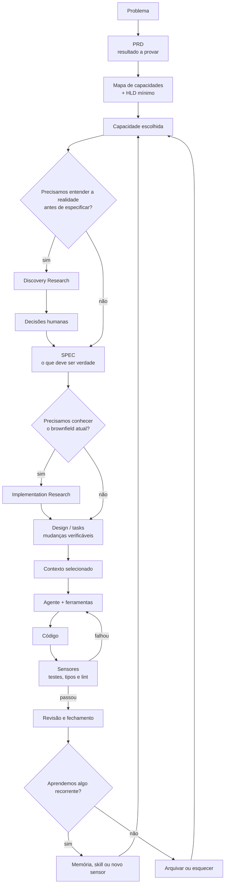

# Do zero ao agente

## Engenharia de contexto, especificações e harnesses para sistemas de IA confiáveis

> **Edição 0.2 · agosto de 2026**

Este livro é uma introdução prática para quem quer trabalhar com agentes de IA em projetos de
software, mas ainda se sente perdido entre termos como *context engineering*, SDD, `AGENTS.md`,
*skills*, subagentes e *harness engineering*.

A ideia central é simples:

> Um agente não trabalha bem porque recebeu “um prompt perfeito”. Ele trabalha bem quando existe
> um sistema que lhe oferece direção, contexto, ferramentas, limites e feedback.

Esse sistema começa com boa engenharia de software: testes, integração contínua, versionamento,
code review, feedback rápido, observabilidade, design simples, refactoring e pequenas unidades de
mudança. O trabalho específico com agentes torna essas práticas legíveis, executáveis e
verificáveis pelo agente, acrescentando estruturas somente quando autonomia, contexto ou
coordenação realmente exigem.

Não é necessário conhecer agentes, arquitetura de software ou modelos de linguagem antes de
começar. Termos importantes aparecem primeiro em português e, em seguida, em inglês.

---

## Como usar este livro

Cada capítulo começa com uma dificuldade concreta e só então apresenta os conceitos que ajudam a
resolvê-la. Ao final, você encontra uma síntese, perguntas de revisão e, quando fizer sentido, um
exercício prático.

Você pode seguir três rotas:

1. **Primeiro contato:** leia as partes em ordem e faça apenas as perguntas de revisão.
2. **Consulta:** use o sumário e o [glossário essencial](10-glossario-essencial.md) para voltar a um
   conceito específico.
3. **Mão na massa:** depois da Parte 4, acompanhe o [estudo de caso](08-estudo-de-caso.md) em
   paralelo com as partes seguintes, compare-o com o
   [mini-estudo Data Foundation](08b-mini-estudo-data-foundation.md) e use o
   [manual de referência](09-estado-da-arte.md) para consultar prompts por fase no seu próprio
   projeto. Para materializar a jornada do trabalho de uma SPEC num quadro operacional, siga com o
   experimento
   [Linear como memória operacional da SPEC](09b-linear-como-memoria-operacional-da-spec.md).

### Convenções visuais

| Elemento | Significado |
|---|---|
| **Analogia** | Uma imagem cotidiana para formar o primeiro modelo mental. |
| **Exemplo** | Um caso concreto, quase sempre no Mercado Bom Preço do Seu Renato. |
| **Armadilha** | Uma ideia que parece útil, mas costuma gerar ruído ou burocracia. |
| **Em uma frase** | A menor síntese que vale guardar. |
| **Perguntas de revisão** | Um teste de entendimento, não uma prova de memorização. |

---

## Sumário

### Antes de começar

- [Introdução — do prompt ao sistema](00-introducao.md)

### Parte 1 — Fundamentos

- [Capítulo 1 — Por que prompts não bastam](01-fundamentos.md#capítulo-1--por-que-prompts-não-bastam)
- [Capítulo 2 — `AGENTS.md` e divulgação progressiva](01-fundamentos.md#capítulo-2--agentsmd-e-divulgação-progressiva)

### Parte 2 — Arquitetura da memória

- [Capítulo 3 — Memória e estado de trabalho](02-memoria.md#capítulo-3--memória-e-estado-de-trabalho)
- [Capítulo 4 — Em qual fonte confiar?](02-memoria.md#capítulo-4--em-qual-fonte-confiar)

### Parte 3 — Do problema à capacidade

- [Capítulo 5 — Os cinco níveis de decisão](02b-do-problema-a-capacidade.md#capítulo-5--os-cinco-níveis-de-decisão)
- [Capítulo 6 — PRD, jornada do usuário e mapa de capacidades](02b-do-problema-a-capacidade.md#capítulo-6--prd-jornada-do-usuário-e-mapa-de-capacidades)
- [Capítulo 7 — HLD mínimo e escolha da capacidade](02b-do-problema-a-capacidade.md#capítulo-7--hld-mínimo-e-escolha-da-capacidade)

### Parte 4 — Especificação e planejamento

- [Capítulo 8 — SPEC como contrato de comportamento](03-especificacao-e-planejamento.md#capítulo-8--spec-como-contrato-de-comportamento)
- [Capítulo 9 — Research antes e depois da SPEC](03-especificacao-e-planejamento.md#capítulo-9--research-antes-e-depois-da-spec)
- [Capítulo 10 — Fatias verticais e grafo de tarefas](03-especificacao-e-planejamento.md#capítulo-10--fatias-verticais-e-grafo-de-tarefas)

### Parte 5 — Engenharia de contexto operacional

- [Capítulo 11 — Montagem do contexto](04-engenharia-de-contexto.md#capítulo-11--montagem-do-contexto)
- [Capítulo 12 — Ciclo de vida do contexto](04-engenharia-de-contexto.md#capítulo-12--ciclo-de-vida-do-contexto)
- [Capítulo 13 — Subagentes como fronteiras de contexto](04-engenharia-de-contexto.md#capítulo-13--subagentes-como-fronteiras-de-contexto)

### Parte 6 — Engenharia de harness

- [Capítulo 14 — Guias e sensores](05-harness.md#capítulo-14--guias-e-sensores)
- [Capítulo 15 — Conhecimento executável](05-harness.md#capítulo-15--conhecimento-executável)

### Parte 7 — Autonomia e coordenação

- [Capítulo 16 — Orçamento de atenção humana](06-autonomia-e-coordenacao.md#capítulo-16--orçamento-de-atenção-humana)
- [Capítulo 17 — Orquestração de agentes](06-autonomia-e-coordenacao.md#capítulo-17--orquestração-de-agentes)

### Parte 8 — Fechamento e aprendizagem

- [Capítulo 18 — Quando uma feature está realmente pronta?](07-lifecycle-e-aprendizagem.md#capítulo-18--quando-uma-feature-está-realmente-pronta)
- [Capítulo 19 — Promoção de memória](07-lifecycle-e-aprendizagem.md#capítulo-19--promoção-de-memória)
- [Capítulo 20 — Matriz de reconstrução](07-lifecycle-e-aprendizagem.md#capítulo-20--matriz-de-reconstrução)
- [Capítulo 21 — Métricas e harness que aprende](07-lifecycle-e-aprendizagem.md#capítulo-21--métricas-e-harness-que-aprende)

### Prática e consulta

- [Estudo de caso — recuperação de senha](08-estudo-de-caso.md)
- [Mini-estudo de caso — Data Foundation](08b-mini-estudo-data-foundation.md)
- [Estado da arte — manual de referência](09-estado-da-arte.md)
- [Experimento — Linear como memória operacional da SPEC](09b-linear-como-memoria-operacional-da-spec.md)
- [Glossário essencial](10-glossario-essencial.md)
- [Fontes e leituras recomendadas](11-fontes.md)

---

## O mapa do livro

Quase todos os conceitos dos próximos capítulos ocupam um lugar nesse ciclo, mas nem toda mudança
percorre todas as caixas. Uma alteração pequena pode ir do objetivo diretamente à implementação e
a um teste. Research, SPEC, design, grafo, review independente, Skill e orquestração entram quando
reduzem uma incerteza ou um risco concreto; o mapa mostra responsabilidades possíveis, não um
waterfall obrigatório.

---

## Três ideias para levar até o fim

1. **Minimize o conhecimento ativo, não o conhecimento disponível.** Tenha uma biblioteca grande e
   uma mochila pequena.
2. **Transforme intenção em feedback executável.** Uma regra importante fica mais forte quando o
   ambiente consegue verificá-la.
3. **Faça o sistema aprender com falhas recorrentes.** O objetivo não é impedir todo erro; é evitar
   que a equipe pague pelo mesmo erro indefinidamente.

---

## Nota editorial

O caderno de pesquisa original foi preservado apenas no ambiente de trabalho e não faz parte da
edição publicada. Esta pasta contém a **síntese didática**: menos repetição, uma ordem de aprendizagem
clara e distinção explícita entre ideias das fontes, interpretações e recomendações práticas.
